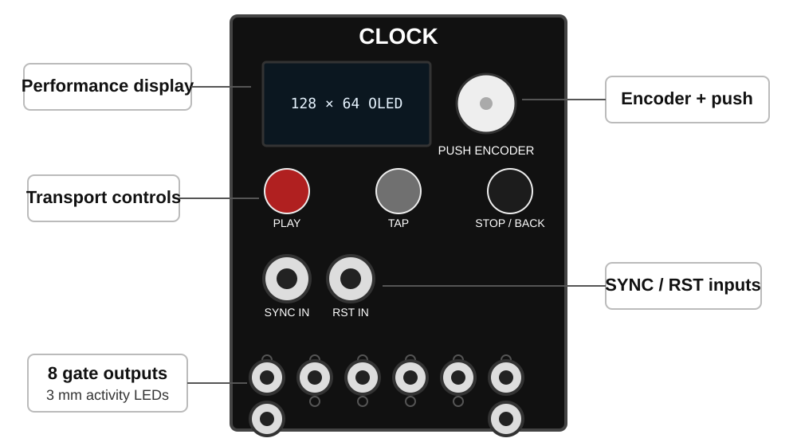
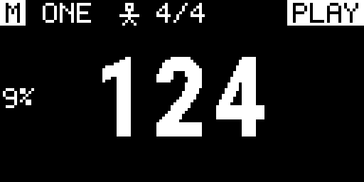

<!-- Author: Axel Napolitano | License: PolyForm-Noncommercial-1.0.0 -->

# CLOCK

**Eight-channel Eurorack master clock, rhythm generator and gate sequencer by South Signal Lab.**

[](https://github.com/napolitano/eurorack-clock-firmware/actions/workflows/ci.yml)
[](https://github.com/napolitano/eurorack-clock-firmware/releases)
[](LICENSE.md)

<p align="center">
  
</p>

CLOCK is the firmware and reference design for our own **10 HP, eight-output Eurorack clock module** built around the STM32F401CCU6 Black Pill. It combines a deterministic master timeline with three ways of using the outputs: eight independent rhythmic channels, one shared clock on all outputs, or an eight-output divider bank.

The project is deliberately DIY-oriented: commonly obtainable parts, a compact physical interface, reproducible builds, a native simulator, strong automated tests, and documentation that is meant to be useful at the workbench rather than merely satisfy a release checklist.

> [!IMPORTANT]
> **Current status: `0.19.0-beta.1`.** V1 is now feature-frozen. The implemented firmware model, UI, persistence, simulator, dual SPI/I2C display support and host-side timing tests form the release-qualification baseline. From this point to 1.0, changes are limited to defects, qualification gaps, reproducibility/documentation work, and compatibility work required to keep later 1.x upgrades safe. Final PCB/comparator validation and physical HIL timing sign-off remain prerelease milestones.

## Why another Eurorack Clock?

A clock module looks simple until it becomes the timing centre of a real rack. Then the trade-offs matter: how quickly can you change tempo, how many related rhythms can you derive without repatching, can one channel become Euclidean while another remains a straight clock, what happens when external sync disappears, and can you understand the state without living inside nested menus?

CLOCK exists because we wanted a module with a specific balance that we did not want to compromise away:

- **Eight useful outputs, not eight copies of the same feature.** Each output can be a straight clock, a Euclidean pattern, a 64-step gate sequence or Off, while One Clock and Divider Bank cover the common global use cases immediately.
- **A performance interface first.** One OLED, one push encoder and three large transport buttons keep PLAY, TAP and STOP/BACK physically obvious. Detailed settings are available, but they are not the normal performance surface.
- **One deterministic timing model.** Clock, Euclid and Sequencer derive from the same master timeline instead of behaving like unrelated mini-sequencers that happen to share a box.
- **Useful sync semantics rather than a token clock input.** INTERNAL, EXTERNAL and AUTO sources, configurable PPQN, edge selection, filtering, loss policy and separate reset behaviour are explicit parts of the design.
- **DIY should still feel like a finished instrument.** The goal is not merely a buildable PCB. Parts availability, simulator coverage, update/recovery documentation, HIL procedures and a publication-quality manual are part of the product.
- **The software should be maintainable.** Timing, hardware access, UI, persistence and rendering are separated, and the same production logic is exercised on the host rather than replaced by a simplified simulator model.

This is an independent South Signal Lab development. It is not a firmware port for another clock module and not a clone of a commercial product.

### Why no general CV modulation?

CLOCK deliberately stays in the **digital timing, gate, and trigger** domain. Hardware Rev 1 has SYNC and RST inputs, but no general parameter-CV inputs, analog modulation outputs, or CV modulation matrix. This is a product boundary, not a missing 1.0 feature.

A quality eight-channel analog modulation-output stage would move the module into a different cost and assembly class. Our quality target would require an eight-channel **16-bit DAC-class solution** plus two quad output-op-amp stages; a 12-bit MCP-class compromise is not considered good enough for this direction. The current project estimate is roughly **EUR 30-40 additional BOM cost**, before the wider impact of fine-pitch SMD assembly, PCB complexity, calibration, testing, and documentation. General CV parameter inputs would add their own analog front ends, routing, jacks, and validation scope.

Rather than dilute DIY buildability to chase feature parity with modulation-centric clocks, CLOCK spends its complexity budget on precise digital timing and rhythm. Post-1.0 cross-channel interaction can still become sophisticated, but the first direction is internal event logic - clocks, gates, resets, fills, probability, and rhythm relationships - without changing the analog hardware.

## What CLOCK does

| Area | Current implementation |
| --- | --- |
| Format | Eurorack, 3U, 10 HP reference panel |
| Outputs | 8 gate/clock outputs, target 0/+5 V, individual activity LEDs |
| Inputs | Separate SYNC and RST inputs through the planned LM393 conditioning stage; no general parameter-CV inputs by design |
| MCU | STM32F401CCU6 Black Pill, 84 MHz Cortex-M4 |
| Display | 128×64 SSD1306/SSD1315; SPI reference path, bounded deferred I2C alternative |
| Controls | Push encoder + PLAY/PAUSE + TAP + STOP/BACK |
| Topologies | Independent, One Clock, Divider Bank |
| Channel functions | Off, Clock, Euclid, Sequencer |
| Tempo | 1–999 BPM technical range; factory user range 20–999 BPM |
| Euclid | 1–64 steps, hits and rotation |
| Sequencer | 1–64 binary gate steps per channel, four 16-step editor pages |
| Persistence | CURRENT auto-save + 8 named presets + factory templates, CRC/schema protected |
| Timing service | 20 kHz deterministic scheduler, 50 µs service quantum |
| Simulator | SDL3 interactive front panel + headless integration target |
| Firmware language | C++17 |

CLOCK always boots in **STOP**. Stored state can restore configuration, but it never silently resumes gate output after power-up.

## Three output topologies

### One Clock

The factory topology. One shared configuration drives all eight outputs, which is ideal when several modules should receive the same master pulse. Shared controls include rate, rational ratio, Swing, gate length and phase.

One Clock also owns **Humanize**. It adds a small deterministic per-output displacement while keeping the common restart/downbeat exact:

```text
OFF / 250 / 500 / 1000 / 2000 µs
```

### Independent

Each physical output becomes its own rhythmic channel while remaining anchored to the same master timeline. A channel can use:

- **CLOCK** - a regular derived clock;
- **EUCLID** - a Euclidean pattern with 1–64 steps, hits and rotation;
- **SEQ** - a manually editable 1–64-step binary gate sequence;
- **OFF** - no generated events.

Common per-channel timing includes rate, rational numerator/denominator, Swing, probability, gate length, phase, reset policy and mute. This makes polymetric and polyrhythmic patches possible without sacrificing a shared downbeat.

### Divider Bank

One master source feeds eight fixed clock divisions. Three families are available:

| Family | Outputs |
| --- | --- |
| POW2 | ×1, ÷2, ÷4, ÷8, ÷16, ÷32, ÷64, ÷128 |
| INT | ×1, ÷2, ÷3, ÷4, ÷5, ÷6, ÷7, ÷8 |
| PRIME | ×1, ÷2, ÷3, ÷5, ÷7, ÷11, ÷13, ÷17 |

The mode is intentionally simple: choose the family and the shared gate length, then patch the eight results.

## Timing and musical behaviour

The hard timing path is independent from OLED refresh and foreground UI work. A 20 kHz hardware timer services the production engine every 50 µs. Internally, one monotonic Q32 master timeline provides the common reference for all output modes.

Important properties:

- integer/fixed-point accumulation; no floating-point clock accumulation;
- fractional remainder retained for rational rates to prevent long-term truncation drift;
- shared epoch/event serial keeps Clock, Euclid and Sequencer aligned across live edits;
- Swing alternates long/short intervals while preserving the duration of the pair;
- gate-off scheduling is bounded by the actual event interval so a long gate cannot swallow the next rising edge;
- `GLOBAL` reset re-anchors a channel; `FREE` preserves that channel's local cycle position;
- tempo changes do not implicitly reset phase or stop transport;
- local edits reschedule only the affected channel unless the setting is genuinely global.

For Euclid and Sequencer, `×1` uses a **sixteenth-note grid**. A 16-step pattern therefore spans one 4/4 bar.

The detailed timing contract is normative: [`docs/TIMING.md`](docs/TIMING.md).

## External SYNC and RST

The firmware-side synchronization model supports:

- source: `INTERNAL`, `EXTERNAL`, `AUTO`;
- PPQN: `1`, `2`, `4`, `24`;
- rising/falling edge selection;
- configurable glitch filter;
- lock-loss timeout;
- loss policy: stop, freewheel or return to internal timing;
- reset input as `TRIGGER` or `GATE`.

SYNC/RST edges are captured by GPIO interrupts and consumed in the deterministic scheduler. External tempo estimation is period-based and includes smoothing, continuity handling, adaptive timeout and timestamp-wrap-safe arithmetic.

> [!CAUTION]
> Host tests prove the software semantics, not the analog input stage. Comparator thresholds, signal integrity, final timer-capture routing and resulting output jitter must still pass the real-hardware HIL plan before a 1.0 release candidate. See [`docs/HIL_TEST_PLAN.md`](docs/HIL_TEST_PLAN.md).

## Controls and UI

The normal interaction grammar is deliberately small:

| Gesture | Performance | Overview / mode | Settings / editor |
| --- | --- | --- | --- |
| Encoder turn | Master BPM | Move selection | Move/change value |
| Encoder short press | Open overview | Confirm selection | Enter/confirm/toggle step |
| Encoder long press | Open current context settings | Open highlighted settings | Context dependent |
| TAP + encoder press | Open Settings | - | - |
| Hold TAP + encoder turn | - | Open six-function palette | - |
| PLAY/PAUSE | Play/pause | - | Sequencer: next 16-step page |
| TAP | Tap Tempo | Modifier | Sequencer: previous 16-step page |
| STOP/BACK | Stop + reset global phase | Back/cancel | Back/cancel |

The performance screen stays intentionally sparse: timing authority/lock, selected context, meter, transport, BPM and only the non-default timing modifiers that matter at that moment. Euclid and Sequencer add a live pattern strip at the bottom.



For the complete interaction flow, mode-selection confirmation, presets, settings and screen reference, use the [User Manual](docs/manual/README.md).

## Presets, recovery and templates

CLOCK keeps a durable **CURRENT** working state and eight named user presets. Persistence uses schema/version validation, CRC checks and A/B Flash slots. Writes are staged and coalesced; physical Flash commits are deferred while transport is playing so erase/program operations cannot block the live gate path.

Factory templates provide useful starting states including a conventional clock tree, divider set, polyrhythmic ratios, Euclidean kit and mixed-mode setup. Templates replace the working configuration; they are not user-preset slots.

## Display transport

SPI remains the preferred/reference display transport. I2C is also supported for easier module sourcing, but it is deliberately isolated from musical timing:

- `present()` publishes a framebuffer; it does not perform an immediate I2C transfer;
- at most one I2C transaction is serviced per foreground pass;
- data packets contain at most 24 framebuffer bytes;
- only dirty pages are sent;
- stale UI frames may be discarded - latest frame wins;
- NACKs are retried without pretending the physical display was updated.

A slower I2C frame rate is acceptable. Additional gate jitter, missed edges, SYNC/RST faults or encoder loss are not. SPI-vs-I2C HIL under maximum display activity is therefore a mandatory V1 qualification test before a 1.0 release candidate.

## Native simulator

The SDL3 simulator runs the production firmware logic on the desktop. It provides the real 128×64 framebuffer, the physical front-panel layout, virtual controls, SYNC/RST injection, gate-state visibility and a developer oscilloscope.

```bash
cmake --preset simulator
cmake --build --preset simulator
./build/simulator/clock-simulator
```

Headless simulator tests are available through the dedicated preset and CI. See [`docs/SIMULATOR.md`](docs/SIMULATOR.md).

## Build and test

### Firmware

The reference hardware profile is SPI SSD1306:

```bash
pio run -e blackpill_f401cc_spi_ssd1306
```

Additional profiles cover SPI SSD1315 and I2C SSD1306/SSD1315. The custom linker/upload path protects the Flash sectors reserved for A/B persistence.

### Native tests

The public PlatformIO command exposes the complete native suite rather than a small smoke subset:

```bash
pio test -e native
```

Current inventory: **90 named test cases** across Clock Core, Realtime/SYNC/RST and full Host Firmware/UI/HAL suites. Those cases execute more than **218,000 assertions** in the default host configuration; exhaustive clock-core matrices account for most of them.

The broader host matrix additionally recompiles display variants, runs sanitizer configurations and produces aggregate coverage:

```bash
python scripts/run_host_tests.py
```

Current validated aggregate baseline:

```text
Executable lines     6248 / 6507   96.02 %
Functions              533 / 542    98.34 %
Decision branches     3710 / 4115   90.16 %
```

The project enforces a 90% decision-branch gate. Production-source architecture checks additionally reject heap allocation in embedded code and flag stack frames larger than 4 KiB. Full details: [`test/README.md`](test/README.md) and [`docs/TEST_COVERAGE.md`](docs/TEST_COVERAGE.md).

## Documentation

| Document | Purpose |
| --- | --- |
| [User Manual](docs/manual/README.md) | Publication manual, generated UI assets, ODT/PDF release workflow |
| [User Guide](docs/USER_GUIDE.md) | Repository-native operating reference |
| [Timing](docs/TIMING.md) | Normative scheduler and timing contract |
| [Architecture](docs/ARCHITECTURE.md) | Firmware boundaries and responsibilities |
| [Configuration](docs/CONFIGURATION.md) | Build-time and runtime configuration |
| [Simulator](docs/SIMULATOR.md) | Desktop simulator and headless usage |
| [HIL Test Plan](docs/HIL_TEST_PLAN.md) | Mandatory physical validation before a 1.0 release candidate |
| [Roadmap](docs/ROADMAP.md) | V1 freeze, 1.0 qualification path, post-1.0 musical roadmap and VCV track |
| [V1 Forward-Compatibility Audit](docs/V1_FORWARD_COMPATIBILITY.md) | Persistence/event-architecture constraints that protect later 1.x migration |
| [Development](docs/DEVELOPMENT.md) | Developer workflow and quality gates |
| [Doxygen](Doxyfile) | Source-level API documentation |

The curated manual screenshots are generated from the **real production framebuffer**, not redrawn mockups. Their catalog and human-readable descriptions live in [`docs/manual/assets/manual-screenshots.tsv`](docs/manual/assets/manual-screenshots.tsv).

## Hardware target

The current reference design uses:

- STM32F401CCU6 Black Pill;
- 0.96-inch 128×64 SSD1306/SSD1315 OLED;
- PEC11L-style push encoder;
- three C&K D6R transport buttons;
- separate conditioned SYNC and RST inputs;
- eight Thonkiconn-style output jacks;
- eight 3 mm red activity LEDs;
- 74HCT244-class 5 V output buffer;
- local +12 V to +5 V conversion.

The simulator panel dimensions and control coordinates are maintained in [`sim/panel_layout.ini`](sim/panel_layout.ini). The documentation front-panel SVG is generated directly from that file, so the illustration cannot silently drift away from the simulator layout.

## Supporting the project

CLOCK is developed independently by South Signal Lab. If the firmware, documentation or engineering work is useful to you, the repository exposes **GitHub Sponsors** and **Patreon** through GitHub's standard Sponsor panel via [`.github/FUNDING.yml`](.github/FUNDING.yml).

- [GitHub Sponsors](https://github.com/sponsors/napolitano)
- [Patreon - South Signal Lab](https://www.patreon.com/southsignallab)

## Project identity, citation and license

The canonical software identity is **South Signal Lab CLOCK**. Citation metadata is provided in [`CITATION.cff`](CITATION.cff) and [`codemeta.json`](codemeta.json).

Firmware source is licensed under the **PolyForm Noncommercial License 1.0.0**; see [`LICENSE.md`](LICENSE.md). The manual and its publication assets have their own documentation license described under [`docs/manual/LICENSE.md`](docs/manual/LICENSE.md). Third-party components retain their respective upstream licenses.

Because PolyForm Noncommercial restricts commercial use, this repository is **source-available**, not OSI open-source. That distinction is intentional and documented rather than hidden behind a generic "open source" label.

<h6 align="center">From Munich with &#9829;</h6>
