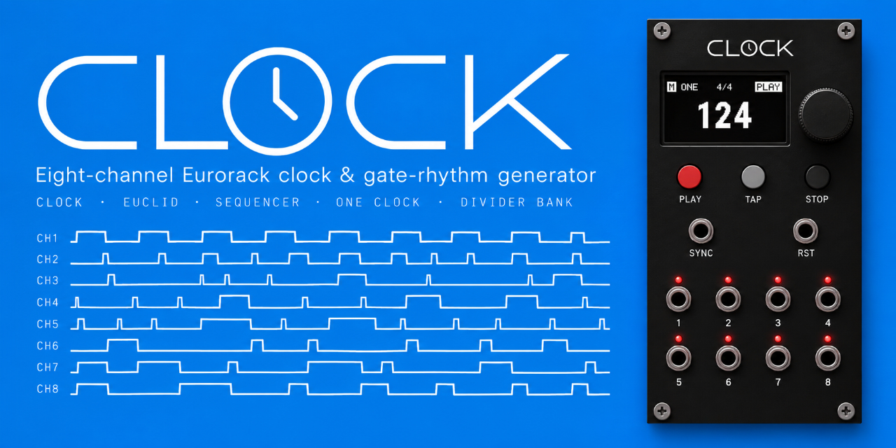
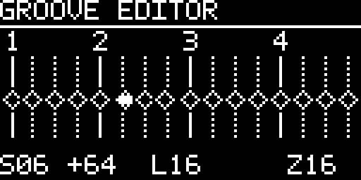
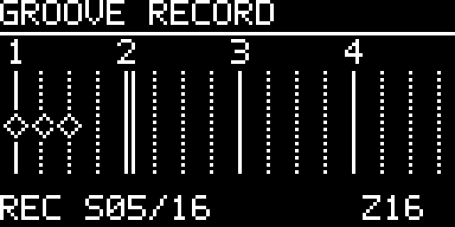
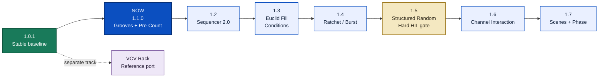

<!-- Author: Axel Napolitano | License: PolyForm-Noncommercial-1.0.0 -->

<p align="center">
  
</p>

[](https://github.com/napolitano/eurorack-clock-firmware/actions/workflows/ci.yml)
[](https://github.com/napolitano/eurorack-clock-firmware/actions/workflows/manual-publication.yml)
[](https://github.com/napolitano/eurorack-clock-firmware/releases)
[](platformio.ini)
[](CMakeLists.txt)
[](docs/TEST_COVERAGE.md)
[](LICENSE.md)

# CLOCK

**Eight-channel Eurorack master clock, rhythm generator and gate sequencer by South Signal Lab.**

CLOCK is the firmware and reference design for our own **10 HP, eight-output Eurorack clock module** built around the STM32F401CCU6 Black Pill. It combines a deterministic master timeline with three ways of using the outputs: eight independent rhythmic channels, one shared clock on all outputs, or an eight-output divider bank.

The project is deliberately DIY-oriented: commonly obtainable parts, a compact physical interface, reproducible builds, a native simulator, strong automated tests, and documentation that is meant to be useful at the workbench rather than merely satisfy a release checklist.

> [!IMPORTANT]
> **Stable firmware: `1.1.0`.** This release makes Grooves a first-class timing tool, adds Pre-Count and configurable digital-input roles, and expands Custom Grooves with graphical editing, live TAP recording, named storage, the horizontal Channel Mode carousel, and the related UI/persistence work.

**HIL policy:** the physical HIL ledger remains fully visible and evidence-checked, but incomplete HIL status is advisory for release automation through `1.4.x`. The hard all-PASS release gate activates for release candidates and stable releases from `1.5.0` onward. Physical Groove/TAP-record captures are therefore tracked qualification evidence, not substituted by host tests. See [`docs/qualification/`](docs/qualification/README.md) and [`docs/HIL_TEST_PLAN.md`](docs/HIL_TEST_PLAN.md).

## 1.1.0 — Grooves become a first-class timing tool

The headline change in 1.1 is the **Groove Engine**. Groove is deterministic microtiming layered onto the same master timeline used by Clock, Euclid and Sequencer. It is not Humanize and it does not create a second free-running clock.

Factory choices currently include `SWING 54 / 58 / 62 / 66` and `POCKET A / B / C`, with **Amount 0–100%** and **rotation**. One Clock owns one global Groove; Independent stores it per channel; Divider Bank deliberately remains Groove-free.

Custom Grooves go further. A 1–64-step graphical editor uses movable diamond markers around the nominal beat/step grid, supports signed early/late timing, bounded zoom (`FIT / 32 / 16 / 8 / 4`) and live preview while the clock is running. Ten named Custom Groove slots are the frozen 1.1.0 storage scope, with save/load/overwrite/rename/delete, generated editable default names, and the actual stored Groove name on Performance.

<table>
<tr>
<td align="center"><br><sub><b>Editor:</b> shape deterministic microtiming directly on the 128×64 grid.</sub></td>
<td align="center"><br><sub><b>Record:</b> capture TAP timing with Count-In, One-Shot/Endless and a live playhead.</sub></td>
</tr>
</table>

`RECORD >` is a second input mode over the same Custom Groove draft: **PLAY** starts/stops capture, **TAP** records an event with the high-resolution physical button timestamp, **PLAY + encoder** zooms, and the moving playhead follows the real engine phase. Recorder Count-In is independently configurable `OFF / 1–64` (default `4`); `ONE SHOT` stops at the end while `ENDLESS` wraps and overwrites only steps that receive a new TAP. A recorded Groove can be opened immediately in `EDITOR >` for cleanup before saving.

CLOCK 1.1.0 also adds the optional 1–64-beat **Pre-Count**, globally configurable `INPUT 1 / INPUT 2` roles (`OFF / SYNC / RESET / RUN / START / STOP / RESTART / TAP`), a scalable horizontal Channel Mode carousel, improved long-information handling on the OLED, and tighter simulator/host qualification. The frozen 1.1 scope and later milestones are documented in [`docs/ROADMAP.md`](docs/ROADMAP.md).

## Why another Eurorack Clock?

A clock module looks simple until it becomes the timing centre of a real rack. Then the trade-offs matter: how quickly can you change tempo, how many related rhythms can you derive without repatching, can one channel become Euclidean while another remains a straight clock, what happens when external sync disappears, and can you understand the state without living inside nested menus?

CLOCK exists because we wanted a module with a specific balance that we did not want to compromise away:

- **Eight useful outputs, not eight copies of the same feature.** Each output can be a straight clock, a Euclidean pattern, a 64-step gate sequence or Off, while One Clock and Divider Bank cover the common global use cases immediately.
- **A performance interface first.** One OLED, one push encoder and three large transport buttons keep PLAY, TAP and STOP/BACK physically obvious. Detailed settings are available, but they are not the normal performance surface.
- **One deterministic timing model.** Clock, Euclid and Sequencer derive from the same master timeline instead of behaving like unrelated mini-sequencers that happen to share a box.
- **Useful sync semantics rather than a token clock input.** INTERNAL, EXTERNAL and AUTO sources, configurable PPQN, edge selection, filtering, loss policy and separate reset behaviour are explicit parts of the design.
- **DIY should still feel like a finished instrument.** The goal is not merely a buildable PCB. Parts availability, simulator coverage, update/recovery documentation, HIL procedures and a publication-quality manual are part of the product.
- **The software should be maintainable.** Timing, hardware access, UI, persistence and rendering are separated, and the same production logic is exercised on the host rather than replaced by a simplified simulator model.

This is an independent South Signal Lab development. It is not a firmware port for another clock module and not a clone of a commercial product.

### Why no general CV modulation?

CLOCK deliberately stays in the **digital timing, gate, and trigger** domain. Hardware Rev 1 has two LM393-conditioned digital comparator inputs, physically/net-named SYNC and RST on the current PCB, but no general parameter-CV inputs, analog modulation outputs, or CV modulation matrix. In firmware 1.1.0 their roles are configurable globally; the factory assignment remains `INPUT 1 = SYNC`, `INPUT 2 = RESET`. This is a product boundary, not a general CV subsystem.

A quality eight-channel analog modulation-output stage would move the module into a different cost and assembly class. Our quality target would require an eight-channel **16-bit DAC-class solution** plus two quad output-op-amp stages; a 12-bit MCP-class compromise is not considered good enough for this direction. The current project estimate is roughly **EUR 30-40 additional BOM cost**, before the wider impact of fine-pitch SMD assembly, PCB complexity, calibration, testing, and documentation. General CV parameter inputs would add their own analog front ends, routing, jacks, and validation scope.

Rather than dilute DIY buildability to chase feature parity with modulation-centric clocks, CLOCK spends its complexity budget on precise digital timing and rhythm. Post-1.0 cross-channel interaction can still become sophisticated, but the first direction is internal event logic - clocks, gates, resets, fills, probability, and rhythm relationships - without changing the analog hardware.

## Roadmap at a glance

CLOCK reached **1.0** by stabilizing and qualifying the product that already existed, rather than delaying the first stable release until every future rhythm idea was implemented. Musical expansion begins after 1.0 and stays focused on what eight precise gate/trigger outputs can do well.



The hard physical-HIL release gate deliberately starts at **1.5.0**; before then HIL remains visible and evidence-checked but advisory to release automation. The detailed roadmap documents scope, dependencies, constraints and exit criteria for each milestone: **[`docs/ROADMAP.md`](docs/ROADMAP.md)**.

## What CLOCK does

| Area | Current implementation |
| --- | --- |
| Format | Eurorack, 3U, 10 HP reference panel |
| Outputs | 8 gate/clock outputs, target 0/+5 V, individual activity LEDs |
| Inputs | Two LM393-conditioned digital comparator inputs; Rev 1 physical nets remain SYNC/PA8 and RST/PA9, while firmware 1.1.0 assigns their musical roles globally |
| MCU | STM32F401CCU6 Black Pill, 84 MHz Cortex-M4 |
| Display | 128×64 SSD1306/SSD1315 over the final 4-wire SPI pin map |
| Controls | Push encoder + PLAY/PAUSE + TAP + STOP/BACK |
| Topologies | Independent, One Clock, Divider Bank |
| Channel functions | Off, Clock, Euclid, Sequencer |
| Tempo | 1–999 BPM technical range; factory user range 20–999 BPM |
| Euclid | 1–64 steps, hits and rotation |
| Sequencer | 1–64 binary gate steps per channel, four 16-step editor pages |
| Groove Engine | Factory Swing/Pocket grooves, Amount/Rotate, 1–64-step Custom Editor and TAP Record |
| Custom Groove library | 10 named durable slots with save/load/overwrite/rename/delete |
| Pre-Count | Optional silent 1–64-beat count-in before a fresh STOP→PLAY |
| Persistence | CURRENT auto-save + 8 named presets + factory templates, CRC/schema protected |
| Timing service | 20 kHz deterministic scheduler, 50 µs service quantum |
| Simulator | SDL3 interactive front panel + headless integration target |
| Firmware language | C++17 |

CLOCK always boots in **STOP**. Stored state can restore configuration, but it never silently resumes gate output after power-up.

## Three output topologies

### One Clock

The factory topology. One shared configuration drives all eight outputs, which is ideal when several modules should receive the same master pulse. Shared controls include rate, rational ratio, Swing/Groove, gate length and phase.

One Clock also owns **Humanize**. It adds a small deterministic per-output displacement while keeping the common restart/downbeat exact:

```text
OFF / 250 / 500 / 1000 / 2000 µs
```

### Independent

Each physical output becomes its own rhythmic channel while remaining anchored to the same master timeline. A channel can use:

- **CLOCK** - a regular derived clock;
- **EUCLID** - a Euclidean pattern with 1–64 steps, hits and rotation;
- **SEQ** - a manually editable 1–64-step binary gate sequence;
- **OFF** - no generated events.

Common per-channel timing includes rate, rational numerator/denominator, Swing/Groove, probability, gate length, phase, reset policy and mute. This makes polymetric and polyrhythmic patches possible without sacrificing a shared downbeat.

### Divider Bank

One master source feeds eight fixed clock divisions. Three families are available:

| Family | Outputs |
| --- | --- |
| POW2 | ×1, ÷2, ÷4, ÷8, ÷16, ÷32, ÷64, ÷128 |
| INT | ×1, ÷2, ÷3, ÷4, ÷5, ÷6, ÷7, ÷8 |
| PRIME | ×1, ÷2, ÷3, ÷5, ÷7, ÷11, ÷13, ÷17 |

The mode is intentionally simple: choose the family and the shared gate length, then patch the eight results.

## Timing and musical behaviour

The hard timing path is independent from OLED refresh and foreground UI work. A 20 kHz hardware timer services the production engine every 50 µs. Internally, one monotonic Q32 master timeline provides the common reference for all output modes.

Important properties:

- integer/fixed-point accumulation; no floating-point clock accumulation;
- fractional remainder retained for rational rates to prevent long-term truncation drift;
- shared epoch/event serial keeps Clock, Euclid and Sequencer aligned across live edits;
- Swing alternates long/short intervals while preserving the duration of the pair;
- gate-off scheduling is bounded by the actual event interval so a long gate cannot swallow the next rising edge;
- `GLOBAL` reset re-anchors a channel; `FREE` preserves that channel's local cycle position;
- tempo changes do not implicitly reset phase or stop transport;
- local edits reschedule only the affected channel unless the setting is genuinely global.

For Euclid and Sequencer, `×1` uses a **sixteenth-note grid**. A 16-step pattern therefore spans one 4/4 bar.

The detailed timing contract is normative: [`docs/TIMING.md`](docs/TIMING.md).

## Configurable external inputs

Hardware Rev 1 provides two electrically equivalent LM393-conditioned digital comparator paths. The current PCB/net names remain **SYNC on PA8** and **RST on PA9**, but firmware 1.1.0 treats them as **INPUT 1** and **INPUT 2** at the product layer. Factory assignment remains `INPUT 1 = SYNC` and `INPUT 2 = RESET`, so existing patches keep their expected behavior.

Open `SETTINGS → GENERAL SETTINGS → INPUTS` to assign a role. Current selectable roles are:

- `OFF` — ignore the input;
- `SYNC` — external clock acquisition through the existing PPQN/edge/filter/smoothing/loss pipeline;
- `RESET` — external phase reset using the existing `TRIGGER / GATE` reset mode;
- `RUN` — level-authoritative transport (`HIGH = PLAY`, `LOW = STOP`);
- `START` — a positive edge starts transport;
- `STOP` — a positive edge stops transport;
- `RESTART` — a positive edge performs a deterministic stop/restart from phase zero;
- `TAP` — a positive edge is fed, with its captured timestamp, into the same Tap Tempo estimator used by the front-panel TAP button.

`FILL` is reserved in the input-role model for the later Euclid/Fill work, but is **not selectable or persistable yet**. Every active role is exclusive across the two inputs: if one input owns `SYNC`, `SYNC` is skipped while editing the other input. `OFF` is the only role that may be assigned twice.

`INPUTS → CONFIG` contains the shared external timing/reset parameters:

- source: `INTERNAL`, `EXTERNAL`, `AUTO` (factory default: `AUTO`);
- PPQN: `1`, `2`, `4`, `24`;
- rising/falling edge selection for `SYNC`;
- configurable glitch filter;
- selectable period smoothing: `OFF`, `LOW`, `MEDIUM`, `FULL` (factory default: `LOW`);
- lock-loss timeout;
- loss policy: stop, freewheel or return to internal timing;
- reset mode: `TRIGGER` or `GATE`.

Physical input transitions are captured by GPIO interrupts and timestamped before scheduler-side role interpretation. A role change discards already queued edges from the old assignment, so an electrical pulse captured as SYNC can never become START, STOP or TAP merely because the menu was changed before the scheduler consumed it. `RUN` is level-authoritative after assignment, but assigning RUN is transport-neutral: the current comparator level is adopted as a baseline and only a later physical level change may command PLAY/STOP. This also preserves the boot STOP contract for a persisted RUN assignment.

With `LOSS = FREE`, both the timing engine and the Performance BPM display retain the last measured external tempo after lock is lost. `LOSS = INTERNAL` returns both to the configured internal fallback BPM; `LOSS = STOP` stops transport.

> [!CAUTION]
> Host tests prove the digital firmware semantics, not the analog input stage. Comparator thresholds, signal integrity, physical input latency/jitter and resulting output jitter remain real-hardware HIL qualification items. The Rev 1 pin/net names SYNC/RST are hardware facts even when firmware assigns different musical roles. See [`docs/HIL_TEST_PLAN.md`](docs/HIL_TEST_PLAN.md).

## Controls and UI

The normal interaction grammar is deliberately small:

| Gesture | Performance | Overview / mode | Settings / editor |
| --- | --- | --- | --- |
| Encoder turn | Master BPM | Move selection | Move/change value |
| Encoder short press | Open overview | Confirm selection | Enter/confirm/toggle step |
| Encoder long press | Open current context settings | Open highlighted settings | Context dependent |
| TAP + encoder press | Open Settings | - | - |
| Hold TAP + encoder turn | - | Open/scroll horizontal mode carousel | - |
| PLAY/PAUSE | Play/pause | - | Sequencer: next 16-step page |
| TAP | Tap Tempo | Modifier | Sequencer: previous 16-step page |
| STOP/BACK | Stop + reset global phase | Back/cancel | Back/cancel |

`SETTINGS → GENERAL SETTINGS` contains `INPUTS >`, `DIAGNOSTICS >` and `HARDWARE >`. `HARDWARE >` owns the two persistent device-local installation preferences: **ENCODER DIR** (`NORMAL / REVERSED`) changes semantic rotary direction after quadrature decoding, and **ORIENTATION** (`0 DEG / 180 DEG`) rotates the OLED transfer framebuffer. `DIAGNOSTICS → INPUTS` shows the live conditioned **INPUT 1 / INPUT 2** comparator levels; `DIAGNOSTICS → OUTPUTS` shows the eight gate source levels in a 4×2 indicator grid. Device-local hardware preferences are deliberately not changed by named presets or factory templates. Settings selection is shown by full-row inversion rather than a left-side cursor, reclaiming horizontal space on the 128×64 display.

The Settings root action is named **PHASE RESET** because it only re-anchors the global musical phase; it does not erase settings or presets. The destructive **FACTORY RESET** action is deliberately buried as the final `INFO` item and requires explicit `NO / YES` confirmation with `NO` selected by default.

On Performance, the first TAP starts a tempo-measurement sequence without visual feedback. From the second TAP onward, each TAP restarts a compact **8×8 shrinking-dot animation** in a fixed right-aligned 8×8 slot at the display edge while the BPM numerals remain centered. The four non-blocking frames contract from a filled 8-pixel disc to a 2-pixel dot. If no new TAP arrives within one beat at the configured **MIN BPM**, both the Tap Tempo sequence and the visual sequence reset; the next TAP is again the silent first tap.

The performance screen stays intentionally sparse: timing authority/lock, selected context, meter, transport, BPM and only the non-default timing modifiers that matter at that moment. Euclid and Sequencer add a live pattern strip at the bottom.


For the complete interaction flow, mode-selection confirmation, presets, settings and screen reference, use the [User Manual](docs/manual-source/README.md).

## Presets, recovery and templates

CLOCK keeps a durable **CURRENT** working state and eight named user presets. Persistence uses schema/version validation, CRC checks and A/B Flash slots. Writes are staged and coalesced; physical Flash commits are deferred while transport is playing so erase/program operations cannot block the live gate path.

Factory templates provide useful starting states including a conventional clock tree, divider set, polyrhythmic ratios, Euclidean kit and mixed-mode setup. Templates replace the working configuration; they are not user-preset slots.

## Display transport

SPI is the final hardware display transport. The older I2C transport remains host-covered for regression/reference purposes only and is not exposed as a production Blackpill profile:

- `present()` publishes a framebuffer; it does not perform an immediate I2C transfer;
- at most one I2C transaction is serviced per foreground pass;
- data packets contain at most 24 framebuffer bytes;
- only dirty pages are sent;
- stale UI frames may be discarded - latest frame wins;
- NACKs are retried without pretending the physical display was updated.

Display work may never add gate jitter, missed edges, SYNC/RST faults or encoder loss. Final-board HIL therefore stresses the SPI path at maximum display activity.

## Native simulator

The SDL3 simulator runs the production firmware logic on the desktop. It provides the real 128×64 framebuffer, the physical front-panel layout, virtual controls, SYNC/RST injection, gate-state visibility and a developer oscilloscope.

```bash
cmake --preset simulator
cmake --build --preset simulator
./build/simulator/clock-simulator
```

Headless simulator tests are available through the dedicated preset and CI. See [`docs/SIMULATOR.md`](docs/SIMULATOR.md).

The hidden boot Easter egg is selected at compile time. The shipped/default configuration uses **BEATKNECHT** (`CLOCK_EASTER_EGG=5`); Pixel Raid, Formula 1, Breakout, and Egg Journey remain selectable alternatives. Egg Journey is implemented under the matching `egg_journey_*` source names.

## Build and test

### Firmware

The reference hardware profile is SPI SSD1306:

```bash
pio run -e blackpill_f401cc_spi_ssd1306
```

An additional production profile covers SPI SSD1315. The custom linker/upload path protects the Flash sectors reserved for A/B persistence.

### Native tests

The public PlatformIO command exposes the complete native suite rather than a small smoke subset:

```bash
pio test -e native
```

Current inventory: **496 explicitly named Native test cases**. PlatformIO exposes eleven behavioral suites rather than leaving the 44-case mathematical core as the dominant visible result:

| Native suite | Cases | Primary purpose |
| --- | ---: | --- |
| `test_clock_core` | 44 | deterministic rate, Q32, probability, Euclid and sequencer mathematics |
| `test_realtime` | 28 | scheduler, physical gate driver and realtime input/timing integration |
| `test_sync_behavior` | 116 | external clock acquisition plus configurable INPUT 1/2 role semantics, transport commands, reset/run levels, jitter/glitches/loss and nominal LM393-front-end modeling |
| `test_swing` | 39 | Swing/Groove mathematics, exhaustive Custom-Groove sweeps, Groove Record capture and engine timing invariants |
| `test_humanize` | 12 | One Clock humanize bounds, deterministic repeatability, channel spread, swing interaction and mode isolation |
| `test_tap_tempo` | 24 | tap acquisition, averaging, clamps, invalid intervals, reset behavior, jitter and timestamp wrap |
| `test_controls` | 51 | TIM4 quadrature counting, detent recovery, fast-turn behavior, NORMAL/REVERSED direction and button debounce |
| `test_settings` | 88 | settings boundaries, input-role exclusivity, INPUTS/HARDWARE navigation, device preferences, grouped channel settings and invalid-input behavior |
| `test_screensavers` | 19 | all screensaver renderers, deterministic frames, rewind behavior and long frame sweeps |
| `test_easter_eggs` | 36 | launch gating, reset state, host-safe output behavior and game-specific control/state contracts |
| `test_host_firmware` | 39 | complete firmware/UI/HAL/persistence scenarios, Groove Editor/Record workflows, schema migration and framebuffer/navigation contracts against deterministic framework fakes |

The default Native run executes more than **433,000 assertions**. Exhaustive loops remain useful for mathematical invariants, but user-visible musical and control contracts now also have independently reported cases. The nominal front-end tests exercise 2.5 V, 3 V and 4 V clock amplitudes through the documented resistor/hysteresis model; they do **not** replace physical comparator HIL.

The broader host matrix additionally recompiles display variants, runs sanitizer configurations and produces aggregate coverage:

```bash
python scripts/run_host_tests.py
```

Current validated aggregate baseline:

```text
Executable lines     9260 / 9667   95.79 %
Functions              805 / 819    98.29 %
Decision branches     5639 / 6246   90.28 %
```

The project enforces a 90% decision-branch gate. Production-source architecture checks additionally reject heap allocation in embedded code and flag stack frames larger than 4 KiB. Full details: [`test/README.md`](test/README.md) and [`docs/TEST_COVERAGE.md`](docs/TEST_COVERAGE.md).

## Documentation

| Document | Purpose |
| --- | --- |
| [User Manual](docs/manual-source/README.md) | Publication manual, generated UI assets, ODT/PDF release workflow |
| [User Guide](docs/user-guide/README.md) | Chapter-oriented operating reference aligned with the publication manual |
| [Timing](docs/TIMING.md) | Normative scheduler and timing contract |
| [Architecture](docs/ARCHITECTURE.md) | Firmware boundaries and responsibilities |
| [Configuration](docs/CONFIGURATION.md) | Build-time and runtime configuration |
| [Simulator](docs/SIMULATOR.md) | Desktop simulator and headless usage |
| [HIL Test Plan](docs/HIL_TEST_PLAN.md) | Physical qualification evidence; advisory to release automation through 1.4.x, enforced from 1.5.0 |
| [Roadmap](docs/ROADMAP.md) | Released 1.1 Groove/Pre-Count scope, later 1.x milestones, and the VCV track |
| [GitHub Wiki publication](docs/WIKI.md) | Generated Wiki structure, automatic sync and ODT manual download |
| [V1 Forward-Compatibility Audit](docs/V1_FORWARD_COMPATIBILITY.md) | Persistence/event-architecture constraints that protect later 1.x migration |
| [Development](docs/DEVELOPMENT.md) | Developer workflow and quality gates |
| [Release Process](docs/RELEASE_PROCESS.md) | Firmware flavor matrix, manual/licensing payload, provenance and GitHub publication contract |
| [Doxygen](Doxyfile) | Source-level API documentation |

The curated manual screenshots are generated from the **real production framebuffer**, not redrawn mockups. Their catalog and human-readable descriptions live in [`docs/manual-source/assets/manual-screenshots.tsv`](docs/manual-source/assets/manual-screenshots.tsv).

## Hardware target

The current reference design uses:

- STM32F401CCU6 Black Pill;
- 0.96-inch 128×64 SSD1306/SSD1315 OLED;
- PEC11L-style push encoder;
- three C&K D6R transport buttons;
- two conditioned comparator inputs with factory SYNC/RESET roles and configurable global firmware assignments;
- eight Thonkiconn-style output jacks;
- eight 3 mm red activity LEDs;
- 74HCT541-class 5 V output buffer;
- local +12 V to +5 V conversion.

The simulator panel dimensions and control coordinates are maintained in [`sim/panel_layout.ini`](sim/panel_layout.ini). The documentation front-panel SVG is generated directly from that file, so the illustration cannot silently drift away from the simulator layout.

## Supporting the project

CLOCK is developed independently by South Signal Lab. If the firmware, documentation or engineering work is useful to you, the repository exposes **GitHub Sponsors** and **Patreon** through GitHub's standard Sponsor panel via [`.github/FUNDING.yml`](.github/FUNDING.yml).

- [GitHub Sponsors](https://github.com/sponsors/napolitano)
- [Patreon - South Signal Lab](https://www.patreon.com/southsignallab)

## Project identity, citation and license

The canonical software identity is **South Signal Lab CLOCK**. Citation metadata is provided in [`CITATION.cff`](CITATION.cff) and [`codemeta.json`](codemeta.json).

Firmware source is licensed under the **PolyForm Noncommercial License 1.0.0**; see [`LICENSE.md`](LICENSE.md). The manual and its publication assets have their own documentation license described under [`docs/manual-source/LICENSE.md`](docs/manual-source/LICENSE.md). Third-party components retain their respective upstream licenses.

Because PolyForm Noncommercial restricts commercial use, this repository is **source-available**, not OSI open-source. That distinction is intentional and documented rather than hidden behind a generic "open source" label.

<h6 align="center">From Munich with &#9829;</h6>
