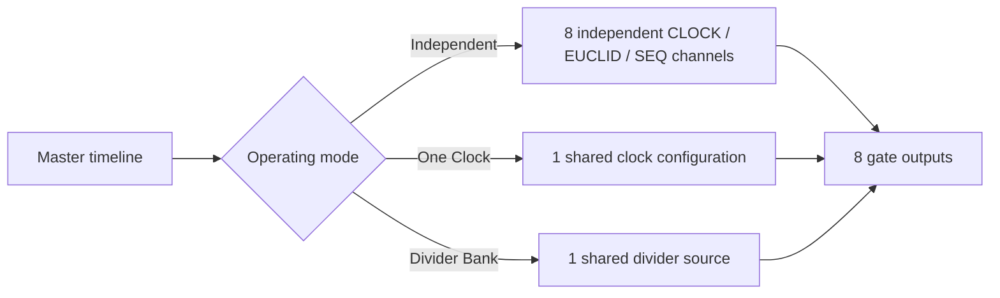
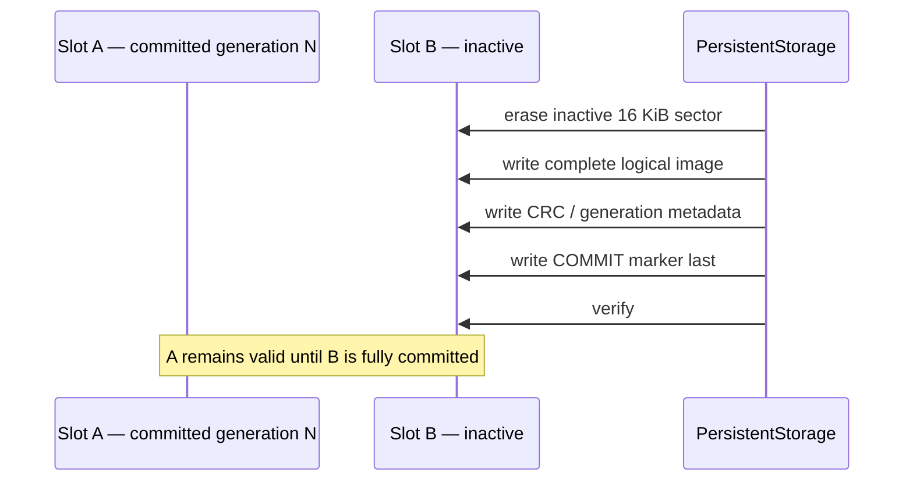
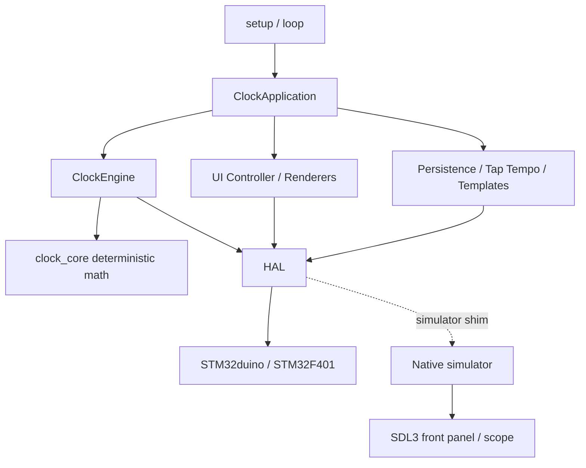

<!-- Author: Axel Napolitano | License: PolyForm-Noncommercial-1.0.0 -->

# CLOCK — Eurorack Clock by South Signal Lab

> **Eight-channel precision clock, rhythm and gate generator for Eurorack — STM32F401 firmware `0.19.0-alpha.62`.**

[](CHANGELOG.md)
[](CHANGELOG.md)
[](.github/workflows/ci.yml)
[](.github/workflows/release.yml)
[](docs/TEST_COVERAGE.md)
[](test/README.md)
[](platformio.ini)
[](platformio.ini)
[](platformio.ini)
[](docs/SIMULATOR.md)
[](docs/README.md)
[](LICENSE.md)
[](CITATION.cff)
[](codemeta.json)

**South Signal Lab CLOCK** is a DIY-focused eight-output Eurorack clock module built around the **STM32F401CCU6 Black Pill**. It combines a shared precision master timeline with independent Clock, Euclidean, and 64-step gate-sequencer channels, plus two global operating modes: **One Clock** and **Divider Bank**.

The firmware is intentionally engineered as a maintainable embedded system rather than a monolithic sketch: hardware access is isolated behind HAL, timing is independent from rendering, persistent state is power-loss tolerant, and the real production firmware runs unchanged inside the native desktop simulator.

> [!IMPORTANT]
> CLOCK is still an **alpha hardware/firmware project**. The current production model, UI, persistence, simulator, interrupt-driven encoder/SYNC/RST capture boundary, clock engine, dual SPI/I2C display HAL, tests, and documentation are implemented. Final comparator/PCB validation, timer Input Capture for maximum SYNC precision, and the final compare-event scheduler remain open hardware/real-time milestones.

## Contents

- [At a glance](#at-a-glance)
- [Operating modes](#operating-modes)
- [Timing model](#timing-model)
- [Controls and UI](#controls-and-ui)
- [External sync](#external-sync)
- [Persistence](#persistence)
- [Native simulator](#native-simulator)
- [Hardware target](#hardware-target)
- [Build and test](#build-and-test)
- [Architecture](#architecture)
- [Documentation](#documentation)
- [Project status](#project-status)
- [Citation and persistent identity](#citation-and-persistent-identity)
- [License](#license)

## At a glance

| Area | Current implementation |
| --- | --- |
| Outputs | 8 gate/clock outputs |
| MCU | STM32F401CCU6 Black Pill |
| Display | 128×64 SSD1306/SSD1315; SPI reference profile + bounded deferred I2C option |
| Main controls | Push encoder, PLAY/PAUSE, TAP, STOP/BACK |
| Channel modes | OFF, CLOCK, EUCLID, SEQ |
| Global modes | ONE CLOCK, DIVIDER BANK |
| Tempo | Factory 20–999 BPM; user-adjustable limits within 1–999 BPM |
| Clock source | INTERNAL, EXTERNAL, AUTO |
| Sequencer | 64 binary steps per output |
| Euclid | 1–64 steps, hits, rotation |
| Persistence | CURRENT + 8 named presets; CRC; schema migration; A/B Flash slots |
| Simulator | SDL3 interactive front panel + headless integration target |
| Scheduler | 20 kHz deterministic service scheduler, Q32 timeline |
| Language | C++17 |

CLOCK starts safely in **STOP** after every boot. Stored transport state is never allowed to auto-start outputs.

## Operating modes

### Independent

Every physical output is configured separately:

```text
OUT1  CLOCK
OUT2  CLOCK
OUT3  EUCLID
OUT4  SEQ
OUT5  OFF
OUT6  EUCLID
OUT7  SEQ
OUT8  CLOCK
```

Each active channel has its own rate, rational ratio, swing, probability, gate length, phase, reset policy, mute state, and mode-specific parameters while remaining anchored to the same deterministic master timeline.

### One Clock

One shared clock configuration drives all eight outputs. **Humanize exists only in One Clock** and applies small deterministic per-output timing offsets without moving the common restart/downbeat.

Humanize choices:

```text
OFF / 250 / 500 / 1000 / 2000 µs
```

When Humanize is active, a compact human pictogram appears in the performance header.

### Divider Bank

A shared master clock feeds eight fixed divisions. Divider families include powers of two, consecutive integers, and primes.



## Timing model

The production timing engine uses one monotonic Q32 master timeline. CLOCK, EUCLID, and SEQ are scheduled by the same 20 kHz hardware-timer path rather than by UI refresh or the foreground `loop()`. OLED work is explicitly lower priority; the detailed timing contract is documented in [`docs/TIMING.md`](docs/TIMING.md).

Core timing properties:

- 20 kHz scheduler service quantum: **50 µs**;
- fixed-point Q32 master accumulation — no floating-point clock accumulation;
- rational rate accumulation carries fractional remainder rather than truncating it;
- shared epoch/event serial keeps CLOCK, EUCLID, and SEQ aligned through live mode/rate changes;
- Swing alternates long/short intervals while preserving the pair duration;
- gate length is limited against the actual effective event interval to prevent swallowed edges;
- `GLOBAL` reset re-anchors a channel; `FREE` preserves its local cycle position;
- BPM changes do not implicitly reset phase or stop transport;
- channel edits reschedule only the affected channel unless the edited setting is genuinely global.

For pattern modes, `x1` is a **sixteenth-note grid**. A 16-step Euclidean or Sequencer pattern therefore spans one 4/4 bar at x1.

> [!NOTE]
> The current 20 kHz scheduler is intentionally treated as an alpha implementation boundary. Extremely fast derived rates are bounded by representable output timing. The planned final real-time backend is timer-compare/event driven; higher layers are already isolated from that replacement.

## Controls and UI

The UI is designed for the actual 128×64 one-bit OLED rather than as a miniature desktop interface.

| Control | Performance | Navigation / editor |
| --- | --- | --- |
| Encoder turn | Master BPM | Select / edit |
| Encoder short press | Channel overview | Select / confirm / toggle |
| Encoder long press | Open selected channel/global menu | Open highlighted channel/global menu |
| TAP + encoder press | Main Settings | — |
| TAP + encoder turn | Mode palette | Select mode while held |
| PLAY/PAUSE | Start / pause | Sequencer page forward |
| TAP | Tap Tempo | Sequencer page back |
| STOP/BACK | Stop | Back |

The Settings root is grouped by intent:

```text
SETTINGS
├─ GENERAL SETTINGS >
│  ├─ CLOCK >
│  ├─ SYNC >
│  └─ SCREENSAVER >
├─ CHANNEL SETTINGS >
├─ PRESETS >
├─ INFO >
│  ├─ NAME
│  ├─ VERSION
│  ├─ AUTHOR
│  ├─ LICENSES >
│  └─ UPDATES >
└─ RESET
```

Factory tempo limits are **20–999 BPM**. `MIN BPM` and `MAX BPM` are user settings; their technical range is 1–999 BPM. These bounds apply to manual tempo changes and Tap Tempo, not to External Sync.

The factory operating mode is **ONE CLOCK**. The six-function channel-mode palette is ordered **ONE CLOCK → DIVIDER → CLOCK → EUCLID → SEQUENCER → OFF**. `ALL MASTER` intentionally uses the same One Clock topology; the other factory templates switch explicitly to independent-channel operation.

Screensavers are named rather than numbered. Factory default is `CLOCK`:

- `CLOCK` — eight differently phased clock channels rendered as moving oscilloscope traces;
- `PLUG` — a damped plucked-string animation;
- `HEARTBEAT` — a pulsating heart;
- `ACID` — a gravity-influenced bouncing smiley whose spin changes on wall impacts;
- `FRACTAL` — progressively reveals one of several curated Barnsley-fern crops;
- `ORBIT` — animated orbit display;
- `OFF` — no animated screensaver.

The full interaction model is documented in the [User Guide](docs/USER_GUIDE.md).

## External sync

The domain and engine support:

- source: INTERNAL / EXTERNAL / AUTO;
- PPQN: 1 / 2 / 4 / 24;
- rising/falling edge policy;
- glitch-filter configuration;
- lock/loss policy: STOP / FREEWHEEL / INTERNAL;
- externally measured tempo and phase references;
- monotonic scheduler time with musical phase corrected separately.

The simulator can inject conditioned SYNC and RST edges into the production engine. SYNC verifies PPQN interpretation, phase alignment, tempo following, and source/loss behavior; RST verifies global phase reset without stopping transport. Both virtual inputs can be driven by SQUARE, SINE, or TRIANGLE sources reduced through an ideal `HI`/`LO` comparator model.

> [!WARNING]
> The firmware capture boundary is implemented as interrupt-driven conditioned HIGH/LOW inputs; SYNC/RST are not foreground-polled. The final PCB comparator implementation, pin routing, thresholds/hysteresis, and electrical HIL remain open. For maximum SYNC precision the final PCB should route SYNC to a timer Input Capture capable pin; GPIO EXTI timestamping remains the functional fallback.

## Persistence

CLOCK does not use external NVM and does not use STM32duino EEPROM emulation.

Two independent STM32F401 **16 KiB Flash sectors** provide A/B persistence:



Properties:

- logical image: currently 8 KiB;
- hard architectural maximum: **12 KiB**;
- minimum reserved headroom per slot: **4 KiB**;
- CURRENT autosave + 8 named user presets + four independent arcade Top-100 tables;
- field-by-field serialization rather than raw C++ structs;
- schema version + CRC-32 + value validation;
- schema-v3/v4 migration to the current format;
- complete previous generation survives an interrupted write before COMMIT;
- firmware upload is split around persistence sectors so normal updates do not erase user state;
- Flash commit is deferred while transport is PLAYING.

This layout leaves **224 KiB** of the STM32F401's Flash available to firmware.

## Native simulator

The simulator is a second hardware platform for the **real firmware**, not a reimplementation of the module UI.

It runs the same:

- `ClockApplication`;
- `ClockEngine`;
- debounce and encoder quadrature code;
- OLED framebuffer and renderers;
- 20 kHz scheduler callback;
- persistence image;
- screensavers and game;
- all channel modes.

Only STM32/Arduino-facing primitives are replaced by a host shim.

Interactive build:

```bash
cmake --preset simulator
cmake --build --preset simulator
python scripts/run_simulator.py
```

Headless CI/integration build:

```bash
cmake --preset simulator-headless
cmake --build --preset simulator-headless
ctest --preset simulator-headless
```

The developer oscilloscope provides eight gate traces, edge counts, pulse widths, transport-relative musical reference lines, zoom stages from **0.5 to 32 seconds**, and optional freeze-on-STOP. Its grid is derived from the unswung musical reference lattice rather than from arbitrary fixed milliseconds, making Swing, phase, and One Clock Humanize visually measurable.

Panel positions and mechanical sizes are configured in **millimetres** in [`sim/panel_layout.ini`](sim/panel_layout.ini). The simulator geometry models D6R buttons, TS/TRS Thonkiconn front geometry, 3 mm LEDs, and configurable front-panel artwork.

See [Simulator Guide](docs/SIMULATOR.md).

## Hardware target

Current controller: **STM32F401CCU6 Black Pill**.

### Controls and display

| Function | Pin |
| --- | --- |
| Encoder A / B | PA0 / PA1 |
| Encoder push | PB10 |
| PLAY/PAUSE | PB12 |
| TAP | PB13 |
| STOP/BACK | PB14 |
| OLED I2C SCL / SDA | PB6 / PB7 |
| OLED SPI SCK / MOSI / CS / D-C / RESET | PA5 / PA7 / PA4 / PB9 / PB15 |

### Outputs

The planned gate/clock electrical contract is **0 V LOW / nominal +5 V HIGH**. This is deliberate: +5 V is widely interoperable for Eurorack clock, trigger, gate, reset, Euclid, and sequencer use, while the planned 74HCT244 is itself a 5 V logic buffer and cannot provide a +10 V jack level. A +10 V option is therefore not part of the current hardware architecture.

| Output | GPIO |
| ---: | --- |
| 1 | PA2 |
| 2 | PA3 |
| 3 | PA8 |
| 4 | PA9 |
| 5 | PA10 |
| 6 | PB0 |
| 7 | PB1 |
| 8 | PB5 |
| 74HCT244 `/OE` | PB8 |

The output buffer is kept disabled during boot and whichever compile-time Easter egg is selected, then enabled only after all logical gate sources are known LOW.

## Build and test

Firmware (SPI SSD1306 remains the reference/default profile):

```bash
pio run
pio run -e blackpill_f401cc_spi_ssd1315
pio run -e blackpill_f401cc_i2c_ssd1306
pio run -e blackpill_f401cc_i2c_ssd1315
```

Native deterministic core:

```bash
pio test -e native
```

Full host matrix and coverage:

```bash
python scripts/run_host_tests.py --skip-sanitizers
python scripts/run_host_tests.py --sanitizers-only
```

Hard CI gates:

| Metric | Gate | Current alpha.62 baseline |
| --- | ---: | ---: |
| Executable lines | ≥95% | 95.99% |
| Functions | ≥95% | 98.31% |
| Source decisions | ≥90% | 90.04% |
| Host warnings | 0 | `-Werror` |
| ASan | clean | clean |
| UBSan | clean | clean |

GitHub Actions additionally build the STM32F401 I2C/SPI targets and the native simulator on Linux, Windows, and macOS. Tagged releases remain source-only while the STM32duino static-link compliance packaging remains deliberately unresolved.

See [Testing](test/README.md), [Coverage](docs/TEST_COVERAGE.md), and [HIL Test Plan](docs/HIL_TEST_PLAN.md).

## Architecture



The governing rule is simple:

> **Hardware belongs in HAL. Musical behavior belongs above HAL. UI may configure and observe timing, but it never produces timing.**

Additional repository rules are enforced by [`scripts/check_architecture.py`](scripts/check_architecture.py): hardware API boundaries, centralized UI strings, source size limits, colocated headers, file metadata, and Doxygen API briefs. [`scripts/check_documentation.py`](scripts/check_documentation.py) separately validates local documentation links, Markdown fences, README footers, manual SVG accessibility metadata, and current-version identity.

See [Architecture](docs/ARCHITECTURE.md).

## Documentation

The documentation is organized by audience rather than by file type:

| Need | Start here |
| --- | --- |
| Use the module | [User Guide](docs/USER_GUIDE.md) |
| Understand all docs | [Documentation Index](docs/README.md) |
| Run the simulator | [Simulator Guide](docs/SIMULATOR.md) |
| Build / develop | [Developer Workstation Guide](docs/DEVELOPER_README.md) |
| Understand architecture | [Architecture](docs/ARCHITECTURE.md) |
| Change factory/build settings | [Configuration](docs/CONFIGURATION.md) |
| Understand tests | [Test Coverage](docs/TEST_COVERAGE.md) |
| Qualify hardware | [HIL Test Plan](docs/HIL_TEST_PLAN.md) |
| Review dependencies / licences | [Dependencies](docs/DEPENDENCIES.md) / [Licensing](docs/LICENSING.md) |
| Prepare the future manual | [Manual Workspace](docs/manual/README.md) |
| Follow documentation conventions | [Documentation Style](docs/DOCUMENTATION_STYLE.md) |
| Contribute code or documentation | [Contributing](CONTRIBUTING.md) |
| Review vulnerability reporting | [Security Policy](.github/SECURITY.md) |
| See release history | [Changelog](CHANGELOG.md) |

GitHub-native Mermaid diagrams are used for architecture and flows; reusable manual illustrations are maintained as standalone SVG under [`docs/manual/assets/`](docs/manual/assets/).

## Project status

Implemented and under automated verification:

- complete eight-channel state model;
- Independent / One Clock / Divider Bank operating topologies;
- CLOCK / EUCLID / 64-step SEQ;
- Humanize restricted to One Clock;
- user tempo boundaries and Tap Tempo;
- Q32 timing, swing, phase, probability, reset semantics;
- safe boot and output-buffer control;
- A/B internal-Flash persistence with presets and migration;
- OLED UI, settings, screensavers, and configurable boot Easter eggs;
- interactive/headless native simulator;
- host coverage and sanitizer matrix.

Still deliberately open:

- final External Sync comparator/PCB validation and timer Input Capture routing;
- final lock/jitter estimator on real input hardware;
- final compare-event scheduler replacing the 20 kHz service ISR;
- final PCB-level SPI **and I2C** OLED signal-integrity/timing validation;
- final end-user manual sign-off and hardware photography.

## Citation and persistent identity

The short product name remains **CLOCK**. For search, citation, archival metadata, and other contexts where the generic word “clock” is ambiguous, the canonical project identity is **South Signal Lab CLOCK**.

Machine-readable metadata is maintained in two root-level files:

- [`CITATION.cff`](CITATION.cff) — GitHub-native citation metadata and the metadata source intended for future Zenodo archiving;
- [`codemeta.json`](codemeta.json) — CodeMeta/JSON-LD software metadata for software catalogs, indexers, and automated discovery.

The software author and copyright holder is **Axel Napolitano**; **South Signal Lab** is the project/creator brand used as publisher/producer identity. The software license identifier is `PolyForm-Noncommercial-1.0.0`.

No DOI is claimed for this alpha release. A DOI will only be added after an actual archive has minted it. GitHub renders a **Cite this repository** action automatically when `CITATION.cff` is present on the default branch. Future Zenodo integration can mint persistent DOIs for selected published releases without introducing a parallel `.zenodo.json` metadata source.

See [Project Identity and Citation](docs/PROJECT_IDENTITY.md) for the metadata and archival policy.

## License

CLOCK project software is licensed under the **PolyForm Noncommercial License 1.0.0** (`PolyForm-Noncommercial-1.0.0`). Commercial use is not granted by this licence.

Third-party framework/font components retain their upstream licences. See [`LICENSE.md`](LICENSE.md), [`THIRD_PARTY_NOTICES.md`](THIRD_PARTY_NOTICES.md), and [`third_party/`](third_party/).

<h6 align="center">From Munich with &#9829;</h6>
