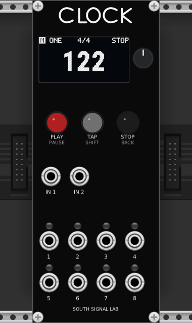

<!-- Author: Axel Napolitano | License: PolyForm-Noncommercial-1.0.0 -->

# South Signal Lab CLOCK for VCV Rack

> **Experimental Trial-First port — post-1.1.0 development**

The VCV Rack version exists so you can try **South Signal Lab CLOCK** before building the Eurorack hardware. It is not a separate clock implementation: the plugin compiles the production CLOCK application, timing engine, UI, persistence and 128×64 renderer, then adapts only the Rack-facing controls, ports, sample timing and patch storage.

  

## What you get

- the normal CLOCK boot sequence and OLED UI;
- PLAY/PAUSE, TAP/SHIFT, STOP/BACK and the push encoder;
- two digital inputs, shown on the panel as **IN 1** and **IN 2**;
- eight **0/+5 V** gate/clock outputs numbered **1–8**;
- One Clock, Independent and Divider Bank operation;
- Clock, Euclid and Sequencer channel functions;
- Grooves, Custom Grooves, Pre-Count, presets and the normal CLOCK settings model;
- CLOCK persistence stored inside the Rack patch.

The current experimental host layer supports **one active CLOCK instance per Rack process**. Additional instances deliberately stay disabled rather than sharing process-global simulator/HAL state unsafely.

## Mouse controls

The panel follows the hardware interaction model as closely as Rack allows.

| VCV action | CLOCK action |
| --- | --- |
| Click PLAY | PLAY / PAUSE |
| Click TAP | TAP |
| Click STOP | STOP / BACK |
| Mouse wheel over encoder | Encoder turn |
| Hold left mouse button on encoder and drag vertically | Encoder turn |
| Stationary short click on encoder | Encoder short press |
| Stationary hold on encoder | Encoder long press |

The encoder classifies one mouse-down as either rotation or push. A drag cannot also fire a click.

## Two-control gestures and keyboard shortcuts

Rack has only one mouse pointer, so keyboard input acts as the second hand for hardware-style button combinations. **Hover the mouse over the CLOCK module** before using these keys.

| Key | CLOCK control |
| --- | --- |
| `Shift` held | Hold TAP / SHIFT |
| `Enter` or `E` | Encoder push |
| `Up` / `Down` | Encoder turn |
| `P` | PLAY / PAUSE |
| `T` | TAP |
| `S` or `Backspace` | STOP / BACK |

This makes the important hardware chords practical in Rack:

- `Shift` + `Enter` = **TAP/SHIFT + encoder push**;
- hold `Shift` while pressing `Up`/`Down` = **TAP/SHIFT + encoder turn**.

Mouse and keyboard can be mixed. For example, hold `Shift` and use the mouse wheel over the encoder.

## General Settings from the Rack context menu

Right-click the module and choose **General Settings...**. This opens CLOCK's existing production **GENERAL SETTINGS** page on the OLED. It does not create a Rack-only configuration panel or duplicate CLOCK state.

The page is the same settings hierarchy used by the hardware/firmware UI: **MODE & CLOCK**, **INPUTS**, **SCREENSAVER**, **DIAGNOSTICS**, and **HARDWARE**. Use the normal encoder and BACK controls from there.

## Inputs and outputs

The physical Rev-1 hardware names its two comparator paths SYNC and RST, but firmware 1.1.0 treats them as configurable digital inputs. The VCV panel therefore uses the neutral labels **IN 1** and **IN 2** while Rack's port metadata retains the SYNC/RST reference names.

Outputs **1–8** follow the instantaneous production gate state. Panel LEDs are visual indicators only; they do not stretch the actual gate voltage.

## Installing an experimental build

CLOCK uses Rack 2 plugin packages (`.vcvplugin`). Put the package in the Rack user plugin folder for your operating system, then restart Rack. If a locally built plugin does not appear, inspect Rack's `log.txt` from **Help → Open user folder**.

For source builds and Rack SDK setup, use the developer guide: [`docs/VCV_DEVELOPMENT.md`](docs/VCV_DEVELOPMENT.md).

## Current boundaries

The VCV port is a software trial of CLOCK's digital behavior. It does **not** model the analogue LM393 input stage, real Eurorack electrical tolerances, jack loading, propagation delay or physical output jitter. Those remain hardware/HIL topics.

The canonical project documentation remains [`README.md`](README.md) and [`docs/USER_GUIDE.md`](docs/USER_GUIDE.md).

<h6 align="center">From Munich with &#9829;</h6>
