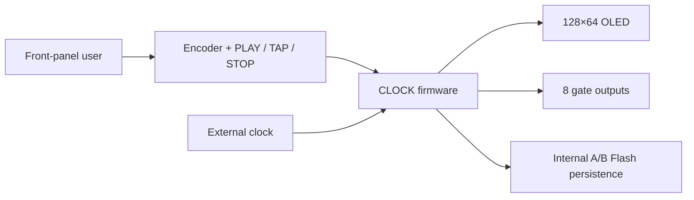
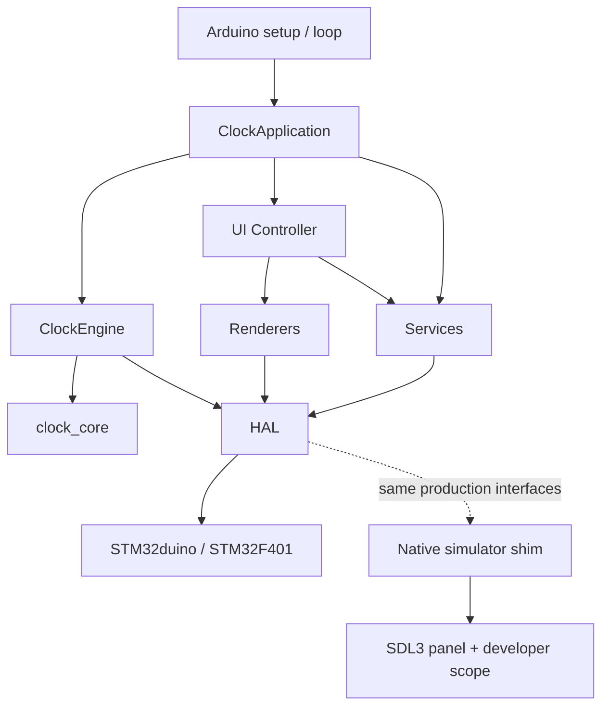
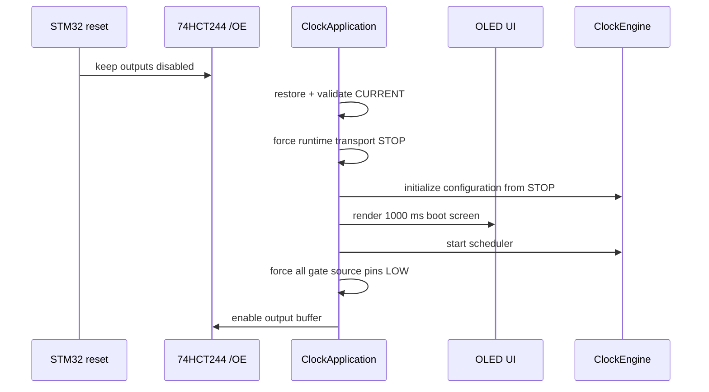
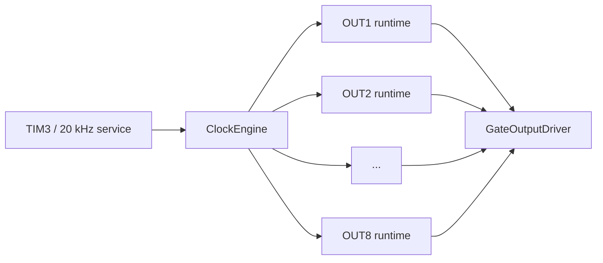
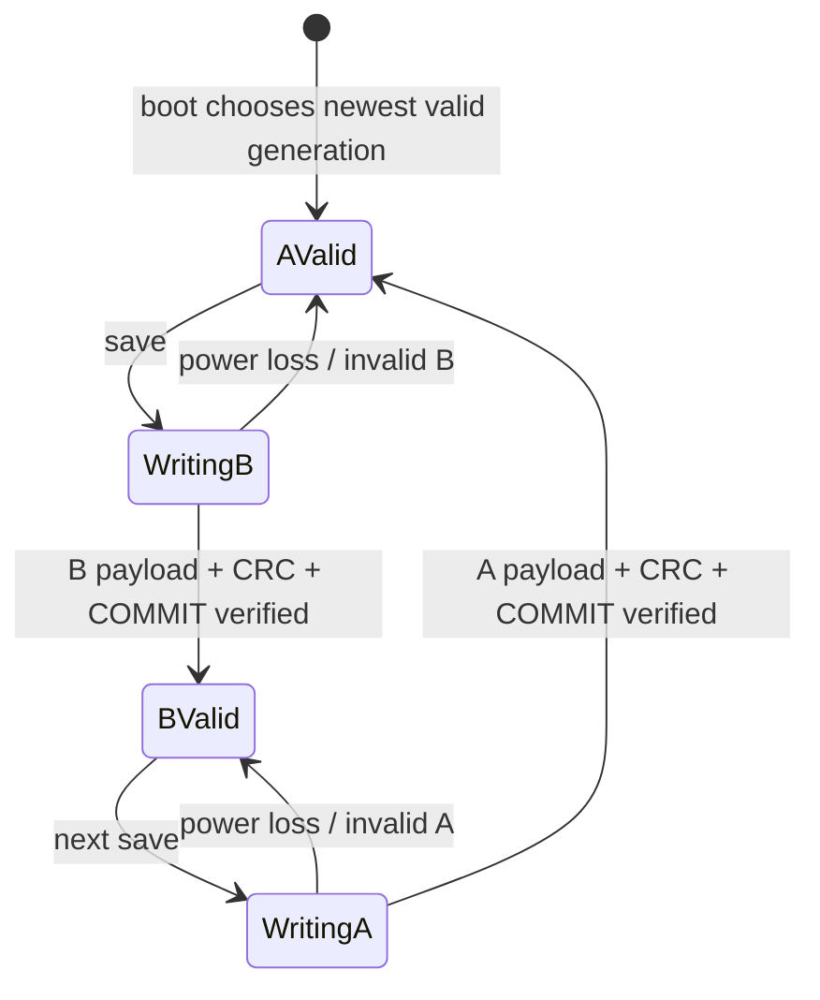
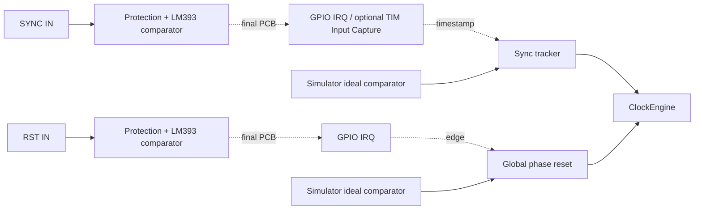
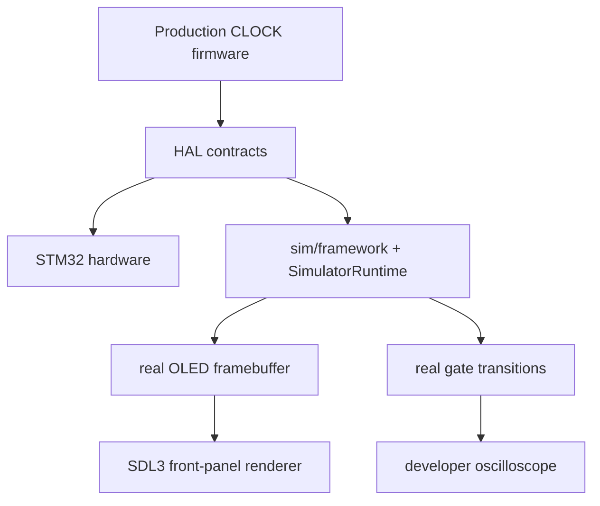

<!-- Author: Axel Napolitano | License: PolyForm-Noncommercial-1.0.0 -->

# South Signal Lab CLOCK Firmware Architecture

> **Core rule:** Hardware belongs in HAL. Musical behavior belongs above HAL. UI may configure and observe timing, but it never produces timing.

CLOCK is organized as a layered embedded application with one production codebase serving both the STM32F401 target and the native simulator. The architecture is intentionally conservative: hardware dependencies are narrow, real-time code has explicit constraints, and persistence/UI concerns do not leak into the scheduler.

## System context



## Product-level I/O boundary

CLOCK Hardware Rev 1 is architected as a digital event instrument, not as a mixed-signal modulation generator. The eight output channels are gate/trigger outputs; the only analog-conditioned inputs in scope are SYNC and RST. General parameter-CV inputs, analog modulation outputs, and an analog modulation matrix are intentionally outside the V1 hardware contract.

This matters architecturally: the timing core should not acquire dependencies on a future DAC/ADC subsystem simply to mirror feature sets from modulation-centric clock products. Internal cross-channel behavior can evolve post-1.0 as deterministic event processing while the HAL boundary remains digital. The product rationale and cost/buildability trade-off are recorded in [`ROADMAP.md`](ROADMAP.md).

## Layer model



The practical dependency direction is always **downward**. HAL must not know about UI, menu state, presets, Euclidean patterns, or musical modes.

## Source layout

```text
src/
├── config.h          compile-time firmware policy
├── defaults.h        editable factory user state
├── pin_map.h         physical MCU/peripheral wiring
├── ui_text.h/.cpp    static user-visible text catalogue
├── version.h         firmware version source of truth
├── main.cpp          Arduino composition entry
├── app/              application lifecycle / composition root
├── domain/           persistent and runtime domain types
├── engine/           real-time scheduler and output timing
├── hal/              hardware/framework boundary
├── services/         persistence, Tap Tempo, templates
└── ui/               navigation, editing, rendering

lib/clock_core/src/   deterministic hardware-independent timing/pattern math
sim/                  native simulator platform and SDL frontend
test/                 deterministic core + complete host-firmware tests
scripts/              architecture, coverage, release, flash tooling
ld/                   STM32F401 Flash/linker layout
```

Headers are colocated with their implementation files. There is no global `include/` tree.

## Composition root

`ClockApplication` owns startup order and connects HAL, engine, services, and UI. `src/main.cpp` remains a minimal Arduino adapter.

Boot safety is part of architecture, not UI policy:



A persisted PLAY value is metadata only; it is never authorization to start outputs during boot.

## Domain model

`src/domain/` holds musical state and labels. It must remain independent from Arduino/STM32 framework APIs.

The top-level `ClockState` contains:

- master tempo and meter;
- user MIN/MAX BPM limits;
- clock source and External Sync settings;
- operating topology;
- One Clock shared settings and Humanize;
- Divider Bank settings;
- eight channel configurations;
- display/screensaver preferences;
- persisted UI-relevant configuration where appropriate.

Transient scheduler phase is not serialized as durable musical state.

## Deterministic core

`lib/clock_core` contains pure deterministic math suitable for exhaustive/property tests:

- Q32 timing helpers;
- reduced rational rates;
- Euclidean hit generation;
- sequencer step operations;
- swing/rate invariants;
- probability helpers that can be driven deterministically in tests.

The core owns no display, GPIO, Flash, or wall-clock operations.

## Real-time engine

`ClockEngine` owns the master timeline and eight output runtimes.

### Current scheduler

TIM3 services the engine at 20 kHz (50 µs). The scheduler is an alpha backend, but the surrounding interfaces are deliberately designed so a future timer-compare/event backend can replace it without changing the domain/UI model.



### ISR constraints

Real-time scheduler code must remain:

- allocation-free;
- non-blocking;
- bounded;
- integer/fixed-point for clock accumulation;
- free of OLED/UI rendering;
- free of persistence writes;
- free of logging/formatting.

Configuration changes are copied across an interrupt-safe boundary.

### Shared epoch and event serial

CLOCK, EUCLID, and SEQ do not maintain unrelated notions of musical time. GLOBAL schedules derive their event position and pattern step from one common epoch/event serial. This is what keeps mode changes, rate edits, Swing parity, and pattern-length edits phase coherent.

Humanize is applied only when `OperatingMode::UnifiedClock` (user-visible **One Clock**) is active. It offsets output events without changing the common downbeat or the reference timeline.

## HAL

HAL is the only production implementation layer allowed to call STM32duino hardware APIs.

| Component | Responsibility |
| --- | --- |
| `ControlPanel` | active-low inputs, debounce, quadrature decoding |
| `GateOutputDriver` | eight gate/LED source signals and 74HCT244 `/OE`; planned jack domain is nominal 0/+5 V |
| `OledDisplay` | 1-bit framebuffer, primitives, fonts, SSD1306/SSD1315 protocol |
| `PeriodicTimer` | current scheduler timer adapter |
| `PersistentStorage` | project-owned A/B internal-Flash persistence |
| `SystemClock` | non-real-time monotonic milliseconds/delay |
| `InterruptLock` | short application/ISR critical sections |

`pin_map.h` is the only non-HAL file allowed to include MCU pin definitions directly because it is a declarative wiring map.

The output architecture deliberately targets nominal **+5 V HIGH**, not +10 V. The 74HCT244 is a 5 V-domain buffer; a future +10 V requirement would cross the HAL/PCB boundary and require a different physical output stage rather than a firmware setting.

## Display transport

The UI talks to one `OledDisplay` API. I2C/SPI is selected at build time and does not appear in renderer logic.

```cpp
config::DisplayTransport::I2c
config::DisplayTransport::Spi
```

The default PlatformIO/reference profile uses SPI. I2C is a fully supported procurement-compatible option for SSD1306/SSD1315 modules, not merely a regression target.

The display driver maintains a 128×64 1-bit framebuffer, but transport scheduling deliberately differs:

- **SPI:** `present()` immediately transfers dirty pages.
- **I2C:** `present()` publishes the newest frame only; `service()` performs at most one bounded transaction per foreground pass, with at most 24 display-data bytes per transaction. A newer frame may replace an unfinished stale frame.

The 20 kHz scheduler has higher interrupt priority than EXTI and I2C, so display service is never the musical timing owner. See [`TIMING.md`](TIMING.md) for the explicit timing contract.

## UI architecture

The UI is split by responsibility:

- `UiController` — input/gesture dispatch and screen transitions;
- `SettingsEditor` — validated state mutation;
- `menu_model` — settings rows and localized values;
- `UiRenderer` — top-level dispatch;
- `PerformanceRenderer` — performance screen;
- `ChannelNavigationRenderer` — channel overview, mode palette, sequencer editor;
- `SettingsRenderer` — settings, preset lists, confirmation/name entry;
- `ScreensaverRenderer` — STOP-mode display protection/animation.

Static firmware strings live in `ui_text.h`. Renderers must not embed user-facing prose.

## Persistence

CLOCK uses two independent 16 KiB STM32F401 Flash sectors. STM32duino EEPROM emulation is not used.



Layout:

```text
0x08000000  Sector 0   16 KiB   firmware
0x08004000  Sector 1   16 KiB   persistence A
0x08008000  Sector 2   16 KiB   persistence B
0x0800C000  Sector 3   16 KiB   firmware
0x08010000  Sector 4   64 KiB   firmware
0x08020000  Sector 5  128 KiB   firmware
```

Firmware budget: **224 KiB**. Persistence: **2 × 16 KiB**. Logical storage is 8 KiB with a hard 12 KiB future ceiling. The upper half currently hosts compact independent arcade Top-100 tables while the lower 4 KiB retains the established settings/preset and legacy-score layout.

`PersistentStateService` serializes fields explicitly, validates ranges, checks CRC, and migrates supported prior schemas. The storage layer writes the inactive slot and programs COMMIT last.

The DFU upload helper emits separated firmware regions so ordinary firmware updates do not overwrite sectors 1/2.

## External SYNC / RST boundary

The engine-side sync/global-reset semantics and the interrupt-driven digital capture boundary are implemented and simulator/host-testable. The analog comparator frontend and final STM32 pin routing remain deliberately separate until PCB routing is frozen:



The current firmware timestamps conditioned SYNC/RST levels from GPIO interrupts and queues them for deterministic scheduler-side consumption; foreground polling is not used. This EXTI path is the V1 baseline and must be measured on representative hardware. Timer Input Capture is an optional escalation if those measurements do not meet the V1 timing requirement; it is not assumed to be necessary before the data exists. RST does not require period-measurement precision and remains naturally edge/level interrupt driven. The simulator's SQUARE/SINE/TRIANGLE generators do not emulate LM393 electrical characteristics.

## Native simulator architecture

The simulator compiles production application/engine/UI/services/HAL-facing code and substitutes only the MCU/framework layer.



The SDL frontend must never implement its own musical scheduler or duplicate UI state.

## Configuration ownership

| File | Owns |
| --- | --- |
| `src/config.h` | compile-time runtime/hardware-independent policy |
| `src/defaults.h` | user-visible factory defaults |
| `src/pin_map.h` | physical pin assignment |
| `src/ui_text.h` | static UI strings |
| `src/version.h` | firmware version |
| `sim/panel_layout.ini` | simulator-only mechanical/front-panel geometry |

See [`CONFIGURATION.md`](CONFIGURATION.md).

## Documentation and API comments

Public C++ declarations are documented in their headers with Doxygen-compatible comments. The required convention is:

```cpp
/**
 * @brief Applies one external clock phase reference.
 * @param bpmMilli Filtered external tempo in milli-BPM.
 * @param pulsesPerQuarterNote Number of input pulses per quarter note.
 */
void acceptExternalPulse(std::uint32_t bpmMilli, std::uint8_t pulsesPerQuarterNote);
```

Implementation files avoid repeating the same API prose. They document non-obvious invariants and algorithms close to the code instead.

## Automated architecture checks

`scripts/check_architecture.py` rejects:

- framework hardware APIs outside HAL/pin mapping;
- third-party PlatformIO `lib_deps` without an explicit architecture decision;
- static UI strings outside `ui_text.h`;
- missing C++ file metadata;
- missing Doxygen file `@brief` metadata;
- undocumented public/function declarations where the documented-header policy applies;
- non-colocated implementation headers;
- executable header-only logic outside explicit simulator-framework exceptions;
- oversized `src/main.cpp` and implementation units.

The architecture policy is a CI gate, not an advisory checklist.
