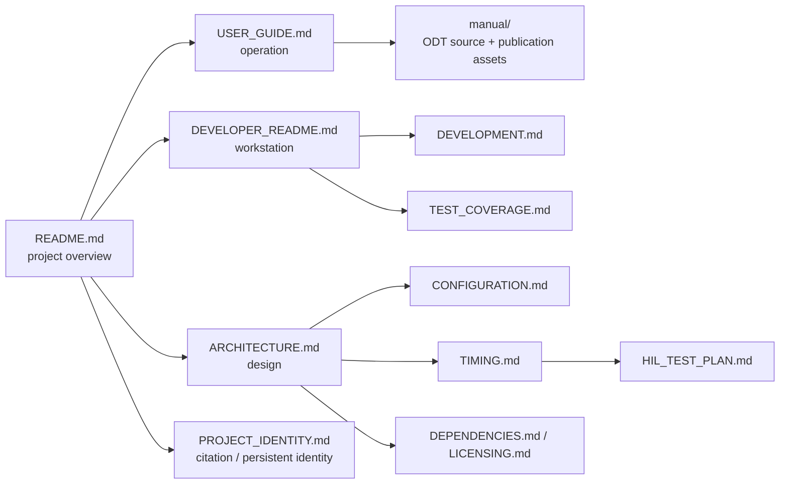

<!-- Author: Axel Napolitano | License: PolyForm-Noncommercial-1.0.0 -->

# South Signal Lab CLOCK Documentation

This directory is the documentation entry point for CLOCK. Documents are grouped by task and audience; the root [`README.md`](../README.md) remains the concise project landing page.

## Start here

| I want to… | Document |
| --- | --- |
| learn the module as a musician | [`USER_GUIDE.md`](USER_GUIDE.md) |
| run or configure the native simulator | [`SIMULATOR.md`](SIMULATOR.md) |
| understand the firmware architecture | [`ARCHITECTURE.md`](ARCHITECTURE.md) |
| understand timing and real-time/display isolation | [`TIMING.md`](TIMING.md) |
| set up a development workstation | [`DEVELOPER_README.md`](DEVELOPER_README.md) |
| understand the day-to-day development workflow | [`DEVELOPMENT.md`](DEVELOPMENT.md) |
| change compile-time or factory settings | [`CONFIGURATION.md`](CONFIGURATION.md) |
| understand automated test coverage | [`TEST_COVERAGE.md`](TEST_COVERAGE.md) |
| validate real hardware | [`HIL_TEST_PLAN.md`](HIL_TEST_PLAN.md) |
| audit dependencies | [`DEPENDENCIES.md`](DEPENDENCIES.md) |
| understand release/licensing constraints | [`LICENSING.md`](LICENSING.md) |
| understand citation, DOI, and project identity | [`PROJECT_IDENTITY.md`](PROJECT_IDENTITY.md) |
| maintain or publish the end-user manual | [`manual/README.md`](manual/README.md) |
| write or review repository documentation | [`DOCUMENTATION_STYLE.md`](DOCUMENTATION_STYLE.md) |
| contribute to CLOCK | [`../CONTRIBUTING.md`](../CONTRIBUTING.md) |
| review security reporting | [`../.github/SECURITY.md`](../.github/SECURITY.md) |

## Documentation model

## Documentation rules

CLOCK documentation follows a few explicit rules:

1. **US English** is the canonical repository language.
2. User-visible behavior is described from the actual production implementation, not from intended behavior.
3. Prototype limitations are called out with GitHub admonitions rather than hidden in prose.
4. GitHub-native Mermaid is preferred for architecture and software-flow diagrams.
5. Reusable manual artwork is kept as SVG in [`manual/assets/`](manual/assets/) so it can be reused in Markdown, PDF, or future layout sources without raster degradation.
6. OLED screenshots must come from the production renderer/framebuffer and use nearest-neighbor enlargement.
7. Mechanical drawings must distinguish **conceptual/manual artwork** from manufacturing drawings.
8. Source API documentation is Doxygen-compatible; public declarations carry a concise `@brief` plus parameters/return semantics where relevant.
9. Every README-style document ends with the same project footer.

> [!IMPORTANT]
> Documentation must not turn planned hardware into an implemented feature. The interrupt-driven digital SYNC/RST firmware boundary exists; final comparator circuitry, PCB pin routing, timer Input Capture precision, and electrical HIL remain open until measured on representative hardware.

## Manual assets

The SVGs in [`manual/assets/`](manual/assets/) are deliberately source-controlled plain SVG rather than embedded binary artwork. Current prepared illustrations:

- [`front-panel-anatomy.svg`](manual/assets/front-panel-anatomy.svg)
- [`operating-modes.svg`](manual/assets/operating-modes.svg)
- [`timing-swing-phase.svg`](manual/assets/timing-swing-phase.svg)
- [`external-sync-flow.svg`](manual/assets/external-sync-flow.svg)
- [`persistence-ab.svg`](manual/assets/persistence-ab.svg)
- [`simulator-scope.svg`](manual/assets/simulator-scope.svg)

<h6 align="center">From Munich with &#9829;</h6>
