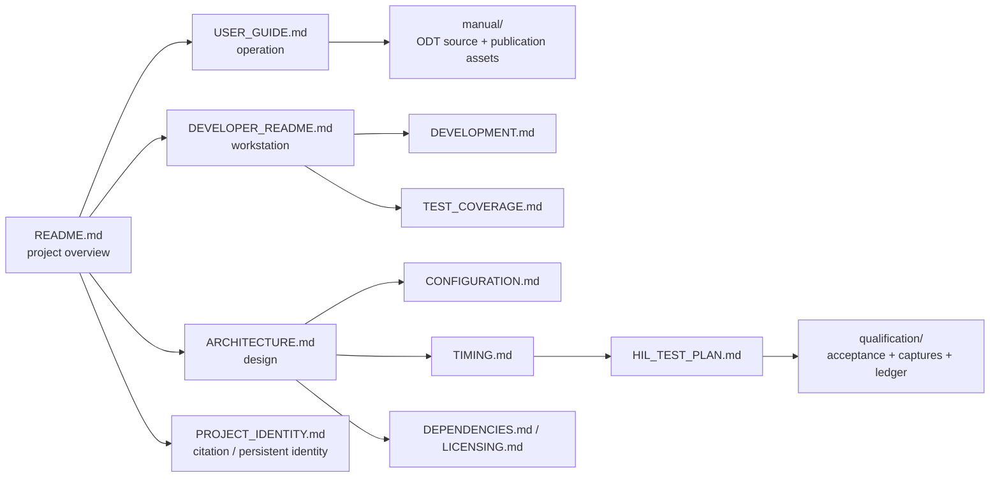

<!-- Author: Axel Napolitano | License: PolyForm-Noncommercial-1.0.0 -->

# South Signal Lab CLOCK Documentation

This directory is the documentation entry point for CLOCK. Documents are grouped by task and audience; the root [`README.md`](../README.md) is the project landing page, while [`USER_GUIDE.md`](USER_GUIDE.md) is the canonical GitHub-readable operating reference.

## Start here

| I want to… | Document |
| --- | --- |
| learn the module as a musician | [`USER_GUIDE.md`](USER_GUIDE.md) |
| run or configure the native simulator | [`SIMULATOR.md`](SIMULATOR.md) |
| understand the firmware architecture | [`ARCHITECTURE.md`](ARCHITECTURE.md) |
| understand timing and real-time/display isolation | [`TIMING.md`](TIMING.md) |
| set up a development workstation | [`DEVELOPER_README.md`](DEVELOPER_README.md) |
| understand the day-to-day development workflow | [`DEVELOPMENT.md`](DEVELOPMENT.md) |
| change compile-time or factory settings | [`CONFIGURATION.md`](CONFIGURATION.md) |
| understand automated test coverage | [`TEST_COVERAGE.md`](TEST_COVERAGE.md) |
| validate real hardware | [`HIL_TEST_PLAN.md`](HIL_TEST_PLAN.md) and [`qualification/`](qualification/README.md) |
| audit dependencies | [`DEPENDENCIES.md`](DEPENDENCIES.md) |
| understand release/licensing constraints | [`LICENSING.md`](LICENSING.md) |
| understand citation, DOI, and project identity | [`PROJECT_IDENTITY.md`](PROJECT_IDENTITY.md) |
| maintain or publish the end-user manual | [`manual/README.md`](manual/README.md) |
| write or review repository documentation | [`DOCUMENTATION_STYLE.md`](DOCUMENTATION_STYLE.md) |
| contribute to CLOCK | [`../CONTRIBUTING.md`](../CONTRIBUTING.md) |
| review security reporting | [`../.github/SECURITY.md`](../.github/SECURITY.md) |

## Documentation model

## Documentation rules

CLOCK documentation follows a few explicit rules:

1. **US English** is the canonical repository language.
2. User-visible behavior is described from the actual production implementation, not from intended behavior.
3. Prototype limitations are called out with GitHub admonitions rather than hidden in prose.
4. GitHub-native Mermaid is preferred for architecture and software-flow diagrams.
5. The maintained typeset manual lives in [`manual/clock-user-manual.odt`](manual/clock-user-manual.odt); reusable artwork stays as SVG in [`manual/assets/`](manual/assets/) so it can be reused without raster degradation. The numbered front-panel drawing is generated from the simulator layout and must not be hand-positioned independently.
6. OLED screenshots must come from the production renderer/framebuffer and use nearest-neighbor enlargement. Every screenshot needs meaningful alt text or an adjacent caption that tells the reader what state is visible and why it matters.
7. Mechanical drawings must distinguish **conceptual/manual artwork** from manufacturing drawings.
8. Source API documentation is Doxygen-compatible; public declarations carry a concise `@brief` plus parameters/return semantics where relevant.
9. Every README-style document ends with the same project footer.

> [!IMPORTANT]
> Documentation must not turn planned hardware into an implemented feature. The interrupt-driven digital SYNC/RST firmware boundary exists; final comparator circuitry, PCB pin routing, external-SYNC capture latency/jitter, and electrical HIL remain open until measured on representative hardware. Timer Input Capture is an escalation path, not a prerelease requirement by itself.

## Manual assets

The SVGs in [`manual/assets/`](manual/assets/) are deliberately source-controlled plain SVG rather than embedded binary artwork. Current prepared illustrations:

- [`front-panel-anatomy.svg`](manual/assets/front-panel-anatomy.svg) — numbered cobalt-blue front-panel key generated from `sim/panel_layout.ini`
- [`operating-modes.svg`](manual/assets/operating-modes.svg)
- [`timing-swing-phase.svg`](manual/assets/timing-swing-phase.svg)
- [`external-sync-flow.svg`](manual/assets/external-sync-flow.svg)
- [`persistence-ab.svg`](manual/assets/persistence-ab.svg)
- [`simulator-scope.svg`](manual/assets/simulator-scope.svg)

- [`ROADMAP.md`](ROADMAP.md) - V1 feature freeze and post-1.0 plan.
- [`V1_FORWARD_COMPATIBILITY.md`](V1_FORWARD_COMPATIBILITY.md) - V1 migration constraints.
- [`qualification/V1_ACCEPTANCE.md`](qualification/V1_ACCEPTANCE.md) - objective physical timing acceptance criteria.
- [`qualification/V1_BENCH_MATRIX.md`](qualification/V1_BENCH_MATRIX.md) - repeatable V1 bench configurations.
- [`qualification/HIL_CAPTURE_FORMAT.md`](qualification/HIL_CAPTURE_FORMAT.md) - normalized edge-capture format and analyzer workflow.
- [`qualification/v1_qualification.json`](qualification/v1_qualification.json) - machine-readable physical qualification ledger.

<h6 align="center">From Munich with &#9829;</h6>
