<!-- Author: Axel Napolitano | License: PolyForm-Noncommercial-1.0.0 -->

# South Signal Lab CLOCK Roadmap

This roadmap separates the first stable DIY release from later musical expansion. Version 1.0 is not defined by exhausting every feature idea. It is defined by a hardware/firmware/documentation combination that can be built, supported, reproduced, and used without known release-blocking software defects.

## Master roadmap

```mermaid
flowchart LR
    B["NOW<br/>0.19.0-beta.x<br/>V1 qualification"] --> RC["1.0.0-rc.x<br/>Release candidate"] --> V1["1.0.0<br/>Stable V1"]
    V1 --> G["1.1.x<br/>Swing 2.0<br/>Groove Engine"]
    G --> S["1.2.x<br/>Sequencer 2.0"]
    S --> E["1.3.x<br/>Euclid Auto-Fill<br/>Conditions"]
    E --> R["1.4.x<br/>Ratchet / Burst"]
    R --> N["1.5.x<br/>Structured Random<br/>Hard HIL gate"]
    N --> I["1.6.x<br/>Channel Interaction<br/>Utility events"]
    I --> P["1.7.x<br/>Scenes<br/>Phase tools"]
    V1 -. separate track .-> VCV["VCV Rack<br/>Reference port"]
    P -. research .-> X["Later<br/>Groove Learn · Elastic Sync<br/>Phase Drift · Euclid Morph"]

    classDef current fill:#0B4FC0,color:#ffffff,stroke:#062F75,stroke-width:2px;
    classDef stable fill:#197A5A,color:#ffffff,stroke:#0B513A,stroke-width:2px;
    classDef music fill:#EAF0FF,color:#12213A,stroke:#0B4FC0,stroke-width:1.5px;
    classDef gate fill:#F4E8C1,color:#2A2416,stroke:#9D771B,stroke-width:1.5px;
    classDef virtual fill:#EEE7F7,color:#221832,stroke:#74509A,stroke-width:1.5px;
    classDef research fill:#F2F2F2,color:#222222,stroke:#777777,stroke-dasharray: 4 3;

    class B current;
    class V1 stable;
    class RC,G,S,E,R,I,P music;
    class N gate;
    class VCV virtual;
    class X research;
```

**Reading the diagram:** the main firmware line stays deliberately narrow. `1.0.0` stabilizes the product that already exists; `1.1` through `1.4` deepen musical timing and gate behavior; `1.5` adds structured generative behavior and is also the point where the physical HIL ledger becomes a hard release gate. VCV Rack is a separate implementation track, not another firmware milestone.

## Product boundary

CLOCK is deliberately a **digital timing, gate, and trigger instrument**. Hardware revision 1 does not add analog CV/modulation outputs or a general-purpose CV modulation matrix, and it does not add general parameter-CV inputs.

This is a deliberate DIY-quality decision, not a missing 1.0 requirement. A quality eight-channel analog modulation-output path would move the design into a different cost and assembly class: the project would require an eight-channel 16-bit DAC-class solution plus two quad output op-amp stages. A 12-bit MCP-class compromise is not considered adequate for this product direction. The present project estimate is roughly **EUR 30-40 additional BOM cost** before the wider consequences for fine-pitch SMD assembly, PCB complexity, calibration, testing, and documentation.

General CV parameter inputs would likewise add analog front ends, routing, jacks, and UI/validation scope. They are therefore outside hardware Rev 1. Post-1.0 channel interaction may still become deep, but it should initially remain **internal and event-based**: clocks, gates, resets, logic, probability, fills, and other deterministic rhythm relationships rather than an analog modulation subsystem.

## Path to 1.0

| Stage | Version | Scope | Exit criterion |
| --- | --- | --- | --- |
| Historical baseline | `0.19.0-alpha.63` | Implemented V1 feature set before freeze | Superseded by beta freeze |
| **V1 feature freeze** | **`0.19.0-beta.1`** | Freeze product scope; audit persistence and event architecture for later 1.x migration; align docs and release semantics | Existing behavior unchanged; forward-compatibility risks documented and guarded by tests |
| **Qualification infrastructure** | **`0.19.0-beta.2`** | Machine-readable HIL ledger, reproducible capture format, objective scheduler-derived timing limits | Qualification workflow is auditable and cannot claim PASS without evidence |
| **Current qualification line** | **`0.19.0-beta.4+`** | PCB bring-up, electrical measurements, SYNC/RST comparator validation, SPI/I2C stress, timing HIL, defect correction, build/manual refinement | Software/release gates stay green; physical qualification accumulates without blocking release automation before 1.5 |
| Release candidate | `1.0.0-rc.x` | Externally buildable candidate; release blockers only | Firmware, simulator, docs, packaging and upgrade path agree; no known release-blocking software defects |
| Stable | **`1.0.0`** | First supported CLOCK DIY release | A third party can build, flash, configure and use the V1 design from published material; open HIL items are explicitly disclosed |

### V1 feature-freeze rule

From `0.19.0-beta.1` until `1.0.0`, a change is accepted only when it fixes a defect, closes a qualification/documentation gap, improves reproducibility, or is required to preserve a safe migration path. Swing/Groove expansion, Sequencer expansion, Euclid Auto-Fill, Ratchets, structured random, channel logic, scenes, and other new musical behavior are intentionally deferred.

### V1 engineering workstreams

The beta/RC line is therefore not empty. It has five concrete workstreams:

| Workstream | Required work before 1.0 | Evidence |
| --- | --- | --- |
| Hardware bring-up | complete P1 prototype, verify power path, 5 V logic, gate buffer, SYNC/RST comparator behavior and front-panel wiring | bench notes, measurements, schematic/PCB updates |
| Timing | verify internal period accuracy, gate width, phase behavior, eight-output skew and external-SYNC behavior under representative loads | HIL captures and qualification ledger |
| Display isolation | stress SPI and I2C while all timing engines are active; display may lose frame rate but must not own musical timing | comparative timing captures |
| Persistence/update safety | validate CURRENT/presets, power-cycle behavior, schema-v6 recovery and the migration contract for later schemas | host tests plus representative-device tests |
| Publication quality | build/flash instructions, BOM, troubleshooting, release artifacts, manual and repository docs describe the same product | CI, release checklist and manual review |

## HIL enforcement policy

Physical HIL remains tracked from the V1 beta onward, but it is deliberately **non-blocking for automated release builds through 1.4.x**. CI still validates the qualification ledger itself: every normative test must be represented, status values must be valid, and any claimed `PASS` must point to real repository evidence.

The hard all-PASS HIL gate starts with **1.5.0**. Release candidates and stable releases at or beyond that version require every normative HIL item to be `PASS`; alpha and beta development builds remain advisory. This staged policy lets early stable firmware ship without pretending unfinished bench work is complete, while making physical qualification a formal release guarantee from 1.5 onward.

## Post-1.0 milestone detail

### 1.1.x — Swing 2.0 and Groove Engine

**Goal:** make timing feel a first-class musical parameter rather than a single alternating delay value.

Planned scope:

- grid-aware classic drum-machine-style swing with a musically familiar straight-to-deep range;
- a substantial curated factory groove library rather than a handful of renamed swing values;
- editable custom groove patterns with deterministic per-step microtiming;
- Groove Amount to scale a stored pattern from straight through exaggerated timing;
- pattern rotation/phase so related channels can share one groove with different starting positions;
- Humanize remains a separate stochastic layer and is never conflated with deterministic groove timing.

Dependencies and constraints:

- event timestamps must remain monotonic and bounded by the scheduler contract;
- custom groove persistence must use a migration-safe schema rather than silently enlarging schema v6;
- the UI must remain usable on the 128×64 display without turning the performance surface into a DAW-style editor.

Definition of done:

- exhaustive host vectors across BPM, ratios, grids and groove amounts;
- simulator views for editing and performance feedback;
- no timing regression in existing Straight/Swing behavior;
- HIL vectors defined for representative subtle, triplet-like and extreme grooves.

### 1.2.x — Sequencer 2.0

**Goal:** turn the existing 64-step binary trigger pattern into a compact but expressive gate sequencer.

Planned scope:

- probability per step;
- gate duration per step;
- relative gate/duty values for tempo-independent musical lengths;
- short trigger values for percussion-style use;
- Tie for continuous gates across neighboring active steps;
- `DEFAULT` inheritance so users only override exceptional steps.

Dependencies and constraints:

- eight channels × 64 steps means 512 step records, so metadata must be packed and migrated deliberately;
- large step metadata must not be copied wholesale under interrupt lock;
- gate length must never consume or erase the next legal rising edge unless Tie explicitly requests continuity.

Definition of done:

- all 512 steps round-trip through persistence;
- per-step probability is deterministic for fixed seed/test fixtures;
- Tie produces no retrigger at the boundary;
- changing BPM preserves relative gate semantics;
- editor remains practical across all four 16-step pages.

### 1.3.x — Euclid Auto-Fill and Trigger Conditions

**Goal:** add multi-cycle musical variation without destroying the clarity of the base Euclidean pattern.

Planned scope:

- Euclid Auto-Fill with configurable interval;
- independent fill probability;
- configurable number/density of added hits;
- selectable fill region such as whole cycle, final half or final quarter;
- shared `FILL` state that Sequencer conditions can reference;
- trigger conditions such as cycle-count conditions plus `FILL` / `NOT FILL`.

Design rule:

`output = base event OR temporary fill event`. A fill is an overlay. It must never mutate the stored Euclid hits/rotation or silently rewrite a sequencer pattern.

Definition of done:

- reset/restart semantics are deterministic;
- fills cleanly disappear at the end of their window;
- the same seed and state produce repeatable fill decisions;
- conditions remain understandable in both UI and manual.

### 1.4.x — Ratchet and Burst

**Goal:** create musically useful sub-events from one legal clock/sequencer event.

Planned scope:

- bounded ratchet count;
- `EVEN` spacing first;
- `ACCEL`, `DECEL` and `BOUNCE` profiles only after the bounded scheduler model is proven;
- compatible trigger/gate handling with the 1.2 step model.

Dependencies and constraints:

- no recursive event generation;
- the number of scheduled sub-events per scheduler window must have a hard upper bound;
- worst case is eight active channels at high BPM with maximum legal ratchet density.

Definition of done:

- scheduler workload remains bounded under worst-case synthetic tests;
- no collapsed or double-booked gate-off events;
- ratchets remain correctly aligned under external sync and reset.

### 1.5.x — Structured Random and hard HIL enforcement

**Goal:** make randomness repeatable and musically structured rather than a series of unrelated coin tosses.

Planned scope:

- looped random patterns over selectable cycle lengths;
- `EVOLVE`/mutation that changes a bounded amount per repetition;
- deterministic LFSR modes with explicit seed/state behavior;
- interaction with existing channel probability without ambiguous double-random semantics.

Quality-policy change at this line:

- `1.5.0-rc.*` and stable `1.5.0+` releases require every normative physical HIL item to be `PASS` with repository evidence;
- alpha/beta development builds remain advisory.

Definition of done:

- same seed/state gives the same event sequence;
- loop mode repeats bit-for-bit until mutation is requested;
- HIL ledger is 24/24 PASS for a release candidate/stable build.

### 1.6.x — Channel Interaction and Utility Events

**Goal:** exploit the fact that CLOCK already knows all eight event streams internally, without inventing an analog modulation matrix.

Planned scope:

- event logic: `AND`, `OR`, `XOR`, `A - B` and closely related musically legible operations;
- selected event relationships such as reset-by-channel where they remain deterministic and explainable;
- utility output modes such as `RUN`, `BEAT`, `DOWNBEAT`, `BAR`, `ODD BAR`, `EVEN BAR` and `END OF CYCLE`.

Constraints:

- no cyclic dependency graph;
- no hidden virtual-LFO modulation merely to add a feature-matrix checkmark;
- simultaneous events must have a deterministic evaluation order.

Definition of done:

- dependency validation rejects cycles;
- logic truth tables and simultaneous-event cases are exhaustively tested;
- utility outputs are phase-exact to the master musical timeline.

### 1.7.x — Quantized Scenes and Phase Tools

**Goal:** make the eight outputs behave as one performance instrument when desired.

Planned scope:

- Scene load at `NOW`, next beat, next bar, phrase, or cycle boundary;
- atomic application of the selected state at the chosen musical boundary;
- One Clock Phase Spread across the eight outputs;
- group rotation of that phase constellation.

Definition of done:

- no partially applied scene is observable;
- all eight outputs switch from the same committed state boundary;
- phase-spread math is exact and preserved across stop/reset/restart.

## Cross-version architecture contracts

Every post-1.0 feature must preserve these project rules:

1. **No heap in production embedded code.** Runtime storage remains bounded and explicit.
2. **The 20 kHz scheduler owns musical time.** Display, persistence and UI work may degrade their own responsiveness but may not steal timing authority.
3. **Persistent formats are migrated, not reinterpreted.** A newer firmware may upgrade an older state; it must not silently give old bytes new meaning.
4. **Large pattern data stays out of hot interrupt snapshots.** Step metadata and custom grooves need targeted updates or bounded double-buffering.
5. **Hardware, simulator and future VCV implementations share musical semantics.** Platform adapters may differ; event meaning may not fork.
6. **New features earn UI space.** A technically possible function is not accepted solely because it is easy to code.
7. **The digital product boundary remains intentional.** Post-1.0 work prioritizes timing, gate, trigger and internal event relationships rather than a hidden analog/CV redesign.

## VCV Rack track

A VCV Rack version is planned as a **separate post-1.0 track**, not as firmware `1.x` feature numbering. Its purpose is threefold:

- provide a useful virtual CLOCK for VCV users;
- exercise the same musical core through another platform adapter;
- act as a rapid musical test bed for later timing/rhythm ideas before they are promoted into hardware firmware.

Initial scope should mirror the physical CLOCK: eight gate outputs, SYNC/RST semantics, the same timing modes, the same state model where applicable, and no virtual-only general CV sockets simply because they are cheap in software. If a larger virtual instrument is ever desirable, it should be named and scoped separately rather than silently diverging from the hardware reference.

A key acceptance target for the port is **event equivalence**: given the same musical configuration, seed and input-edge sequence, the embedded core, native simulator and VCV adapter should produce equivalent logical event streams within their platform timing representations.

## Later research pool

These are not committed releases. They stay experimental until musical testing justifies promotion:

| Idea | Musical question to answer before promotion |
| --- | --- |
| Groove Learn | Can a tapped or externally captured timing phrase be normalized into a reusable groove without producing jittery garbage? |
| Elastic Sync | Does gradual phase convergence sound and perform better than a hard correction in live external-sync situations? |
| Clock Nudge | Is temporary manual phase/tempo nudging useful enough in Eurorack to justify dedicated interaction grammar? |
| Phase Drift | Can deliberate long-form phasing remain controllable and resettable rather than merely unstable? |
| Correlated Random | Do partially shared random decisions across channels produce more coherent generative rhythm than independent probability? |
| Euclid Morph | Can transitions between Euclidean states remain musically legible across multiple cycles? |

## Versioning rules

- Firmware follows Semantic Versioning.
- Hardware revision and firmware version are separate identities.
- `PATCH` fixes compatible behavior after 1.0.
- `MINOR` adds backward-compatible musical functionality after 1.0.
- `MAJOR` is reserved for a genuine public-contract break, such as an incompatible hardware generation or non-migratable persistent-state contract.
- Development builds may use SemVer prerelease/build metadata; ordinary commits do not require a product-version bump.

The roadmap is directional, not a promise that every listed feature will ship unchanged. A milestone may be narrowed, reordered, or dropped when measurement, usability testing, memory budgets, or musical testing show that the proposed behavior does not justify its cost.
