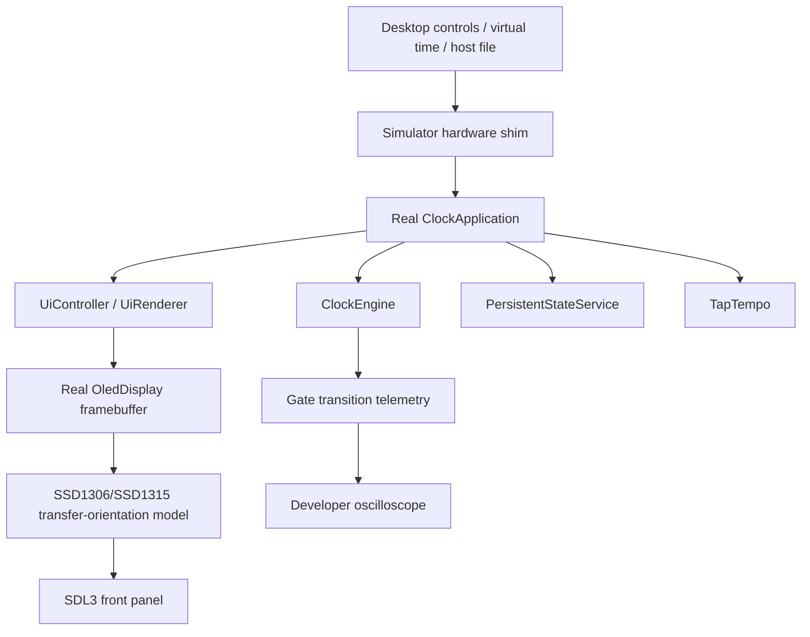
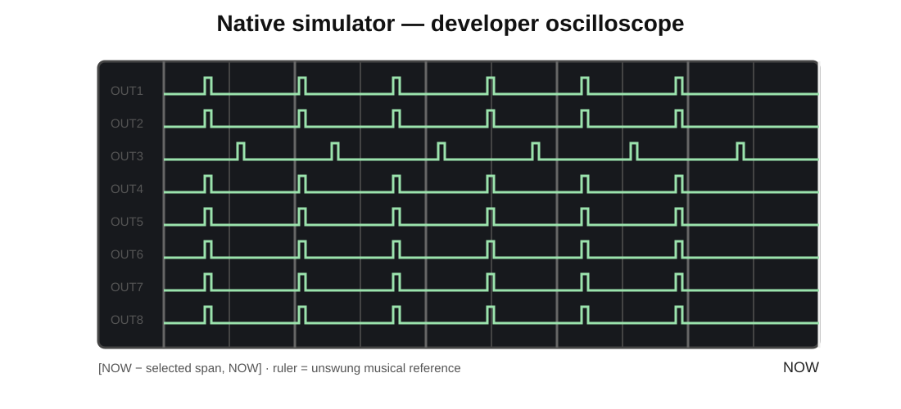
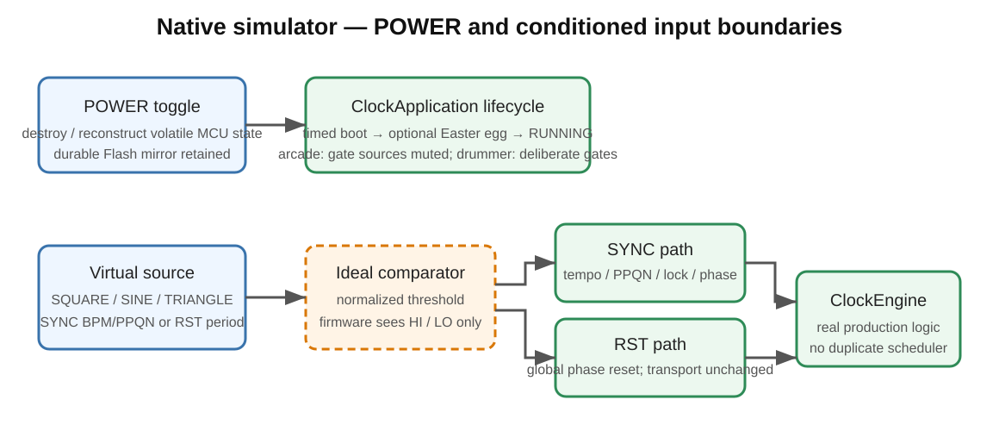

<!-- Author: Axel Napolitano | License: PolyForm-Noncommercial-1.0.0 -->

# South Signal Lab CLOCK Native Simulator

The native simulator runs the **same application, timing engine, UI renderer, persistence service, screensaver code, and OLED framebuffer code** used by the STM32 firmware. It is not a visual reimplementation of the module.

Only the hardware boundary changes:



This makes the simulator useful for UI work, timing regression checks, persistence workflows, long-duration virtual-time tests, and general firmware integration without a connected module.





## What is simulated today

- the exact 128×64 OLED framebuffer, rendered with configurable **integer-only nearest-neighbour scaling**;
- the exact SSD1306/SSD1315 transfer-orientation path used by firmware, so `ORIENTATION = 180 DEG` rotates pixels before transport exactly as on hardware while the controller stays in the canonical scan mode;
- encoder quadrature and encoder push;
- PLAY, TAP, and STOP/BACK buttons, including the firmware's real debounce code;
- all eight gate/LED source signals;
- logical gate-output mute state;
- the real 20 kHz scheduler callback;
- all CLOCK, EUCLID, SEQUENCER, OFF, One Clock, and Divider Bank logic;
- current settings, eight preset slots, and the arcade leaderboards through the durable 8192-byte host persistence image;
- screensaver/dim/display-off behavior;
- accelerated virtual time at 1×, 4×, or 16×;
- a scrolling developer oscilloscope with rising-edge counters, engine-phase-locked musical reference lines, and fixed 0.5 / 1 / 2 / 4 / 8 / 16 / 32 second visible spans;
- explicit `HI` / `LO` state at every output jack;
- virtual sources patched to **SYNC IN** and **RST IN**, each with SQUARE / SINE / TRIANGLE generation and an ideal comparator exposing conditioned `HI` / `LO`;
- SYNC tempo/PPQN acquisition, lock/loss state, and phase/tempo injection into the real clock engine;
- continuous and one-shot RST edges that invoke the real engine global-reset boundary without stopping transport;
- a virtual POWER cycle that destroys/reconstructs volatile application state while retaining durable simulator Flash state;
- the real timed boot screen and encoder-held configurable Easter-egg boot chord;
- windowless full-panel BMP screenshot rendering for CI, documentation, and UI regression capture.

The OLED panel is modeled from the same bytes that firmware would transfer to the physical controller. Firmware renderers always draw into the canonical 128×64 framebuffer. At 0 degrees those bytes are transferred unchanged. At 180 degrees the transport path reverses column order, page order, and the bit order within every page byte, giving the exact mapping `(x,y) -> (127-x,63-y)`. The SSD1306/SSD1315 controller itself remains in CLOCK's canonical `A1/C8` scan orientation. This avoids module-dependent mirroring while keeping renderer coordinates and screenshots canonical.

The virtual input sources model the **conditioned digital boundary** the firmware will see after the analogue frontend. SQUARE, SINE, and TRIANGLE are sampled against an ideal normalized threshold and reduced to `HI` / `LO`. This is useful for checking edge semantics and firmware behavior, but it is deliberately **not** an electrical LM393 model. Real threshold voltages, common-mode limits, open-collector pull-up behavior, hysteresis, noise/glitch susceptibility, propagation delay, protection circuitry, and final STM32 capture timing remain HIL concerns.

The separate Native `test_sync_behavior` suite adds a nominal host-only model of the documented LM393 resistor/hysteresis network and uses it to exercise 2.5 V, 3 V and 4 V input clocks. The interactive simulator intentionally remains at the conditioned-digital boundary; neither path is a substitute for physical comparator HIL.

## Current simulation boundaries

The simulator intentionally distinguishes firmware behavior from electrical/HIL behavior:

- The virtual comparators validate firmware-facing edge behavior only; they do not validate the future LM393/protection/timer-capture hardware.
- Gate waveforms are logical MCU source events; analog edge shape, output-buffer behavior, jack loading, comparator thresholds, and physical jitter remain HIL measurements.
- POWER OFF is a host-side electrical abstraction: it clears volatile MCU/application state and the OLED and mutes gate output, while the simulator persistence file represents non-volatile Flash.
- The one-second boot sequence is serviced non-blockingly in virtual time so intermediate boot frames and the boot-held `PIXEL RAID` chord can be exercised through the normal desktop event loop.

These limitations are explicit so the simulator never claims to validate behavior that still requires the module or a later firmware refactor.

## Front-panel geometry

The simulator follows the intended **10 HP / 3U** physical hierarchy:

- eight output jacks at the bottom in two tight rows of four;
- two digital inputs above them, left aligned and labeled **IN 1** / **IN 2** on the panel;
- PLAY, TAP, STOP in one row above the inputs, with PAUSE / SHIFT / BACK as grey secondary labels;
- OLED above the buttons, left aligned;
- encoder beside the OLED;
- one activity LED associated with each output.

The built-in simulator panel deliberately follows the current VCV presentation: black background, white primary labels, grey secondary button functions, output numbers `1`–`8`, and `SOUTH SIGNAL LAB` branding. The VCV and simulator shells still share the same physical coordinates from `sim/panel_layout.ini`; visual styling does not alter firmware behavior.

The panel geometry is isolated in `sim/panel_layout.h`. Exact PCB/front-panel millimetre coordinates can therefore replace the current design coordinates later without touching firmware or simulator behavior.

## Build system

The STM32 firmware continues to use PlatformIO. The desktop simulator deliberately uses ordinary CMake because it is a native Windows/macOS/Linux program, not an embedded PlatformIO target.

SDL3 is used only by the graphical host frontend. The current project configuration supports both a system SDL3 installation and a pinned fetch of SDL **3.4.16**. SDL's CMake integration exposes the stable `SDL3::SDL3` target for this purpose. SDL is licensed under the zlib license; the text is included as `third_party/LICENSE-SDL-zlib.txt`.

### Fastest portable build

The repository ships CMake presets. With CMake, Ninja, Git, and a C++17 compiler available:

```text
cmake --preset simulator
cmake --build --preset simulator
python scripts/run_simulator.py
```

The `simulator` preset fetches the pinned SDL3 source automatically. No SDL installation is required, but the first configure needs network access.

### Offline/system-SDL build

If SDL3 is already installed in a location discoverable by CMake:

```text
cmake -S . -B build/simulator-system \
  -DCLOCK_SIMULATOR_WITH_SDL=ON \
  -DCLOCK_SIMULATOR_FETCH_SDL=OFF
cmake --build build/simulator-system
```

SDL's upstream CMake documentation supports this `find_package(SDL3)` / `SDL3::SDL3` model on Windows, macOS, and Linux.

## Windows

Recommended native toolchain:

- VSCodium;
- Git;
- CMake 3.20+;
- Ninja;
- Visual Studio 2022 Build Tools with the Desktop C++ workload **or** a current MinGW/MSYS2 toolchain;
- Python 3 for repository helper scripts.

With WinGet, suitable Microsoft build tools can be installed independently of VSCodium. If using MSYS2 instead, SDL upstream recommends the UCRT64 environment for a modern MinGW toolchain.

The repository does not require an absolute compiler path. Keep CMake, Ninja, Git, and the chosen compiler/toolchain launcher on `PATH`. Machine-specific CMake selections belong in ignored `CMakeUserPresets.json`, never in committed workspace settings.

Build with the presets shown above, then run:

```powershell
python scripts\run_simulator.py
```

The native state file defaults to:

```text
.clock-simulator-state.bin
```

in the repository working directory. It is ignored by Git.

## macOS

A typical Homebrew setup is:

```text
brew install cmake ninja git
```

Apple Clang from Xcode Command Line Tools is sufficient:

```text
xcode-select --install
```

Then:

```text
cmake --preset simulator
cmake --build --preset simulator
python3 scripts/run_simulator.py
```

The fetch preset builds SDL as part of the CMake dependency graph. A separately installed SDL3 package can be used with `CLOCK_SIMULATOR_FETCH_SDL=OFF`.

## Linux

Install a normal C++/CMake/Ninja environment. On Debian/Ubuntu-family systems:

```text
sudo apt update
sudo apt install -y build-essential cmake ninja-build git python3
```

Then:

```text
cmake --preset simulator
cmake --build --preset simulator
python3 scripts/run_simulator.py
```

The fetched SDL build may use the window-system development packages available on the distribution. If a distro-supplied SDL3 development package is preferred, install it and configure with `CLOCK_SIMULATOR_FETCH_SDL=OFF`.

## Headless build and tests

SDL is intentionally not required for simulator integration tests:

```text
cmake --preset simulator-headless
cmake --build --preset simulator-headless
ctest --preset simulator-headless
```

This builds the complete firmware against the simulator hardware boundary, boots it, drives real debounced controls, runs the actual scheduler, checks OLED output and gate edges, and exercises simulator persistence.

The headless target is important because failures in the firmware/simulator boundary should not be hidden by a missing graphics package.

## Controls

The simulator keeps the desktop bindings close to the physical module: keys are aliases for panel actions, not alternate firmware behavior. Synthetic button clicks are held for at least 30 ms so the firmware's real 25 ms debounce code still sees them.

### Mouse

- mouse wheel over the encoder, or elsewhere on the module panel except SYNC IN: encoder rotation; natural/flipped wheel direction is normalized;
- left-click encoder: encoder push;
- left-click PLAY / TAP / STOP: corresponding physical button;
- left-click SYNC IN or RST IN: insert/remove that virtual cable (inserting also starts its generator);
- right-click SYNC IN or RST IN: run/hold that generator while leaving the cable connected;
- middle-click either input: cycle SQUARE / SINE / TRIANGLE;
- mouse wheel over SYNC IN: external-source BPM ±1;
- mouse wheel over RST IN: reset period ±100 ms;
- left-click the POWER control in the developer panel: virtual module power toggle.

### Keyboard

| Key | Function |
| --- | --- |
| Left / A | Encoder counter-clockwise; hold for repeated detents |
| Right / D | Encoder clockwise; hold for repeated detents |
| Enter / E | Encoder push |
| Space / P | PLAY |
| T | TAP |
| S / Backspace | STOP/BACK |
| Escape | Quit simulator |
| C | Insert/remove virtual SYNC cable |
| G | Run/hold virtual SYNC generator |
| `[` / `]` | External BPM -1 / +1 |
| PageDown / PageUp | External BPM -10 / +10 |
| Q | Cycle virtual SYNC PPQN: 1 / 2 / 4 / 24 |
| W | Cycle SQUARE / SINE / TRIANGLE for the last selected input jack |
| R | Inject one conditioned RST edge |
| 1 | 1× virtual time |
| 2 | 4× virtual time |
| 3 | 16× virtual time |
| `-` | Reduce visible scope span (zoom in) |
| `+` / `=` | Increase visible scope span (zoom out) |
| F1 | Toggle developer timing view |
| F2 | Toggle virtual module POWER |
| F12 | Save `clock-simulator-screenshot.bmp` |

The firmware still owns its `SOURCE INT / EXT / AUTO` setting. Connecting the virtual generator does **not** silently rewrite user configuration; use the simulated module controls to select External or Auto exactly as on hardware.

## Developer timing view

The right side of the simulator window is instrumentation, not part of the module front panel. It shows:

- current BPM;
- top-level operating mode;
- transport state;
- virtual-time multiplier;
- virtual POWER and logical gate-output state;
- virtual SYNC cable/run state, source waveform, comparator `HI`/`LO`, external BPM, PPQN, acquisition/lock state, and pulse count;
- virtual RST cable/run state, source waveform, comparator `HI`/`LO`, period, and reset count;
- 0.5 / 1 / 2 / 4 / 8 / 16 / 32 seconds of gate history for all eight channels;
- vertical ruler lines anchored to the engine's actual current **musical phase**: the scope remains armed until PLAY from STOP defines the captured-waveform epoch, while each rendered ruler anchor is derived from the live engine position rather than recomputing history from the current BPM/rate. This keeps the grid phase-coherent with recorded gates across tempo, external-SYNC, and rate changes. The right edge is an explicit `NOW` cursor. In ONE CLOCK the ruler follows the unswung shared output rate, in DIVIDER it follows the undivided master beat, and in INDEPENDENT it uses the common 1/16 lattice shared by x1 EUCLID/SEQ and all supported CLOCK note values;
- zoom-dependent ruler spacing chosen to keep Swing/Humanize displacement readable; 16 s uses 1/4 s minor/major divisions and 32 s uses 2/8 s;
- an interactive `FREEZE ON STOP` checkbox (enabled by default) that holds the reference time and retained waveform after STOP; disabling it lets the already-started scope continue scrolling;
- rising-edge counts.

The front panel keeps the physical-style output area uncluttered: jacks are labeled `1`–`8`, while instantaneous logic state remains available in the developer timing view and waveform. The separate LED above each jack retains the simulator's perceptual activity treatment so short triggers remain visible between desktop render frames. The developer row also reports the most recently completed pulse width in milliseconds.

This makes phase/synchronization bugs directly visible. Before the first PLAY the scope is ARMED and does not advance. PLAY from STOP defines the waveform epoch; the musical ruler is then phase-locked to the engine snapshot at the current scope reference time. The grid period still follows effective internal/external BPM, but a later tempo, rate, or sync change does not retroactively slide the ruler away from already captured pulse timing. A CLOCK/EUCLID/SEQ alignment regression, Swing displacement, phase offset, or One Clock Humanize offset can therefore be inspected against the unswung musical reference lattice rather than a decorative or fixed-millisecond ruler.

## Headless screenshots

The SDL executable can render a complete panel frame **without creating a window**. A software renderer draws into an off-screen surface and saves a BMP:

```text
python scripts/run_simulator.py \
  --screenshot build/clock-main.bmp \
  --screenshot-after-ms 250 \
  --no-developer
```

Useful options:

```text
--layout FILE
--panel-image IMAGE
--display-scale 1..8
--screenshot FILE.bmp
--screenshot-after-ms N
--no-developer
```

This mode uses SDL surfaces/software rendering but **no window or video backend**. It is therefore suitable for CI-generated documentation and visual-regression artifacts. The separate manual screenshot generator uses the same production firmware/rendering library without SDL and currently includes the Custom Groove editor plus a live Groove Record frame with the engine-phase playhead; these images are regenerated as part of documentation qualification rather than maintained as hand-drawn mockups. The SDL-enabled CMake build registers a `simulator_headless_screenshot` CTest for this path.

Interactive `F12` captures the current rendered frame as `clock-simulator-screenshot.bmp`.

## Persistence

The firmware still talks only to `hal::PersistentStorage`. In the simulator, the same bytes are mirrored to a normal host file. The firmware's own delayed/coalesced write policy remains active, including the rule that Flash-like commits are not initiated while PLAYING.

By default:

```text
.clock-simulator-state.bin
```

Use a different file for isolated scenarios:

```text
python scripts/run_simulator.py --state build/my-test.simstate
```

Simulator state files and `CMakeUserPresets.json` are excluded by `.gitignore` because they are workstation/user state rather than source.

## Virtual time

The simulator manually advances the same scheduler callback that TIM3 drives on STM32. Scheduler ticks remain at 20 kHz in virtual MCU time.

At 16× speed, one real minute advances approximately sixteen simulated minutes. This is useful for:

- 1 BPM and very slow-divider observation;
- screensaver/dim/off tests;
- long Euclidean or polymetric cycles;
- persistence timeout behavior;
- phase-drift investigations.

The simulator does not replace hardware-in-the-loop validation. It cannot prove comparator thresholds, analogue protection behavior, electrical gate levels, propagation delay, real timer jitter, USB/DFU behavior, or PCB signal integrity.

## SDL dependency and licensing

SDL3 is a simulator-only build dependency and does not enter the STM32 firmware image. SDL 3.x is distributed under the zlib license. The source repository retains the upstream notice in `third_party/LICENSE-SDL-zlib.txt` and lists SDL in `THIRD_PARTY_NOTICES.md`.

This does not change the firmware's PolyForm Noncommercial license or the separate STM32CubeF4/CMSIS licensing analysis documented in `docs/LICENSING.md`.

## Configurable front-panel artwork and geometry

The simulator front panel is now data-driven. The committed default is:

```text
sim/panel_layout.ini
```

The firmware does **not** know or care about this file. It is a simulator-host concern only. The same `PanelLayout` instance is passed to both the renderer and mouse hit testing, so moving a button or jack also moves its clickable area.

### Physical coordinate and size system

Front-panel component positions **and mechanical sizes** are stored in millimetres from the physical panel's top-left corner. Desktop pixels are no longer an independent geometry source. The current prototype panel declares:

```ini
[simulator]
pixels_per_mm = 7.0

[panel]
width_mm  = 50.5
height_mm = 128.5
```

`pixels_per_mm` changes only desktop magnification. Width, height, spacing, circles, and hit areas all use that single scale, so a 9 mm round actuator stays 9 mm relative to the 50.5 × 128.5 mm panel instead of being reverse-engineered from an arbitrary pixel rectangle.

Example:

```ini
[encoder]
x_mm = 44.0472
y_mm = 23.1075
knob_diameter_mm = 8.4166

[play]
x_mm = 9.6792
y_mm = 48.7511
actuator_diameter_mm = 9.0
body_diameter_mm = 12.0
color = #B02020

[jack_ts]
nut_diameter_mm = 7.85
bushing_diameter_mm = 6.0
opening_diameter_mm = 3.6

[jack_trs]
nut_diameter_mm = 7.85
bushing_diameter_mm = 6.0
opening_diameter_mm = 3.6

The 7.85 mm value models the standard QingPu W-QP-NUT-K knurled mounting nut seen from the front. The 6.0 mm bushing and approximately 3.6 mm jack opening come from the Thonkiconn mechanical drawing. PJ366ST/TRS uses the same front geometry; its body is 1 mm wider behind the panel.

[sync]
x_mm = 7.2944
y_mm = 70.1678
jack_type = ts

[reset]
x_mm = 18.6569
y_mm = 70.1678
jack_type = ts

[leds]
diameter_mm = 3.0
```

The D6R default geometry uses the documented 9 mm round actuator and 12 mm body envelope. Only the 9 mm actuator is visible from the front; the 12 mm body remains behind-panel geometry used for hit/mechanical extent. PLAY is rendered red, TAP grey, and STOP black; each button accepts an independent `#RRGGBB` appearance value. The RGB value is a simulator rendering choice, while the millimetre dimensions are mechanical data.

The Thonkiconn profiles distinguish TS (`WQP518MA` / `PJ398SM`) and TRS (`PJ366ST`) as component types even though their front-panel bushing geometry is the same: 6 mm bushing and approximately 3.6 mm opening. The PJ366ST body is 1 mm wider behind the panel, which does not change its front-view diameter. Every jack instance selects its profile with `jack_type = ts` or `jack_type = trs`.

The following physical elements are configurable without touching C++:

- OLED position and rectangle;
- encoder centre and knob/cap diameter;
- D6R button centres, visible actuator diameter, behind-panel body diameter, and individual color;
- TS and TRS Thonkiconn bushing/opening diameters;
- IN 1 / IN 2 jack types and centres (the underlying simulator source roles remain SYNC/RST for host instrumentation);
- all eight output-jack centres and jack types;
- all eight LED centres plus a shared 3 mm default diameter and on/off colors;
- four mounting-screw centres;
- desktop magnification and developer-view geometry.

The encoder knob is deliberately modeled as a separate mechanical part: the PEC11L shaft does not determine the outside diameter of the fitted knob. The committed value therefore remains the existing visual diameter until the final knob part number is frozen; changing `knob_diameter_mm` does not require code changes.

The INI parser is deliberately strict. Unknown sections, unknown keys, duplicate keys, malformed colors/numbers, impossible jack diameters, and invalid dimensions abort simulator startup with a readable error. This prevents a misspelled coordinate or accidental pixel-era key from silently changing the panel.

### OLED integer scaling

`[display] pixel_scale` is an integer in the range 1..8. The OLED is always drawn as exact `N × N` rectangles per firmware pixel; no filtered texture scaling or antialiasing is used. The 128×64 framebuffer therefore remains pixel-faithful at every supported scale.

```ini
[display]
pixel_scale = 2
```

A one-off override is available without editing the INI file:

```text
python scripts/run_simulator.py --display-scale 3
```

The desktop logical presentation also uses SDL's integer-scale mode, so resizing the simulator window does not introduce fractional filtering into the logical canvas.

### Front-panel image

Set `background_image` in `[panel]`:

```ini
[panel]
background_image = assets/front-panel.png
draw_builtin_labels = false
draw_screws = false
```

Relative paths are resolved relative to `panel_layout.ini`. Absolute paths are also accepted. The configured image is stretched exactly over the simulator's panel rectangle; control locations remain driven by the millimetre geometry.

SDL 3.4+ natively loads BMP, PNG, and JPEG surfaces, so this feature does not add SDL_image or another image-library dependency.

For a one-off image override without editing the INI file:

```text
python scripts/run_simulator.py --panel-image path/to/front-panel.png
```

For a completely separate panel definition:

```text
python scripts/run_simulator.py --layout path/to/my-panel-layout.ini
```

The command-line `--panel-image` option takes precedence over `background_image` in the selected layout file.

When an exported production panel graphic already contains labels and mounting-hole artwork, disable `draw_builtin_labels` and/or `draw_screws` to avoid drawing the simulator placeholders over it. The live OLED, encoder, buttons, LEDs, and jacks remain interactive overlays.
