<!-- Author: Axel Napolitano | License: PolyForm-Noncommercial-1.0.0 -->

# South Signal Lab CLOCK — User Guide

> **Beta documentation — v0.19.0-beta.2 · V1 feature freeze**
>
> CLOCK is still prerelease hardware/firmware. The user-facing clock engine, UI, persistence, simulator, interrupt-driven SYNC/RST capture boundary, and SPI/I2C display paths are implemented. Final comparator/PCB validation and physical HIL timing sign-off remain open. Timer Input Capture or compare-event scheduling are implementation options only if measured V1 timing requires them.

This guide is the GitHub-readable operating reference for CLOCK. OLED screenshots are generated from the **production renderer and the real 128×64 framebuffer**, then enlarged with nearest-neighbor scaling. They are not hand-drawn UI mockups.

## 1. What CLOCK is

CLOCK is a 10 HP, eight-output Eurorack master clock, rhythm generator, and gate sequencer. All outputs share one deterministic master timeline, but you can use that timeline in three different ways:

- **One Clock** — one shared clock configuration drives all eight outputs. This is the factory topology.
- **Independent** — each output independently runs Clock, Euclid, Sequencer, or Off.
- **Divider Bank** — one shared source produces eight fixed divisions from a selectable family.


The important design choice is that Independent does **not** mean eight unrelated free-running clocks. Clock, Euclid, and Sequencer channels remain anchored to the same master timeline, so rate changes, resets, and mixed rhythmic functions can stay musically related.

## 2. Quick start

For a first patch:

1. Power the rack with CLOCK connected normally. CLOCK always boots into **STOP**.
2. Patch `OUT 1` to a module that accepts a clock or trigger.
3. Press **PLAY**. The factory topology is **One Clock**, so all eight outputs now carry the same master clock.
4. Turn the encoder to change master BPM.
5. Tap **TAP** repeatedly to set tempo by feel.
6. Press **STOP/BACK** to stop and reset the global phase.
7. Short-press the encoder to inspect the current output topology. Long-press it for the current context settings.
8. Hold **TAP** and turn the encoder when you want to change an output function or global topology.

> [!TIP]
> Start with One Clock until the transport and navigation feel natural. Independent mode is where CLOCK becomes an eight-channel rhythm tool; Divider Bank is the fastest way to obtain conventional clock divisions.

## 3. Product boundary: timing rather than analog CV

CLOCK is intentionally an eight-channel **digital timing, gate, and trigger instrument**. Hardware Rev 1 provides dedicated SYNC and RST inputs, but it does not provide general parameter-CV inputs, analog CV/modulation outputs, or a modulation matrix.

That boundary protects both signal quality and DIY buildability. A quality eight-channel analog modulation-output path would require an eight-channel 16-bit DAC-class solution plus two quad output-op-amp stages; a 12-bit MCP-class implementation is not considered an acceptable quality compromise for this product direction. The project currently estimates roughly EUR 30-40 of additional BOM cost before the added fine-pitch SMD assembly, PCB, calibration, validation, and documentation burden. General parameter-CV inputs would also require additional analog front ends, routing, and panel I/O.

This is therefore **not a missing V1 feature**. CLOCK concentrates on what eight digital event outputs can do well: coherent clocks, Euclidean rhythms, gate sequences, ratios, phase, probability, reset semantics, and robust synchronization. Later firmware may add deeper internal event relationships without requiring an analog modulation subsystem.

For the frozen V1/post-1.0 boundary, see [`ROADMAP.md`](ROADMAP.md).

## 4. Front panel


| No. | Element | Function |
| ---: | --- | --- |
| 1 | OLED | Performance view, menus, editors, prompts, and status feedback |
| 2 | Push encoder | Turn to select/change values; short press to select/confirm; long press (~650 ms) opens the current context settings |
| 3 | PLAY | Start/pause master transport; next page in the Sequencer editor |
| 4 | TAP | Tap Tempo; modifier for Settings and mode selection; previous page in the Sequencer editor |
| 5 | STOP / BACK | Stop and reset global phase from Performance; back/cancel elsewhere |
| 6 | SYNC IN | Conditioned external timing input |
| 7 | RST IN | Conditioned external reset/phase input |
| 8 | OUT 1–8 | Eight clock/gate outputs |
| 9 | Activity LEDs | One red indicator per output |

The panel layout in this illustration is generated from [`sim/panel_layout.ini`](../sim/panel_layout.ini), the same geometry used by the desktop simulator. The drawing is an explanatory manual asset, not a drill or manufacturing template.

## 5. Boot and output safety

CLOCK always powers up in **STOP**. Stored configuration is restored, but a previously saved PLAY state is never allowed to start outputs automatically.

The boot sequence keeps the external gate buffer disabled, initializes the scheduler in STOP, explicitly drives all channel source signals LOW, and only then enables the output stage. This prevents a normal power-up from becoming eight accidental triggers in a patched rack.


The normal boot screen lasts about one second. Holding the encoder push continuously through the complete boot sequence enters the compile-time selected Easter egg; see [Section 20](#20-hidden-boot-easter-eggs).

## 6. Performance screen

The Performance screen is deliberately sparse. It keeps the information required while playing visible and moves configuration detail into contextual pages.

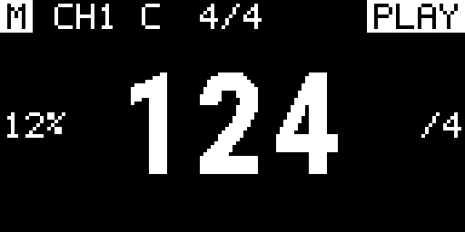

The header shows:

- **filled `M`** when CLOCK is the active master;
- **outlined `S`** when CLOCK follows external timing;
- a lock icon beside `S` when external timing is locked;
- the selected channel and compact mode pictogram;
- master meter in the center;
- transport state at the right.

The BPM numerals are mathematically centered. Non-zero Swing appears at the left of the tempo area and a non-`×1` rate appears at the right. Default values are omitted rather than filling the screen with redundant status.

Clock uses the larger BPM role. Euclid and Sequencer use a smaller tempo role because the lower display area is reserved for live pattern feedback.

### Euclid performance view

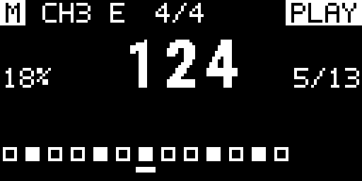

The strip is rendered from the same Euclidean pattern data used by the scheduler, so the display is not a decorative approximation of the rhythm.

### Sequencer performance view

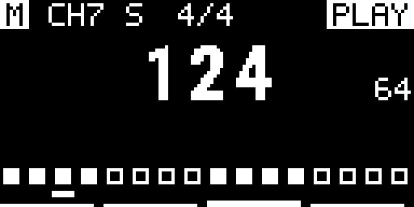

For lengths above 16 steps, the lowest display rows show the active 16-step block. A 64-step sequence therefore exposes four logical display segments.

### STOP


With factory display preferences, STOP-mode inactivity starts the configured screensaver after 2 minutes, dims the OLED after 5 minutes, and powers the OLED panel off after 10 minutes. Any front-panel interaction wakes it immediately.

## 7. Navigation and editing

The standard editing grammar is intentionally consistent:

1. turn to select;
2. press to open/edit;
3. turn to change;
4. press to confirm.

Only the value currently being edited is inverted. Whole-row inversion is avoided because it makes a 128×64 one-bit display unnecessarily busy.

| Gesture | Performance | Overview / mode | Settings / editor |
| --- | --- | --- | --- |
| Encoder turn | Change master BPM | Move selection | Move/change value |
| Encoder short press | Open overview | Confirm selection / return | Enter / confirm / toggle step |
| Encoder long press | Open current channel/global settings | Open highlighted settings | Context-dependent |
| TAP + encoder press | Open Settings tree | — | — |
| Hold TAP + encoder turn | — | Open/scroll six-function palette | — |
| PLAY/PAUSE | Play / pause | — | Sequencer: next 16-step page |
| TAP short | Tap Tempo | Modifier | Sequencer: previous 16-step page |
| STOP/BACK | Stop + global reset | Back / cancel | Back / cancel |

## 8. Channel and global overview

In Independent topology, a short encoder push opens the eight-channel overview. All channels remain visible in a 2×4 grid; each tile contains only its number and mode pictogram. The selected tile is fully inverted.

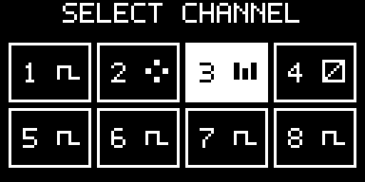

Turn the encoder to move the highlight. Short press commits the highlighted channel and returns to Performance. Long press opens that channel's settings directly.

One Clock and Divider Bank are global topologies, so their overview deliberately does not pretend that eight independent channel tiles exist.

<table>
<tr>
<td align="center">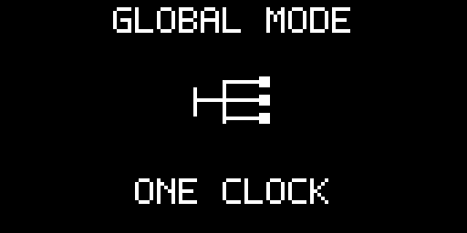<br><sub><b>One Clock:</b> one shared configuration drives all outputs.</sub></td>
<td align="center">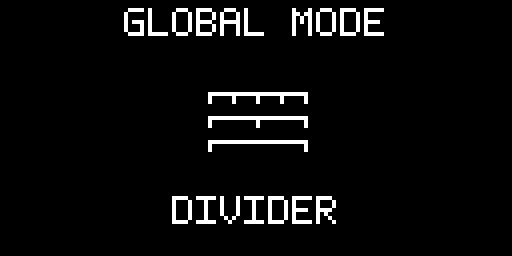<br><sub><b>Divider Bank:</b> one source feeds the eight fixed divider outputs.</sub></td>
</tr>
</table>

Short press returns from a global overview. Long press opens that topology's settings.

## 9. Changing function or topology

Hold **TAP** and turn the encoder. CLOCK opens a 2×3 graphical palette in this order:

1. **One Clock**
2. **Divider Bank**
3. **Clock**
4. **Euclid**
5. **Sequencer**
6. **Off**

One Clock and Divider Bank change the global output topology. Clock, Euclid, Sequencer, and Off select Independent topology for the highlighted channel.

<table>
<tr>
<td align="center">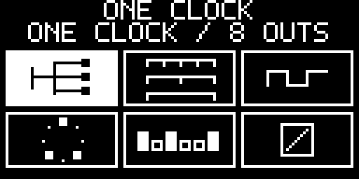<br><sub>One Clock selected</sub></td>
<td align="center">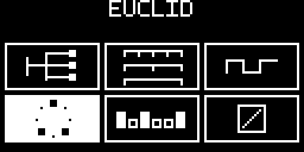<br><sub>Euclid selected</sub></td>
<td align="center">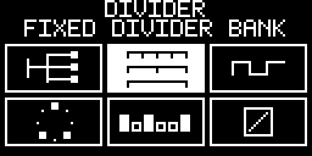<br><sub>Divider Bank selected</sub></td>
</tr>
</table>

Releasing TAP does not silently mutate the running setup. If the highlighted function differs from the active function, CLOCK opens `CHANGE MODE?` with **NO** selected by default.


After confirmation CLOCK opens the most useful destination: Euclid goes to algorithm settings, Sequencer to its editor, One Clock to shared settings, Divider Bank to divider-family settings, while Clock and Off return to Performance.

## 10. Independent Clock

Clock produces a regular derived trigger/clock on one output. Its channel owns:

- integer divide/multiply from `÷32` through `×32` using the curated rate table;
- rational ratio numerator and denominator from 1 to 16;
- local meter;
- Swing from 0–50%;
- Probability from 0–100%;
- gate length `1 / 2 / 5 / 10 / 20 / 50 / 100 ms`;
- Phase from 0–99%;
- reset policy `GLOBAL / FREE`;
- Mute.

Integer and rational rates use fixed/integer timing with remainder retention. CLOCK does not repeatedly truncate fractional intervals, so ratios such as `2:3`, `3:2`, `4:5`, or `5:4` do not accumulate long-term drift simply because an event interval is not an integer number of scheduler quanta.

`GLOBAL` means a global reset re-anchors the channel. `FREE` allows its local cycle position to survive that global reset.

## 11. One Clock

One Clock is the factory topology and the quickest way to use CLOCK as an eight-way master clock multiple.


One shared configuration controls all eight outputs:

- rate and rational ratio;
- Swing;
- gate length;
- Phase;
- **Humanize**.

Humanize exists only in One Clock. Available amplitudes are:

```text
OFF / 250 / 500 / 1000 / 2000 µs
```

It applies small deterministic per-output timing displacement while keeping the common restart/downbeat exact. It is intended to remove perfect simultaneity between eight copies without turning the outputs into unrelated clocks.

## 12. Divider Bank

Divider Bank is intentionally simple: choose one divider family and one shared gate length, then patch the eight outputs.


| Family | OUT 1–8 |
| --- | --- |
| `POW2` | ×1, ÷2, ÷4, ÷8, ÷16, ÷32, ÷64, ÷128 |
| `INT` | ×1, ÷2, ÷3, ÷4, ÷5, ÷6, ÷7, ÷8 |
| `PRIME` | ×1, ÷2, ÷3, ÷5, ÷7, ÷11, ÷13, ÷17 |

There are no fake per-channel settings in this topology because the outputs are intentionally derived from one shared divider source.

## 13. Euclid

A Euclid channel distributes a selected number of hits as evenly as possible across a cycle.

- **STEPS** — 1–64
- **HITS** — 0–STEPS
- **ROTATE** — circular rotation from 0 to STEPS−1

Common channel timing — rate, Swing, Probability, gate length, Phase, reset policy, and Mute — remains outside the Euclid algorithm page.

At `×1`, Euclid advances on a **sixteenth-note grid**. In 4/4, 16 steps therefore span exactly one bar. The channel rate scales that step grid; `×1` does not mean one Euclid step per quarter note.

A simple 16-step / 4-hit pattern gives four evenly distributed hits. Rotation moves the pattern against the shared timeline without changing the hit count.

## 14. Gate Sequencer

Each Sequencer channel stores a binary gate pattern of up to 64 steps. The active sequence length is 1–64 steps.


The editor is divided into four possible pages:

```text
1–16     17–32     33–48     49–64
```

Inside the editor:

- encoder turn moves the step cursor;
- encoder press toggles the selected gate;
- PLAY/PAUSE moves to the next 16-step page;
- TAP moves to the previous 16-step page;
- STOP/BACK returns to Sequencer parameters.

Sequencer tools include **Length, Rotate, Invert, Clear, Fill Alternate, Copy, and Paste**. As with Euclid, `×1` is a sixteenth-note grid, so a 16-step sequence occupies one 4/4 bar.

## 15. Swing, Probability, Phase, gates, and reset

These parameters are shared by Independent Clock/Euclid/Sequencer channels unless stated otherwise.

**Swing** delays alternating subdivisions while preserving the total duration of the pair. A value of 0% is straight timing; values up to 50% progressively lengthen one half and shorten the other.

**Probability** controls whether an otherwise eligible event produces a gate. It changes event emission, not the master timeline, so skipped events do not make the channel's underlying clock drift.

**Phase** offsets a channel relative to the common timeline without creating a separate free-running transport.

**Gate length** selects a trigger duration of 1, 2, 5, 10, 20, 50, or 100 ms. The scheduler also bounds gate-off timing against the actual event interval so a configured long pulse cannot consume the next rising edge.

**Reset policy** controls how an Independent channel reacts to a global reset: `GLOBAL` re-anchors it; `FREE` preserves its local cycle position.


## 16. Transport and Tap Tempo

Transport has three states: **PLAY, PAUSE, STOP**.

- PLAY/PAUSE toggles running and paused states without an implicit phase reset.
- STOP/BACK from Performance enters STOP and applies the global reset policy.
- Tap Tempo adjusts the master tempo from a sequence of TAP presses within the supported 1–999 BPM technical range and the configured user MIN/MAX boundaries.

CLOCK persists the working configuration but never restores PLAY on power-up. Flash commits are also deferred while transport is PLAYING so erase/program work cannot block the live gate path.

## 17. External SYNC and RST

Open `SETTINGS → GENERAL SETTINGS → SYNC` to configure external timing.

Available settings are:

- **SOURCE** — `INTERNAL / EXTERNAL / AUTO`
- **PPQN** — `1 / 2 / 4 / 24`
- **EDGE** — rising / falling
- **LOSS** — `STOP / FREE / INTERNAL`
- **RST MODE** — `TRIGGER / GATE`
- **FILTER** — 0–5000 µs in 250 µs steps
- **TIMEOUT** — 200–5000 ms in 100 ms steps

`TRIGGER` is the factory reset-input mode. One accepted inactive→active reset edge generates one reset; holding the conditioned reset signal HIGH does not repeat it.

`GATE` treats the reset input as a held reset condition: while the conditioned input remains HIGH, the timing engine is held in reset and all generated gates remain LOW. Releasing the input restarts from phase zero.

SYNC/RST transitions are captured by GPIO interrupts and consumed at the deterministic 20 kHz scheduler boundary. External tempo is measured in the period domain with filtering, continuity handling, adaptive timeout, and timestamp-wrap-safe arithmetic. The effective loss timeout is at least long enough for slow valid sources; for example, 20 BPM at 1 PPQN produces one pulse every 3 seconds and must not falsely unlock between pulses.

<table>
<tr>
<td align="center"><br><sub>External selected, not yet locked</sub></td>
<td align="center"><br><sub>External slave locked</sub></td>
<td align="center">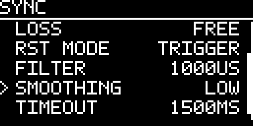<br><sub>SYNC/RST configuration</sub></td>
</tr>
</table>

> [!CAUTION]
> Host tests verify the firmware semantics above, not the final analog input hardware. Comparator thresholds/hysteresis, physical signal integrity, final pin routing, external-SYNC capture latency/jitter, and jack-level output jitter remain HIL requirements before a 1.0 release candidate. Timer Input Capture is required only if the measured EXTI path cannot meet the V1 timing target.

## 18. Presets, CURRENT, and templates

`SETTINGS → PRESETS` contains three different concepts:

- **CURRENT — AUTO SAVE** is the durable working state;
- **LOAD PRESET / SAVE PRESET** use eight named user slots;
- **TEMPLATES** are factory starting configurations rather than user slots.

Preset names can contain up to 16 characters. Saving over an occupied slot requires explicit confirmation, with **NO** selected by default.

<table>
<tr>
<td align="center">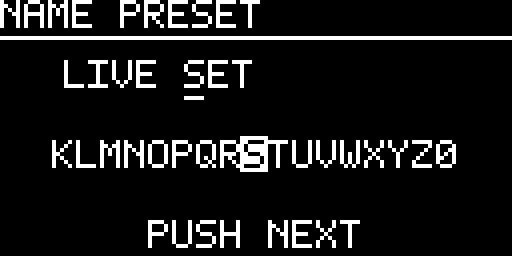<br><sub>Preset name entry</sub></td>
<td align="center"><br><sub>Occupied-slot confirmation</sub></td>
</tr>
</table>

Factory templates currently include `ALL MASTER`, `CLOCK TREE`, `DIVIDERS`, `POLYRHYTHM`, `EUCLID KIT`, and `HYBRID`. Loading a template changes CURRENT; it does not silently create or overwrite a named user preset.

## 19. Screensaver and display protection

Display protection is active only while transport is STOP. The factory timing is:

- screensaver after 2 minutes;
- dim after 5 minutes;
- OLED off after 10 minutes.

The configured order is constrained to `START <= DIM <= OFF`. Any front-panel activity wakes the OLED immediately. `OFF` disables animation but does not disable the later dim/panel-off protection stages.

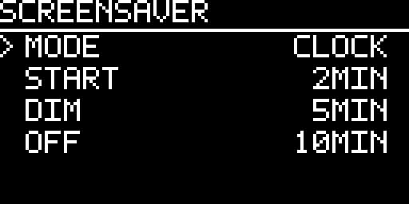

<table>
<tr>
<td align="center"><br><sub>CLOCK</sub></td>
<td align="center">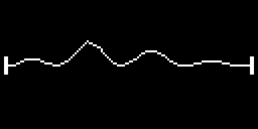<br><sub>PLUG</sub></td>
<td align="center"><br><sub>HEARTBEAT</sub></td>
</tr>
<tr>
<td align="center"><br><sub>ACID</sub></td>
<td align="center">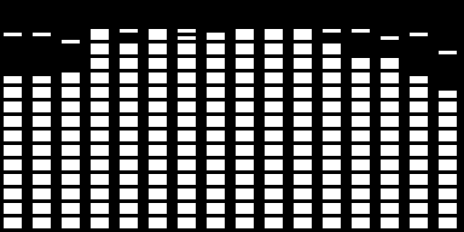<br><sub>SPECTRUM</sub></td>
<td align="center"><br><sub>FIELD</sub></td>
</tr>
<tr>
<td align="center">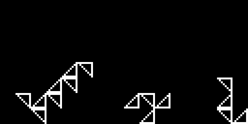<br><sub>BLOX</sub></td>
<td align="center">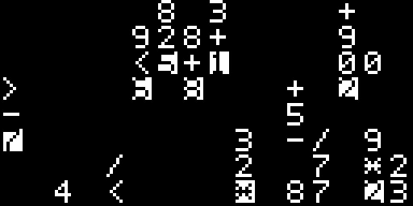<br><sub>MATRIX</sub></td>
<td align="center">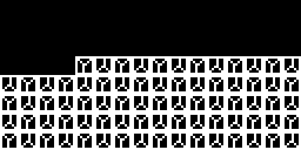<br><sub>CUBE COVER</sub></td>
</tr>
<tr>
<td align="center"><br><sub>FRACTAL</sub></td>
<td align="center"><br><sub>ORBIT</sub></td>
<td align="center"><sub><b>OFF</b><br>No animation; dim and OLED-off protection can remain active.</sub></td>
</tr>
</table>

## 20. Hidden boot Easter eggs

Hold the encoder push continuously from power-up until the boot screen finishes to enter the compile-time selected Easter egg. `CLOCK_EASTER_EGG` selects one of five implementations.

The four ranked games — **Pixel Raid, Formula 1, Breakout, and Egg Journey** — share the same presentation flow: game-specific intro, gameplay, optional three-letter initials entry for a qualifying score, and a scrollable Top 100. A long encoder hold exits back to the normal firmware lifecycle.

<table>
<tr>
<td align="center"><br><sub>Pixel Raid</sub></td>
<td align="center"><br><sub>Formula 1</sub></td>
<td align="center"><br><sub>Breakout</sub></td>
</tr>
<tr>
<td align="center"><br><sub>Egg Journey</sub></td>
<td align="center"><br><sub>BEATKNECHT</sub></td>
<td align="center"><br><sub>Top 100</sub></td>
</tr>
</table>

- **Pixel Raid** — encoder moves the cannon; TAP fires.
- **Formula 1** — encoder steers through changing road geometry and traffic; three crashes end the run.
- **Breakout** — encoder moves the paddle; TAP launches the waiting ball; the run has three lives and scored bricks/board clears.
- **Egg Journey** — encoder shifts the egg within the scrolling lunar landscape; TAP jumps; craters and asteroids consume one of three lives.
- **BEATKNECHT** — not a ranked game. TAP cycles curated one-bar rhythm styles, encoder changes BPM, and OUT 1–8 intentionally emit the displayed eight gate patterns.

<table>
<tr>
<td align="center"><br><sub>Formula 1 crash</sub></td>
<td align="center">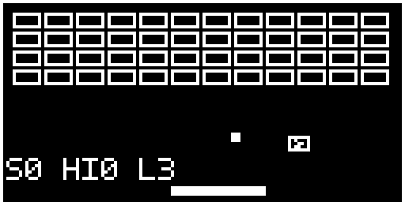<br><sub>Breakout modifier</sub></td>
<td align="center">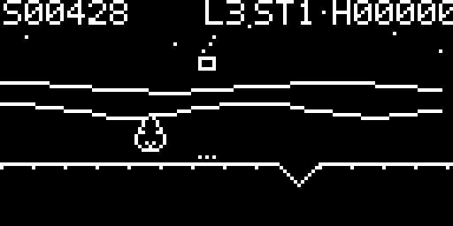<br><sub>Egg Journey</sub></td>
</tr>
</table>

Pixel Raid, Formula 1, Breakout, and Egg Journey keep the external gate-output stage disabled. BEATKNECHT is the deliberate exception: it enables the stage only after its intro has been explicitly started, drives the rhythm gates, and returns all channels LOW before disabling the stage on exit. Normal firmware resumes in STOP.

## 21. INFO, version, and updates

`SETTINGS → INFO` is read-only and separates identity from maintenance information:

- **NAME** — `CLOCK`
- **VERSION** — currently running firmware version
- **AUTHOR** — Axel Napolitano
- **LICENSES** — firmware and bundled third-party license identifiers/attributions
- **UPDATES** — full-screen QR code for the current project update URL (`https://github.com/napolitano`)

<table>
<tr>
<td align="center">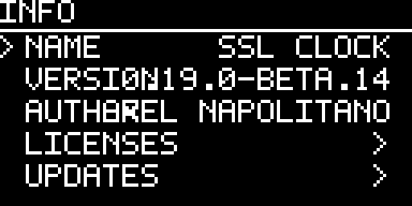<br><sub>Identity</sub></td>
<td align="center">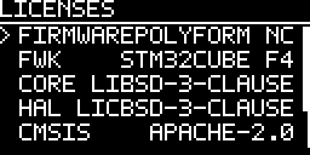<br><sub>Licenses</sub></td>
<td align="center"><br><sub>Updates</sub></td>
</tr>
</table>

## 22. Current technical limits

The current firmware uses a deterministic **20 kHz scheduler**, giving a 50 µs service quantum. UI rendering and I/O transport do not decide musical gate timing. SPI remains the preferred/reference display path; I2C uses deferred, bounded foreground transactions so display work is deliberately subordinate to musical timing.

Persistence uses internal STM32 Flash A/B records. Large persistence staging buffers are static rather than runtime-stack allocations, embedded production code is guarded against dynamic heap allocation, and the build includes a production stack-frame gate.

These software safeguards do not replace physical validation. Before a 1.0 release candidate, representative hardware still needs oscilloscope/logic-analyzer proof for gate jitter and pulse widths, boot/reset behavior, SYNC/RST comparator behavior, final timer capture, and SPI/I2C display stress. See [`HIL_TEST_PLAN.md`](HIL_TEST_PLAN.md).

## 23. License

Firmware source is licensed under the **PolyForm Noncommercial License 1.0.0**. The Required Notice is `Required Notice: Copyright © 2026 Axel Napolitano.` See [`../LICENSE.md`](../LICENSE.md), [`../NOTICE.txt`](../NOTICE.txt), and [`LICENSING.md`](LICENSING.md). The publication manual and documentation artwork use the documentation license described in [`manual/LICENSE.md`](manual/LICENSE.md). Third-party components retain their upstream licenses and notices.

<h6 align="center">From Munich with &#9829;</h6>
