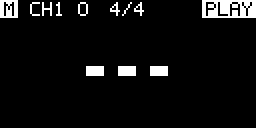
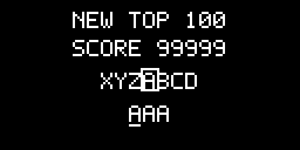
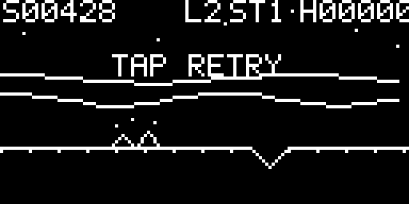
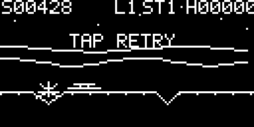
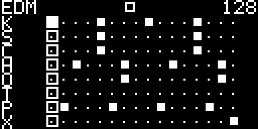

<!-- Author: Axel Napolitano | License: PolyForm-Noncommercial-1.0.0 -->

# South Signal Lab CLOCK — User Guide

> **Prototype documentation — v0.19.0-alpha.62**
>
> The module is still prerelease hardware/firmware. External-sync capture/PLL behavior, diagnostics, and the final event-driven timer scheduler are not final yet. Complete working-state persistence and named user preset slots are implemented in this prerelease.

The screenshots in this guide are generated from the **production OLED renderer and production framebuffer** at 128×64 pixels and then enlarged with nearest-neighbor scaling. They are not conceptual mockups.

## 1. Module concept

The module is an eight-channel Eurorack clock and gate-rhythm generator with three output topologies:

- **Independent** — each of the eight outputs independently uses Off, Clock, Euclid, or Sequencer.
- **One Clock** — one shared clock configuration drives all eight outputs identically.
- **Divider Bank** — one shared clock feeds eight fixed divider outputs; selectable families are powers of two, consecutive integers, and primes.

Independent channels share one deterministic master timeline but own their rate, phase, swing, probability, gate length, reset behavior, and mode-specific pattern/cycle settings. The shared timeline is intentional: transport and Tap Tempo remain master-level operations, while individual outputs are disabled with OFF/MUTE rather than being given hidden asynchronous transports.


## 2. Power-up safety

Power-up always enters **STOP**.

The last user-selected transport state is persisted with CRC protection, but a previously stored PLAY state is historical state only; it is never executed automatically after power-up.

The boot sequence keeps the gate buffer disabled and all eight channel source pins LOW. The scheduler is initialized from STOP, all channel pins are driven LOW again, and only then is the external output stage enabled.

This rule is deliberate: connecting the module to a patch must never create eight accidental startup triggers.

## 3. Boot screen

The boot screen is visible for approximately one second. It shows the module name and firmware version plus a continuous two-pixel progress bar at the bottom edge.


During a normal boot the progress bar is display-only and the eight output LEDs are not animated. Holding the encoder push switch continuously through the complete boot screen launches the compile-time selected Easter egg before the scheduler starts; see Section 17. Arcade games keep the HCT244 output stage disabled. BEATKNECHT is the explicit exception: it enables the stage only while intentionally generating its eight rhythm gates.

## 4. Physical controls

| Control | Performance screen | Channel overview / mode palette | Settings / editor |
| --- | --- | --- | --- |
| Encoder turn | Master BPM | Select channel / mode function | Move cursor / edit value |
| Encoder short press | Open channel overview | Open selected context settings / confirm mode | Enter / confirm / toggle selected gate |
| TAP + encoder press | Open combined Settings | — | — |
| TAP + encoder turn | — | Open/scroll six-function mode palette; release TAP to commit | — |
| PLAY/PAUSE | Play / pause master transport | — | Sequencer: next 16-step page |
| TAP short | Master Tap Tempo | — | Sequencer: previous 16-step page |
| RESET/BACK | Stop | Back | Back |

The standard editing grammar is intentionally simple:

1. turn to select
2. press to edit/open
3. turn to change
4. press to confirm

Only the edited value is inverted. Whole-row inversion is avoided because it makes a 128×64 OLED visually restless.


## 5. Performance screen

The performance screen is intentionally sparse. It shows what is necessary while playing and leaves detailed configuration to dedicated pages.

### 5.1 Clock channel


The header is a compact status bar:

- clock-role badge at the far left
- optional lock symbol immediately beside a locked slave
- selected channel as `CHn` plus its compact mode pictogram
- master meter centered
- transport right-aligned

Clock-role badges:

- **filled `M`** — module is currently master
- **outlined `S`** — module is currently slave
- **padlock next to `S`** — external timing is locked

The performance header deliberately keeps status compact. Full mode names belong in settings pages; the performance screen uses pictograms.

### 5.2 BPM numerals

The BPM display uses dedicated proportional, native-resolution **sans-serif 1-bit numerals derived from Roboto Condensed Bold**. Clock mode uses a larger role; Euclid and Sequencer use a smaller role to leave room for their pattern strips. Roboto is Apache-2.0 licensed; attribution is kept in `THIRD_PARTY_NOTICES.md` and the font file itself is not distributed.

The numerals are not the small UI font enlarged by an integer scale factor. They are stored at their final OLED resolution. The tempo remains mathematically centered even when a non-zero Swing percentage is shown on the left or a non-`x1` Clock rate is shown on the right. Zero Swing and `x1` are deliberately omitted.

### 5.3 Euclid channel


Euclid uses the otherwise free lower part of the display for live pattern feedback:

- filled marks = hits
- outlined cells = rests
- two-pixel underline = current step

The pattern is generated from the same Euclid settings the scheduler uses, so the visualization and gate logic share the same source data.

Euclid parameters are reached from the selected channel settings. Long-TAP has no hidden shortcut function.

### 5.4 64-step Sequencer channel


The performance screen shows the currently active 16-step block:

- filled cell = gate present
- outlined cell = rest
- two-pixel underline = current step inside the active block

For a sequence longer than 16 steps, the lowest two OLED rows show the 16-step block structure. A 64-step sequence therefore has four segments. The active segment is filled; inactive segments remain thin.

Sequencer parameters and the editor are reached from the selected channel settings. Long-TAP has no hidden shortcut function.

### 5.5 Stop state


STOP has no beat/playback animation. With the factory display preferences, two minutes without front-panel activity starts the configured screensaver; after five minutes the panel is dimmed, and after ten minutes the OLED panel is switched off. Any control activity wakes it immediately. This production screenshot also exercises the **1 BPM** lower bound.

## 6. Channel overview

A short encoder push from Performance opens `SELECT CHANNEL` while Independent mode is active. All eight channels remain visible simultaneously in a 2×4 grid. Each tile contains only the bare channel number `1…8` and its current pictogram; the redundant `CH` prefix, rates, ratios and pattern details are intentionally omitted.

The highlighted tile is **fully inverted**. Turning the encoder moves only the highlight. A short push commits that channel and returns to Performance. A long encoder push (about 650 ms) opens the highlighted channel menu instead. The same long push from Performance opens the currently selected channel menu directly.


When **One Clock** or **Divider Bank** is active there is no meaningful per-channel overview. A short encoder push opens a global summary showing the large mode pictogram and full mode name instead of eight fake channel tiles. Short push returns to Performance; long push opens that global mode's settings. RESET/BACK also returns to Performance.


## 7. Six-function mode palette

The fastest mode change happens directly from the overview: **hold TAP and turn the encoder**. The display switches to a 2×3 palette containing symbols only. The top bar always spells out the currently highlighted function; the two global functions also show a short explanation.

Releasing TAP does **not** silently mutate the running configuration. If the highlighted function differs from the active one, a `CHANGE MODE?` dialog appears with safe-default `NO`. Confirm with `YES` before the new topology/generator is applied.

The six functions are:

1. Off — selected channel disabled
2. Clock — selected channel uses the Clock generator
3. Euclid — selected channel uses the Euclidean generator
4. Sequencer — selected channel uses the 64-step gate sequencer
5. One Clock — one shared clock drives all eight outputs
6. Divider Bank — one shared clock drives eight fixed divider outputs

The first four functions select **Independent** operation and modify only the selected channel. One Clock and Divider Bank are global output topologies. The palette intentionally contains no `O/C/E/S` abbreviations inside the tiles; the pictogram is the control while the full highlighted name is shown above.

After confirmation the firmware removes another navigation step by opening the most relevant destination immediately:

- **OFF** → Performance (`---`)
- **CLOCK** → Performance
- **EUCLID** → Steps/Hits/Rotate algorithm settings
- **SEQUENCER** → 16-step editor
- **One Clock** → shared-clock settings
- **Divider Bank** → divider-family setting


## 8. Mode-relevant channel settings

The Channel page is filtered by the active mode rather than exposing irrelevant editors.

- **OFF**: only `MODE`
- **CLOCK**: `MODE`, rate, Clock configuration, swing, probability, gate length, phase, reset behavior, mute
- **EUCLID**: `MODE`, rate, Euclid configuration, swing, probability, gate length, phase, reset behavior, mute
- **SEQUENCER**: `MODE`, rate, Sequencer configuration, swing, probability, gate length, phase, reset behavior, mute

Only the active mode-specific page is reachable. Clock never exposes Euclid/Sequencer parameters, Euclid never exposes Clock/Sequencer parameters, and Sequencer never exposes Clock/Euclid parameters. The mode-specific entry remains near the top of the list.

## 9. Off mode

OFF is a real channel mode, not merely MUTE. It removes the channel from event scheduling and forces its logical gate output LOW. On the performance screen the header mode is `O` and the centered tempo readout is replaced by `---`. The channel configuration remains stored, so it can later be switched back to Clock, Euclid, or Sequencer.



## 10. Clock mode

Clock mode supports:

- divide/multiply
- rational ratios such as `2:3`, `3:2`, `4:5`, `5:4`
- local meter
- phase
- swing
- probability
- gate length
- mute
- GLOBAL/FREE reset policy

Rational timing is retained as integer/fixed-point arithmetic. Fractional remainders are accumulated rather than truncated so ratios do not drift simply because an interval is not an integer number of scheduler quanta.

### 10.1 One Clock


One Clock is the simple eight-output clock topology. One shared configuration drives all eight physical gate outputs from the same clock. Its settings contain shared rate, rational ratio, Swing, gate length, phase, and **HUMANIZE**. Humanize is available only in One Clock: it applies a very small deterministic per-output timing offset while keeping the common restart/downbeat exact. Per-channel Euclid/Sequencer settings are intentionally hidden because they do not participate in this topology.

This mode is useful when the module should behave as a precise eight-way clock multiple rather than as eight independently configured rhythm outputs.

### 10.2 Divider Bank


Divider Bank derives eight deterministic clocks from the master timeline. Its Performance screen places eight small output slots below the centered BPM so the complete bank is readable without entering Settings. Each slot uses an actual graphical multiply/divide mark followed by the factor. Output 1 remains `×1`; outputs 2–8 follow the selected family:

```text
POW2   ×1 ÷2 ÷4 ÷8 ÷16 ÷32 ÷64 ÷128
INT    ×1 ÷2 ÷3 ÷4 ÷5  ÷6  ÷7  ÷8
PRIME  ×1 ÷2 ÷3 ÷5 ÷7  ÷11 ÷13 ÷17
```

Only the divider family and shared gate length are editable. There is no fake per-channel configuration in this topology.

## 11. Euclid mode

Euclid parameters are:

- **STEPS** — 1…64
- **HITS** — 0…STEPS
- **ROTATE** — circular pattern rotation

Common channel settings such as rate, swing, probability, gate length, phase, mute, and reset behavior remain in the parent channel page.

At `RATE x1`, Euclid advances on a **sixteenth-note step grid**. In 4/4, 16 steps therefore occupy exactly one bar. Rate/divider settings scale this pattern grid rather than turning `x1` into one step per quarter note.

Open the channel overview, press the encoder on the selected Euclid channel, then enter the Euclid configuration page.

## 12. Sequencer mode

Each Sequencer track contains a 64-bit gate pattern and an active length from 1 to 64 steps. At `RATE x1`, one sequencer step is one sixteenth note; in 4/4 a 16-step sequence therefore spans one bar.

The parameter page contains:

1. Editor
2. Length
3. Rotate
4. Invert
5. Clear
6. Fill Alternate
7. Copy
8. Paste

The editor shows one 16-step page at a time:

```text
1–16
17–32
33–48
49–64
```

Controls inside the editor:

- encoder turn — move step cursor
- encoder press — toggle gate
- PLAY/PAUSE — next 16-step page
- TAP — previous 16-step page
- RESET/BACK — return to Sequencer parameters


## 13. Transport

Transport has three states:

- PLAY
- PAUSE
- STOP

PLAY/PAUSE toggles running state. RESET/BACK on the performance screen enters STOP and resets the global phase according to the engine's reset policy.

The last user-selected transport value and complete working configuration are staged after a coalescing delay. Physical STM32 Flash commits are deliberately deferred while transport is PLAYING and are flushed only after PAUSE/STOP, avoiding a Flash erase/program stall in the live gate path. Persistence never overrides the boot rule: power-up remains STOP.

## 14. Master/slave status

The performance screen uses role badges instead of `INT`/`EXT` words:

```text
M  = master
S  = slave
🔒 = slave timing locked
```

The settings page still uses full source concepts (`INTERNAL`, `EXTERNAL`, `AUTO`) because configuration requires more context than the performance screen.

Actual external comparator Input Capture and lock/PLL behavior are still prerelease work. The final implementation is intended to use STM32 timer Input Capture rather than foreground GPIO polling.

## 15. Global settings

Hold **TAP** and press the encoder from the performance screen to open the combined Settings tree. A short encoder press remains reserved for channel selection; channel/global menus require a long encoder push.

Current root structure:

```text
SETTINGS
  GENERAL SETTINGS >
    CLOCK >
    SYNC >
    SCREENSAVER >
  CHANNEL SETTINGS >
  PRESETS >
  INFO >
    NAME
    VERSION
    AUTHOR
    LICENSES >
    UPDATES >
  RESET
```

`CHANNEL SETTINGS` follows the active operating context: an Independent channel opens its relevant channel settings; One Clock and Divider Bank expose their own global pages. `UPDATES` renders a camera-scannable QR code for the current project update URL (`https://github.com/napolitano`).

### GENERAL SETTINGS → CLOCK

- BPM
- user `MIN BPM` and `MAX BPM` boundaries
- master meter beats
- master meter unit

Factory user limits are **20…999 BPM**. The limits themselves can be changed within the technical **1…999 BPM** range. Manual encoder changes and Tap Tempo respect the selected boundaries. External Sync deliberately does not.

### GENERAL SETTINGS → SYNC

- source: INTERNAL / EXTERNAL / AUTO
- PPQN: 1 / 2 / 4 / 24
- edge
- loss behavior
- glitch-filter setting
- timeout policy

The physical comparator/timer Input Capture implementation remains prerelease work; the engine-side source/tempo/phase model is already exercised by the simulator.

### CHANNEL SETTINGS

This row opens the settings that actually apply to the selected context. Irrelevant settings are not shown.

In **One Clock**, Humanize is available here and nowhere else. Values are `OFF / 250 / 500 / 1000 / 2000 µs`. A human pictogram in the performance header indicates active Humanize.

### PRESETS

`PRESETS` groups durable user snapshots and factory starting points:

- **CURRENT — AUTO SAVE** continuously stages the working configuration and commits it after the coalescing delay when transport permits Flash writes.
- **LOAD PRESET >** opens eight named user slots.
- **SAVE PRESET >** opens the same slots for explicit saves.
- **TEMPLATES >** opens factory starting configurations.

User preset names are up to **16 characters** and are entered with the encoder. Saving to an occupied slot requires an explicit overwrite confirmation; `NO` is selected by default.


Factory templates currently include:

- ALL MASTER
- CLOCK TREE
- DIVIDERS
- POLYRHYTHM
- EUCLID KIT
- HYBRID

Templates are starting configurations, not user presets. Loading one changes the current working configuration but does not create a new named slot.

### GENERAL SETTINGS → SCREENSAVER

Display protection is active only while transport is STOP. The selector is deliberately ordered with **OFF first**, followed by the animations:

- **OFF** — disables animation while DIM/OFF protection remains available;
- **CLOCK** — factory default; eight independently phased clock traces scroll like a compact oscilloscope;
- **PLUG** — a damped plucked string oscillates between fixed endpoints;
- **HEARTBEAT** — a cyclic pulsating heart;
- **ACID** — a lively acid-style smiley bouncing under simple gravity and rotating as wall/corner impacts transfer angular momentum;
- **SPECTRUM** — a synthetic 16-band spectrum analyser with independently moving segmented bars plus peak-hold/decay markers; it is deliberately fake and does not sample audio;
- **FIELD** — a slower, denser monochrome plasma-like field with four smoothly moving attractors and closely spaced interpolated isocontours;
- **BLOX** — procedural bodies made from triangular 8×8 cells fall and stack until the display fills, then a new pile begins;
- **MATRIX** — original monochrome procedural digital rain using project-owned numeric/symbol glyphs rather than copied film graphics;
- **CUBE COVER** — 8×8 cube tiles cover the OLED using changing traversal orders including forward, reverse, center-out, outside-in, snake, and ring/labyrinth-like fills;
- **FRACTAL** — progressively reveals a pseudo-randomly selected curated Barnsley-fern crop; the same crop is not immediately repeated;
- **ORBIT** — sparse orbital animation.

Factory timing is 2 minutes to screensaver, 5 minutes to dim, and 10 minutes to OLED power-off. The order is constrained (`START <= DIM <= OFF`). Any front-panel activity wakes the display immediately.


### INFO

`INFO` is read-only and deliberately split into product identity and maintenance information:

- **NAME** — `CLOCK`;
- **VERSION** — running firmware version;
- **AUTHOR** — Axel Napolitano;
- **LICENSES >** — firmware and bundled third-party license identifiers, including STM32duino/core, STM32 HAL/LL, CMSIS, and the Roboto Condensed-derived tempo-numeral attribution;
- **UPDATES >** — a full-screen QR code currently encoding `https://github.com/napolitano`.


### RESET

Applies the global reset policy while allowing channels configured as FREE to retain their independent local cycle position.

## 16. Output LEDs

During normal clock operation the eight LEDs represent the eight logical channel signals. They are not cable-presence indicators.

Gate pulse length is configurable in **1, 2, 5, 10, 20, 50, or 100 ms** steps; the factory value is **10 ms** for Independent Clock/Euclid/Sequencer channels, One Clock, and Divider Bank. The scheduler additionally caps a pulse against the effective event interval so a configured long pulse cannot consume the next rising edge. This is intentionally trigger/clock-oriented behavior rather than a fixed 50% square-wave duty cycle.

The planned jack level is **0 V LOW / nominal +5 V HIGH**. +10 V output is not a current requirement: modern Eurorack clock/trigger/gate equipment commonly accepts and/or emits +5 V, and moving to +10 V would require a different output stage instead of the planned 74HCT244.

The LEDs are connected on the MCU side of the planned 74HCT244 gate buffer. Normal boot does not animate them. The hidden game may flash them only while `/OE` keeps the HCT244 disabled; in that state the jack outputs are high-impedance and are not driven HIGH.

## 17. Hidden boot Easter eggs

Hold the encoder push switch continuously from power-up until the boot screen completes to enter the compile-time selected Easter egg. `CLOCK_EASTER_EGG` chooses one of five implementations.

The four arcade games — **Pixel Raid**, **Formula 1**, **Breakout**, and **Egg Journey** — now share the same lightweight retro presentation flow:

1. a game-specific intro with its own pixel motif and continuously scrolling message; the intro remains active until **TAP** or encoder **PUSH** explicitly starts the game;
2. gameplay with score and durable high score;
3. when the run ends, a score that qualifies for the Top 100 opens three-letter initials entry;
4. after initials entry, or immediately when the score does not qualify, the scrollable **TOP 100** table opens;
5. turn the encoder to scroll the ranking and press **BACK** to start a new run.

A long encoder hold remains the game-exit gesture. The leaderboard stores up to 100 entries independently for each ranked game. Existing prerelease single-score records are used as migration fallbacks when a leaderboard has not yet been created.

- **Pixel Raid** (`1`, factory build default): encoder moves the cannon and TAP fires.
- **Formula 1** (`2`): encoder steers. Acceleration and braking are automatic; deterministic pseudo-random traffic must be overtaken. The road includes alternating bends and a compact live track map. Collisions enter a visible crash/recovery sequence; three crashes end the run.
- **Breakout** (`3`): encoder moves the paddle and TAP launches the waiting ball. Paddle impact position produces several rebound angles. Left/right/top walls are explicit, occasional original modifiers can shrink/enlarge the paddle or increase paddle movement speed, and the run now has three lives plus scored bricks/board clears.
- **Egg Journey** (`4`): the player is an egg with eyes. The lunar landscape scrolls continuously while the encoder moves the egg forward/backward within the viewport and TAP jumps. Stars, distant mountains, and a nearer ridge use different parallax ratios. Difficulty rises over distance: terrain scroll speed, crater density/radius, asteroid cadence, and asteroid fall speed progressively increase. The run starts with three lives. A crater collision breaks the shell; a direct asteroid hit flattens the egg. Fresh TAP respawns while lives remain; the third loss enters the shared Top-100 flow.
- **BEATKNECHT** (`5`): a functional eight-channel stand-in rhythm generator rather than a ranked arcade game. It receives its own retro intro but deliberately has no score table. TAP advances endlessly through curated one-bar styles and the encoder adjusts BPM. The OLED shows all eight 16-step patterns plus the current position. OUT 1–8 carry the corresponding gates. Styles are EDM, House, Techno, Hip Hop, Trap, Pop, Rock, Blues, Funk, Reggae, Salsa, Samba, Bossa Nova, and Drum & Bass. These are generic starting templates, not transcriptions of specific recordings.











All five execute before the normal real-time clock scheduler starts. Pixel Raid, Formula 1, Breakout, and Egg Journey keep the external gate-output stage disabled. BEATKNECHT deliberately enables the output stage only after TAP or encoder PUSH explicitly leaves its intro, sets all eight outputs LOW before enabling, and returns every channel LOW before disabling the stage on exit.

After exiting an Easter egg, the normal firmware lifecycle continues and transport is still forced to STOP.

## 18. Timing architecture

The current prerelease uses a shared 20 kHz timer scheduler. UI rendering and I/O polling are outside the real-time path.

Important design rules:

- OLED transfers must never decide gate timing
- no floating-point accumulation for the master timeline
- rational remainders are retained
- changing BPM must preserve timeline phase rather than restart the clock
- gate-off timing is bounded so long gate settings cannot consume the next edge
- GLOBAL reset must not freeze channels configured FREE

The planned later architecture can replace the service-tick scheduler with timer compare/event scheduling without changing the UI/domain structure.


## 19. Memory and persistence policy

STM32F401CC physical resources:

```text
Flash: 256 KiB
SRAM:   64 KiB
```

The firmware reserves two independent 16 KiB Flash sectors for power-loss-safe A/B persistence. The current logical image is 8 KiB: its established lower 4 KiB contains settings, presets, and legacy score records, while the expanded upper region contains four compact independent Top-100 arcade tables. Earlier valid 4-KiB A/B images remain readable and are promoted without discarding their payload on the first new write. The hard logical-image ceiling remains 12 KiB. Firmware uses the remaining 224 KiB of the STM32F401CC Flash. Post-link build gates allow at most 90% of that firmware-owned Flash and 90% of static SRAM:

```text
Firmware Flash capacity: 229376 bytes
Flash build limit (90%): 206438 bytes
Static RAM limit:         58982 bytes
```

Exceeding either limit fails the firmware build.

## 20. Current verification level

The host suite exercises the complete firmware through deterministic HAL fakes and maintains high repository-wide coverage. CI deliberately leaves limited defensive/error-path headroom:

```text
Executable lines:       >= 95%
Production functions:   >= 95%
Decision branches:      >= 90%
ASan / UBSan:           clean
Host warnings:          zero (-Werror)
```

Host coverage cannot prove electrical behavior. Gate jitter, boot pulses at the jack, comparator thresholds, external-sync capture, and final PCB I2C/SPI integrity remain hardware-in-the-loop measurements documented in `HIL_TEST_PLAN.md`.

## 21. Prerelease status

Implemented in the current architecture:

- independent Off/Clock/Euclid/Sequencer mode per channel
- One Clock topology feeding all eight outputs from one shared clock
- Divider Bank topology with powers-of-two, integer, and prime families
- rational timing core
- Euclid generation
- 64-step Sequencer engine/editor
- pictographic 2×4 channel overview with inverted current selection
- compact performance status bar
- native-resolution Roboto Condensed Bold-derived sans-serif BPM raster glyphs
- matched live Euclid/Sequencer 16-step playback strips
- safe STOP-only normal boot behavior
- compile-time boot Easter egg selection: Pixel Raid, Formula 1, Breakout, Egg Journey, or BEATKNECHT; arcade games keep gate-buffer `/OE` disabled while BEATKNECHT explicitly enables it only during rhythm generation
- CRC-protected complete CURRENT-state persistence
- 8 CRC-protected named user preset slots with 16-character encoder name entry
- SPI display HAL plus deferred/bounded I2C OLED refresh variants
- no third-party display/encoder libraries
- host coverage/sanitizer automation
- Flash/RAM memory gates

Still intentionally unfinished:

- final physical SYNC comparator validation and timer Input Capture routing
- final compare/event-driven timer scheduler
- full diagnostics menu
- final PCB pin assignment for external sync/jack detect
- physical HIL sign-off

## 22. License

The project firmware is licensed under **PolyForm Noncommercial License 1.0.0**. The project Required Notice is `Required Notice: Copyright © 2026 Axel Napolitano.` See `LICENSE.md` and `NOTICE.txt` in the repository root. Third-party components and derived font raster data retain their own upstream licenses; see `THIRD_PARTY_NOTICES.md`, `third_party/`, and the prerelease distribution assessment in `docs/LICENSING.md`.
