<!-- Author: Axel Napolitano | License: PolyForm-Noncommercial-1.0.0 -->

# South Signal Lab CLOCK — User Guide

> **Stable baseline: v1.0.1 · current development: 1.1.0**
>
> CLOCK 1.0.1 remains the current stable release. This maintained guide also documents the active 1.1.0 development line, including Pre-Count, configurable digital-input roles, Groove Engine Stage 1/2, Custom Groove editing/recording and the horizontal Channel Mode carousel. These sections describe implemented development behavior; they are not a claim that 1.1.0 has already been released. Physical comparator thresholds, jack-level timing, gate jitter and Groove/TAP-record timing remain tracked HIL evidence.

This guide is the GitHub-readable operating reference for CLOCK. OLED screenshots are generated from the **production renderer and the real 128×64 framebuffer**, then enlarged with nearest-neighbor scaling. They are not hand-drawn UI mockups.

## 1. What CLOCK is

CLOCK is a 10 HP, eight-output Eurorack master clock, rhythm generator, and gate sequencer. All outputs share one deterministic master timeline, but you can use that timeline in three different ways:

- **One Clock** — one shared clock configuration drives all eight outputs. This is the factory topology.
- **Independent** — each output independently runs Clock, Euclid, Sequencer, or Off.
- **Divider Bank** — one shared source produces eight fixed divisions from a selectable family.

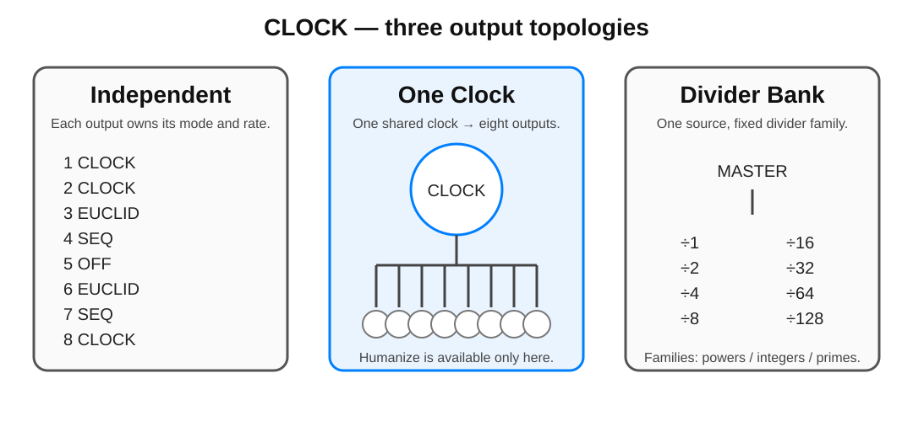

The important design choice is that Independent does **not** mean eight unrelated free-running clocks. Clock, Euclid, and Sequencer channels remain anchored to the same master timeline, so rate changes, resets, and mixed rhythmic functions can stay musically related.

## 2. Quick start

For a first patch:

1. Power the rack with CLOCK connected normally. CLOCK always boots into **STOP**.
2. Patch `OUT 1` to a module that accepts a clock or trigger.
3. Press **PLAY**. The factory topology is **One Clock**, so all eight outputs now carry the same master clock.
4. Turn the encoder to change master BPM.
5. Tap **TAP** repeatedly to set tempo by feel.
6. Press **STOP/BACK** to stop and reset the global phase.
7. Short-press the encoder to inspect the current output topology. Long-press it for the current context settings.
8. Hold **TAP** and turn the encoder when you want to change an output function or global topology.

> [!TIP]
> Start with One Clock until the transport and navigation feel natural. Independent mode is where CLOCK becomes an eight-channel rhythm tool; Divider Bank is the fastest way to obtain conventional clock divisions.

## 3. Product boundary: timing rather than analog CV

CLOCK is intentionally an eight-channel **digital timing, gate, and trigger instrument**. Hardware Rev 1 provides two LM393-conditioned digital comparator inputs on the physical SYNC/PA8 and RST/PA9 nets. Current 1.1 firmware can assign their musical roles globally, but this does not turn them into general parameter-CV inputs; analog CV/modulation outputs and a general modulation matrix remain outside scope.

That boundary protects both signal quality and DIY buildability. A quality eight-channel analog modulation-output path would require an eight-channel 16-bit DAC-class solution plus two quad output-op-amp stages; a 12-bit MCP-class implementation is not considered an acceptable quality compromise for this product direction. The project currently estimates roughly EUR 30-40 of additional BOM cost before the added fine-pitch SMD assembly, PCB, calibration, validation, and documentation burden. General parameter-CV inputs would also require additional analog front ends, routing, and panel I/O.

This is therefore **not a missing V1 feature**. CLOCK concentrates on what eight digital event outputs can do well: coherent clocks, Euclidean rhythms, gate sequences, ratios, phase, probability, reset semantics, and robust synchronization. Later firmware may add deeper internal event relationships without requiring an analog modulation subsystem.

For the frozen V1/post-1.0 boundary, see [`ROADMAP.md`](ROADMAP.md).

## 4. Front panel

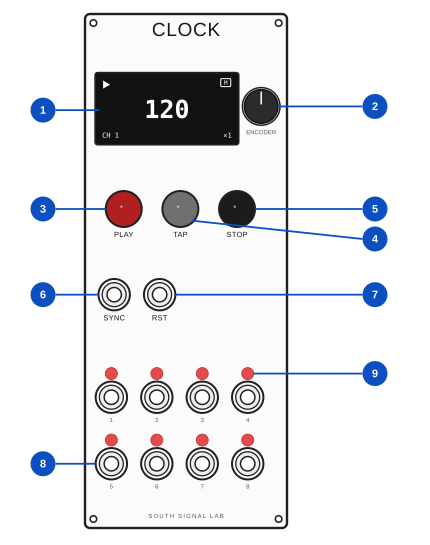

| No. | Element | Function |
| ---: | --- | --- |
| 1 | OLED | Performance view, menus, editors, prompts, and status feedback |
| 2 | Push encoder | Turn to select/change values; short press to select/confirm; long press (~650 ms) opens the current context settings |
| 3 | PLAY | Start/pause master transport; next page in the Sequencer editor |
| 4 | TAP | Tap Tempo; modifier for Settings and mode selection; previous page in the Sequencer editor |
| 5 | STOP / BACK | Stop and reset global phase from Performance; back/cancel elsewhere |
| 6 | SYNC IN | Conditioned external timing input |
| 7 | RST IN | Conditioned external reset/phase input |
| 8 | OUT 1–8 | Eight clock/gate outputs |
| 9 | Activity LEDs | One red indicator per output |

The panel layout in this illustration is generated from [`sim/panel_layout.ini`](../sim/panel_layout.ini), the same geometry used by the desktop simulator. The drawing is an explanatory manual asset, not a drill or manufacturing template.

## 5. Boot and output safety

CLOCK always powers up in **STOP**. Stored configuration is restored, but a previously saved PLAY state is never allowed to start outputs automatically.

The boot sequence initializes the scheduler in STOP and keeps all eight gate source GPIOs LOW until startup is complete. Because the final pin map has no MCU-controlled shared `/OE`, firmware safety is enforced directly at the eight source GPIOs. This prevents a normal power-up from becoming eight accidental triggers in a patched rack.


The normal boot screen lasts about one second. Holding the encoder push continuously through the complete boot sequence enters the compile-time selected Easter egg; see [Section 21](#21-hidden-boot-easter-eggs).

## 6. Performance screen

The Performance screen is deliberately sparse. It keeps the information required while playing visible and moves configuration detail into contextual pages.


The header shows:

- **filled `M`** when CLOCK is the active master;
- **outlined `S`** when CLOCK follows external timing;
- a lock icon beside `S` when external timing is locked;
- the selected channel and compact mode pictogram;
- master meter in the center;
- transport state at the right.

The BPM numerals are mathematically centered. Non-zero Swing appears at the left of the tempo area and a non-`×1` rate appears at the right. When Groove is active, `G:<name>` appears lower-left for Clock/One Clock and directly above the live pattern strip for Euclid/Sequencer. Factory presets show their preset name; Custom Grooves show the actual stored user name. Default or ineffective values are omitted rather than filling the screen with redundant status.

Clock uses the larger BPM role. Euclid and Sequencer use a smaller tempo role because the lower display area is reserved for live pattern feedback.

### Euclid performance view


The strip is rendered from the same Euclidean pattern data used by the scheduler, so the display is not a decorative approximation of the rhythm.

### Sequencer performance view


For lengths above 16 steps, the lowest display rows show the active 16-step block. A 64-step sequence therefore exposes four logical display segments.

### STOP

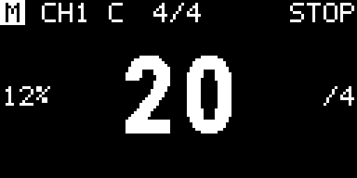

With factory display preferences, STOP-mode inactivity starts the configured screensaver after 2 minutes, dims the OLED after 5 minutes, and powers the OLED panel off after 10 minutes. Any front-panel interaction or conditioned SYNC/RST transition wakes it immediately.

## 7. Navigation and editing

The standard editing grammar is intentionally consistent:

1. turn to select;
2. press to open/edit;
3. turn to change;
4. press to confirm.

Only the value currently being edited is inverted. Whole-row inversion is avoided because it makes a 128×64 one-bit display unnecessarily busy.

| Gesture | Performance | Overview / mode | Settings / editor |
| --- | --- | --- | --- |
| Encoder turn | Change master BPM | Move selection | Move/change value |
| Encoder short press | Open overview | Confirm selection / return | Enter / confirm / toggle step |
| Encoder long press | Open current channel/global settings | Open highlighted settings | Context-dependent |
| TAP + encoder press | Open Settings tree | — | — |
| Hold TAP + encoder turn | — | Open/scroll horizontal mode carousel | — |
| PLAY/PAUSE | Play / pause | — | Sequencer: next 16-step page |
| TAP short | Tap Tempo | Modifier | Sequencer: previous 16-step page |
| STOP/BACK | Stop + global reset | Back / cancel | Back / cancel |

## 8. Channel and global overview

In Independent topology, a short encoder push opens the eight-channel overview. All channels remain visible in a 2×4 grid; each tile contains only its number and mode pictogram. The selected tile is fully inverted.


Turn the encoder to move the highlight. Short press commits the highlighted channel and returns to Performance. Long press opens that channel's settings directly.

One Clock and Divider Bank are global topologies, so their overview deliberately does not pretend that eight independent channel tiles exist.

<table>
<tr>
<td align="center"><br><sub><b>One Clock:</b> one shared configuration drives all outputs.</sub></td>
<td align="center"><br><sub><b>Divider Bank:</b> one source feeds the eight fixed divider outputs.</sub></td>
</tr>
</table>

Short press returns from a global overview. Long press opens that topology's settings.

## 9. Changing function or topology

Hold **TAP** and turn the encoder. CLOCK opens a horizontal mode carousel. The selected function stays centered and is the only item drawn on an inverted background; its immediate neighbors remain unframed, with a pictogram and label underneath. Turning moves the band rather than moving a highlight through a fixed 2×3 tile grid.

The current catalog order is **One Clock → Divider Bank → Clock → Euclid → Sequencer → Off**. The renderer and navigation use this catalog directly, so future channel modes can be added without inventing another fixed palette layout.

One Clock and Divider Bank change the global output topology. Clock, Euclid, Sequencer, and Off select Independent topology for the highlighted channel.

<table>
<tr>
<td align="center">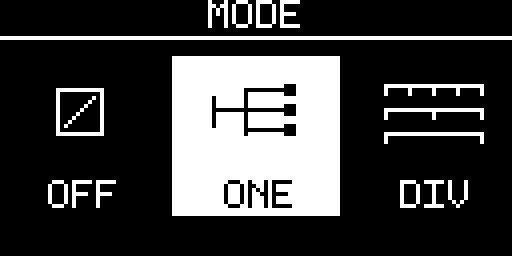<br><sub>One Clock centered</sub></td>
<td align="center">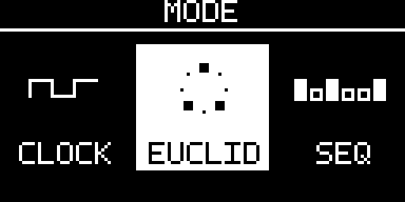<br><sub>Euclid centered</sub></td>
<td align="center">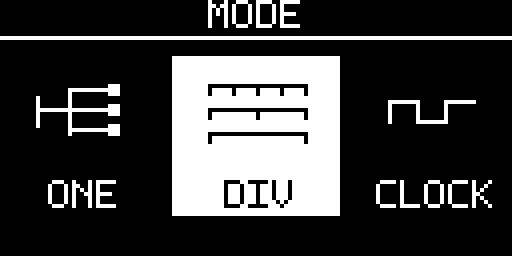<br><sub>Divider Bank centered</sub></td>
</tr>
</table>

Releasing TAP does not silently mutate the running setup. If the highlighted function differs from the active function, CLOCK opens `CHANGE MODE?` with **NO** selected by default.

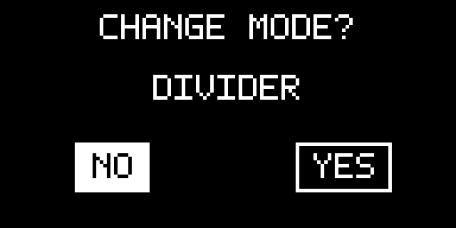

After confirmation CLOCK opens the most useful destination: Euclid goes to algorithm settings, Sequencer to its editor, One Clock to shared settings, Divider Bank to divider-family settings, while Clock and Off return to Performance.

## 10. Independent Clock

A Clock channel can also use the same deterministic Groove layer as Euclid and Sequencer. Factory or Custom Grooves shift event timing without changing the channel rate or master timeline.

Clock produces a regular derived trigger/clock on one output. Its channel owns:

- integer divide/multiply from `÷32` through `×32` using the curated rate table;
- rational ratio numerator and denominator from 1 to 16;
- local meter;
- Swing from 0–50%;
- Probability from 0–100%;
- gate length `1 / 2 / 5 / 10 / 20 / 50 / 100 ms`;
- Phase from 0–99%;
- reset policy `GLOBAL / FREE`;
- Mute.

Integer and rational rates use fixed/integer timing with remainder retention. CLOCK does not repeatedly truncate fractional intervals, so ratios such as `2:3`, `3:2`, `4:5`, or `5:4` do not accumulate long-term drift simply because an event interval is not an integer number of scheduler quanta.

`GLOBAL` means a global reset re-anchors the channel. `FREE` allows its local cycle position to survive that global reset.

## 11. One Clock

One Clock is the factory topology and the quickest way to use CLOCK as an eight-way master clock multiple.


One shared configuration controls all eight outputs:

- rate and rational ratio;
- Swing;
- gate length;
- Phase;
- **Humanize**.

Humanize exists only in One Clock. Available amplitudes are:

```text
OFF / 250 / 500 / 1000 / 2000 µs
```

It applies small deterministic per-output timing displacement while keeping the common restart/downbeat exact. It is intended to remove perfect simultaneity between eight copies without turning the outputs into unrelated clocks.

## 12. Divider Bank

Divider Bank is intentionally simple: choose one divider family and one shared gate length, then patch the eight outputs.

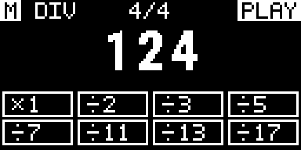

| Family | OUT 1–8 |
| --- | --- |
| `POW2` | ×1, ÷2, ÷4, ÷8, ÷16, ÷32, ÷64, ÷128 |
| `INT` | ×1, ÷2, ÷3, ÷4, ÷5, ÷6, ÷7, ÷8 |
| `PRIME` | ×1, ÷2, ÷3, ÷5, ÷7, ÷11, ÷13, ÷17 |

There are no fake per-channel settings in this topology because the outputs are intentionally derived from one shared divider source.

## 13. Euclid

A Euclid channel distributes a selected number of hits as evenly as possible across a cycle.

- **STEPS** — 1–64
- **HITS** — 0–STEPS
- **ROTATE** — circular rotation from 0 to STEPS−1

Common channel timing — rate, Swing, Groove, Probability, gate length, Phase, reset policy, and Mute — remains outside the Euclid algorithm page.

At `×1`, Euclid advances on a **sixteenth-note grid**. In 4/4, 16 steps therefore span exactly one bar. The channel rate scales that step grid; `×1` does not mean one Euclid step per quarter note.

A simple 16-step / 4-hit pattern gives four evenly distributed hits. Rotation moves the pattern against the shared timeline without changing the hit count.

## 14. Gate Sequencer

Each Sequencer channel stores a binary gate pattern of up to 64 steps. The active sequence length is 1–64 steps.

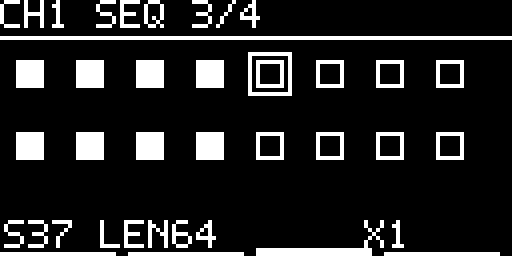

The editor is divided into four possible pages:

```text
1–16     17–32     33–48     49–64
```

Inside the editor:

- encoder turn moves the step cursor;
- encoder press toggles the selected gate;
- PLAY/PAUSE moves to the next 16-step page;
- TAP moves to the previous 16-step page;
- STOP/BACK returns to Sequencer parameters.

Sequencer tools include **Length, Rotate, Invert, Clear, Fill Alternate, Copy, and Paste**. Rate, Swing and Groove remain shared channel-timing controls. As with Euclid, `×1` is a sixteenth-note grid, so a 16-step sequence occupies one 4/4 bar.

## 15. Swing, Probability, Phase, gates, and reset

These parameters are shared by Independent Clock/Euclid/Sequencer channels unless stated otherwise.

**Swing** delays alternating subdivisions while preserving the total duration of the pair. A value of 0% is straight timing; values up to 50% progressively lengthen one half and shorten the other.

**Probability** controls whether an otherwise eligible event produces a gate. It changes event emission, not the master timeline, so skipped events do not make the channel's underlying clock drift.

**Phase** offsets a channel relative to the common timeline without creating a separate free-running transport.

**Gate length** selects a trigger duration of 1, 2, 5, 10, 20, 50, or 100 ms. The scheduler also bounds gate-off timing against the actual event interval so a configured long pulse cannot consume the next rising edge.

**Reset policy** controls how an Independent channel reacts to a global reset: `GLOBAL` re-anchors it; `FREE` preserves its local cycle position.

The Settings-root **PHASE RESET** command applies that global musical reset immediately without stopping to erase or replace any saved configuration. It is intentionally distinct from **FACTORY RESET**, which is a destructive maintenance action under `INFO`.

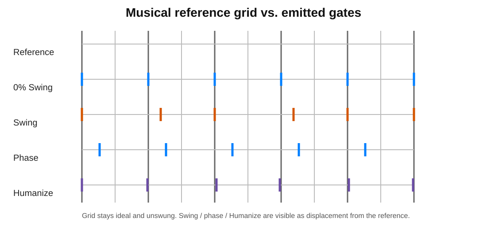

### Swing, Groove, and Humanize — what changes?

All three change **when** an output edge occurs, but they solve different musical problems and remain separate controls.

| Timing tool | Character | Repeats how? | Scope | Main controls |
| --- | --- | --- | --- | --- |
| **Swing** | Regular long/short feel | Alternates every second subdivision | One Clock globally or per Independent channel | `SWING 0–50%` |
| **Groove** | Deterministic rhythmic microtiming pattern | Repeats over the selected 1–64-step Groove pattern | One Clock globally or per Independent channel; not Divider Bank | preset/custom pattern, `AMOUNT`, `ROTATE` |
| **Humanize** | Small deterministic per-output displacement around the shaped grid | Deterministic event/channel sequence rather than a stored Groove pattern | **One Clock only** | `OFF / 250 / 500 / 1000 / 2000 µs` |

Swing is the simplest choice when the desired feel is a regular alternating shuffle. Groove is for a repeatable timing fingerprint that can span more than two events, including early as well as late Custom-Groove steps. Humanize is different again: it slightly separates otherwise coincident One Clock outputs without becoming part of the Groove pattern. The common restart/downbeat remains exact.

The layers can be combined. CLOCK first shapes the nominal event with Swing and Groove, then applies the bounded One Clock Humanize displacement. Safety limits reduce effective displacement when necessary so adjacent events remain ordered and at least one scheduler quantum apart.

## 16. Grooves and Custom Groove Record

Groove is deterministic microtiming applied to the same master timeline as Clock, Euclid and Sequencer. It is separate from One Clock **Humanize**, which is a bounded deterministic per-output displacement. Divider Bank deliberately remains Groove-free.

### Factory Grooves

`TIMING → GROOVE` offers `OFF`, `SWING 54`, `SWING 58`, `SWING 62`, `SWING 66`, and `POCKET A / B / C`. **AMOUNT** scales the selected pattern from straight (`0%`) through its stored shape (`100%`), while **ROTATE** changes where that pattern starts against the channel timeline. One Clock owns one global Groove; Independent stores Groove per channel and applies it equally to Clock, Euclid and Sequencer event timing.

### Custom Groove Editor

`GROOVE → EDITOR` opens the graphical 128×64 Custom Groove editor. A Groove can contain **1–64 steps**. Solid beat guides and dotted step guides show the nominal grid; diamond markers show the actual timing position of each step. The selected diamond is filled. Marker positions may move early or late but are bounded so events remain monotonic and cannot overtake neighboring steps.

<p align="center"><br><sub>Custom Groove editor — the grid is nominal time; diamonds are the stored microtiming positions.</sub></p>

Editor controls:

- **TAP** — select the next marker;
- **encoder turn** — move the selected marker finely;
- **TAP + turn** — coarse marker movement;
- **PLAY + turn** — quick zoom through `FIT / 32 / 16 / 8 / 4` without issuing a transport command;
- **encoder long press** — open the Groove editor menu;
- **BACK** — leave immediately when clean, or open `DISCARD CHANGES?` when the draft has changed.

Changes are previewed live while transport runs but remain temporary until saved. BACK/DISCARD restores the pre-entry Groove state. New Custom Grooves receive an editable generated two-word default name so the save workflow never starts from a blank label.

### TAP Record

`GROOVE → RECORD` is a second input mode over the **same Custom Groove draft**. It uses the same grid and recorded diamond markers, plus a moving playhead driven by the real engine phase. A recorded Groove can therefore be opened immediately in `EDITOR` for manual cleanup and is stored in exactly the same Custom Groove format.

<p align="center"><br><sub>Groove Record — TAP events become signed microtiming offsets on the running grid.</sub></p>

Recorder controls:

- **PLAY** — start/stop capture; stopping rewinds the recorder to the beginning;
- **TAP** — record one timing event; TAP does not run Tap Tempo while the recorder is active;
- **PLAY + turn** — quick zoom;
- **encoder long press** — open the Record menu;
- **BACK** — leave/confirm discard using the same shared-draft rules as the editor.

The Record menu provides **MODE** (`ONE SHOT / ENDLESS`), recorder **COUNT IN** (`OFF / 1–64`, default `4`), **LENGTH** (`1–64`), **ZOOM**, **SAVE**, `EDITOR >`, and **CLEAR**. `ONE SHOT` stops at the end of one pattern pass. `ENDLESS` wraps and continues; only steps that receive a new TAP are overwritten, so an existing Groove can be refined over repeated passes.

Front-panel TAP capture preserves the high-resolution physical press timestamp through button debounce before converting it to a signed per-step offset. Host tests verify that software contract; absolute physical switch latency/jitter remains a HIL measurement.

### Custom Groove library

The frozen 1.1.0 storage scope is **10 named Custom Groove slots**. The normal Groove page exposes `LOAD >`; saved Grooves can also be overwritten, renamed, or deleted with explicit safe confirmations. The Performance screen uses the stored name rather than a generic `CUSTOM` label. The earlier 99-slot idea remains a later storage target and is not part of the 1.1.0 release contract.

## 17. Transport and Tap Tempo

Transport has three states: **PLAY, PAUSE, STOP**.

- PLAY/PAUSE toggles running and paused states without an implicit phase reset.
- STOP/BACK from Performance enters STOP and applies the global reset policy.
- Tap Tempo adjusts the master tempo from a sequence of TAP presses within the supported 1–999 BPM technical range and the configured user MIN/MAX boundaries.
- The first TAP starts a new measurement sequence without an indicator. The second and every following TAP in that sequence triggers a four-frame **8×8 shrinking-dot animation** in a fixed right-aligned slot at the display edge, vertically centered on the tempo display. The BPM numerals remain centered and do not move.
- The Tap Tempo sequence expires after one beat at the configured **MIN BPM**. At the factory minimum of 20 BPM this is 3000 ms; after a longer pause the next TAP is again the silent first tap and the following TAP resumes visual feedback.

CLOCK persists the working configuration but never restores PLAY on power-up. Flash commits are also deferred while transport is PLAYING so erase/program work cannot block the live gate path.

### Pre-Count

`SETTINGS → MODE & CLOCK → PRE COUNT` controls an optional silent count-in. `OFF` preserves the immediate-start behavior; active values run from **1 through 64 beats**. A fresh STOP→PLAY starts the count at the configured master tempo. During the count-in CLOCK advances only the count-in timing reference: **all eight gate outputs remain LOW and the musical pattern position remains at phase zero**. PAUSE freezes an active count and PLAY resumes it; STOP cancels it, so the next PLAY starts the full configured count again.

While Pre-Count is active, the Performance screen keeps the normal context visible around a centered square popover. The popover is black with a one-pixel white border and shows the remaining beat count without any phase animation. Along its lower edge, one cell per master-meter beat visualizes the current step: exactly the active beat is filled and all other beats remain outlined. In 4/4 the four fixed positions therefore read as Tick–Tack–Tack–Tack, with the filled marker moving through the bar and returning to the first position on the next bar. When the count reaches zero the popover disappears and normal gate generation starts from the shared phase-zero boundary. With a locked external clock, Pre-Count remains edge-owned and converts accepted SYNC pulses into the configured **master-meter beat unit** using PPQN. A quarter note is therefore one count beat in `/4`, two beats in `/8`, four beats in `/16`, and half a beat in `/2`; the scheduler does not double-advance the count between accepted external edges.

## 18. Configurable external inputs

Open `SETTINGS → GENERAL SETTINGS → INPUTS` to assign the two conditioned comparator inputs. The current board still has physical/net identities **SYNC/PA8** and **RST/PA9**; the firmware presents them as **INPUT 1** and **INPUT 2** so either electrical path can perform any supported digital input role. Factory assignment is `INPUT 1 = SYNC`, `INPUT 2 = RESET`.

Current selectable roles are:

- **OFF** — ignore the input;
- **SYNC** — external clock acquisition;
- **RESET** — phase reset using the configured `TRIGGER / GATE` semantics;
- **RUN** — conditioned `HIGH = PLAY`, `LOW = STOP`;
- **START** — positive edge starts transport;
- **STOP** — positive edge stops transport;
- **RESTART** — positive edge stops/restarts from phase zero;
- **TAP** — positive edge enters the existing Tap Tempo estimator with the captured input timestamp.

`FILL` is reserved for later Fill functionality and is not selectable in the current development firmware. Active roles are exclusive: a non-`OFF` role assigned to one input is skipped while editing the other. `OFF` may be assigned to both inputs.

<table>
<tr>
<td align="center">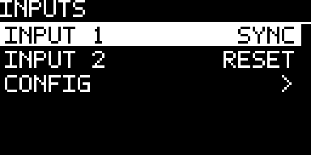<br><sub>Input-role assignments</sub></td>
<td align="center">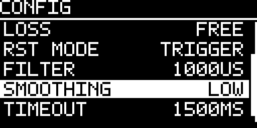<br><sub>Shared input configuration</sub></td>
</tr>
</table>

Choose `CONFIG >` from the INPUTS page for the shared timing/reset parameters:

- **SOURCE** — `INTERNAL / EXTERNAL / AUTO` (factory default: `AUTO`)
- **PPQN** — `1 / 2 / 4 / 24`
- **EDGE** — rising / falling for `SYNC`
- **LOSS** — `STOP / FREE / INTERNAL`
- **RST MODE** — `TRIGGER / GATE`
- **FILTER** — 0–5000 µs in 250 µs steps
- **SMOOTHING** — `OFF / LOW / MEDIUM / FULL` (factory default: `LOW`)
- **TIMEOUT** — 200–5000 ms in 100 ms steps

For a role assigned to `RESET`, `TRIGGER` generates one global phase reset for an accepted active edge; holding the input HIGH does not repeat it. `GATE` uses the current conditioned level: while HIGH, the timing engine is held in reset and all generated gates remain LOW; release restarts from phase zero. A channel configured with local `RESET = FREE` keeps its independent cycle position as defined by the existing reset policy.

For a role assigned to `SYNC`, `AUTO` remains the factory clock source. Without a valid external lock, CLOCK runs from the configured internal BPM. The first accepted selected SYNC edge starts acquisition but does not advertise lock because no period can yet be measured. The second valid selected edge establishes period/BPM, acquires lock, resets external phase to zero and may start transport unless manual transport state takes precedence. While locked in `EXTERNAL` or `AUTO`, the Performance BPM display shows measured external tempo.

`FILTER` and `SMOOTHING` solve different problems. `FILTER` rejects implausibly short electrical/glitch intervals. `SMOOTHING` controls how quickly measured tempo follows genuine period changes: `OFF` uses 100% of the newest period, `LOW` 75% new / 25% previous, `MEDIUM` 50% / 50%, and `FULL` 25% new / 75% previous. `LOW` remains the factory default.

After external clock loss, `LOSS = STOP` stops transport; `LOSS = FREE` continues at the last measured external BPM and keeps that BPM on the Performance display; `LOSS = INTERNAL` returns to the configured fallback BPM. A role change discards queued edges captured under the previous assignment, so a pending clock edge cannot later be reinterpreted as START, STOP, RESTART or TAP. `RUN` is level-authoritative once armed, but assigning RUN is deliberately transport-neutral: CLOCK records the present comparator level as the baseline and waits for a later physical level change before issuing PLAY or STOP. The same baseline rule applies at boot, so a persisted RUN assignment cannot bypass the normal STOP-on-boot contract.

Both physical comparator paths are captured by GPIO EXTI with TIM5 microsecond timestamps and are consumed by the deterministic scheduler. Host tests prove this digital role/state-machine contract. Actual LM393 thresholds, propagation, jack-level timing and output jitter remain HIL evidence.

## 19. Presets, CURRENT, and templates

`SETTINGS → PRESETS` contains three different concepts:

- **CURRENT — AUTO SAVE** is the durable working state;
- **LOAD PRESET / SAVE PRESET** use eight named user slots;
- **TEMPLATES** are factory starting configurations rather than user slots.

Preset names can contain up to 16 characters. Saving over an occupied slot requires explicit confirmation, with **NO** selected by default.

<table>
<tr>
<td align="center">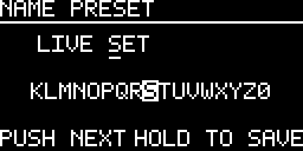<br><sub>Preset name entry</sub></td>
<td align="center"><br><sub>Occupied-slot confirmation</sub></td>
</tr>
</table>

Factory templates currently include `ALL MASTER`, `CLOCK TREE`, `DIVIDERS`, `POLYRHYTHM`, `EUCLID KIT`, and `HYBRID`. Loading a template changes CURRENT; it does not silently create or overwrite a named user preset.

## 20. Device orientation, screensaver, and display protection

`SETTINGS → GENERAL SETTINGS → HARDWARE` contains the two persistent installation preferences:

- **ENCODER DIR** — `NORMAL / REVERSED`. `REVERSED` flips the user-facing rotary direction after quadrature decoding; detent recovery, bounce handling and Fast Turn buffering are unchanged.
- **ORIENTATION** — `0 DEG / 180 DEG`. Firmware rotates the complete 128×64 transfer framebuffer before sending it to the OLED, so the boot screen, settings, screensavers and Easter eggs remain readable with the module mounted upside down. The controller itself stays in the proven `A1/C8` scan orientation; this avoids the mirrored-text behavior seen with controller-remap rotation on interchangeable SSD1306/SSD1315 modules.

<p align="center">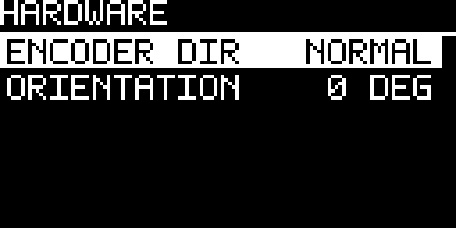<br><sub>Device-local hardware preferences</sub></p>

Both preferences take effect immediately and survive power cycling. They are device-local: loading a named preset or applying a factory template does not change them. Factory defaults are `NORMAL` and `0 DEG`.

### Hardware diagnostics

Open `SETTINGS → GENERAL SETTINGS → DIAGNOSTICS` for a live digital signal view. `INPUTS` shows the two conditioned comparator levels as centered `INPUT 1` and `INPUT 2` indicators, independent of their currently assigned musical roles. `OUTPUTS` shows channels 1–8 as a 4×2 grid of rectangular indicators. An inactive signal is shown as an outlined rectangle; an active signal is filled with its label inverted.

The input page reports the digital comparator levels seen by the MCU; the output page reports the digital source levels actually written by firmware to the eight gate-output GPIOs. The current hardware does not provide ADC voltage measurements at these points, so Diagnostics deliberately does not display inferred voltage values.

Display protection is active only while transport is STOP. The factory timing is:

- screensaver after 2 minutes;
- dim after 5 minutes;
- OLED off after 10 minutes.

The configured order is constrained to `START <= DIM <= OFF`. Any front-panel activity wakes the OLED immediately. `OFF` disables animation but does not disable the later dim/panel-off protection stages.

Four additional visual modes are available: **MAKE MUSIC** builds `MAKE·MUSIC·NOT·WAR` one character at a time and continues row by row; **LABYRINTH** repeatedly generates and draws a random perfect maze; **STARFIELD** scrolls three parallax depth layers; and **FIREWORKS** launches a pixel rocket from changing positions before an upper-screen burst.

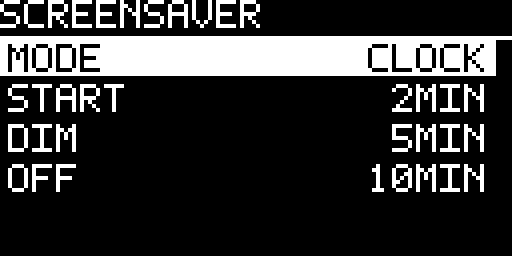

<table>
<tr>
<td align="center">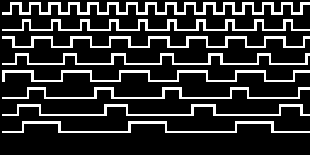<br><sub>CLOCK — eight phased digital traces</sub></td>
<td align="center"><br><sub>PLUG — damped plucked string</sub></td>
</tr>
<tr>
<td align="center"><br><sub>HEARTBEAT — animated pulse</sub></td>
<td align="center"><br><sub>ACID — bouncing smiley physics</sub></td>
</tr>
<tr>
<td align="center"><br><sub>SPECTRUM — 16-band spectrum with peaks</sub></td>
<td align="center"><br><sub>FIELD — moving metaball field</sub></td>
</tr>
<tr>
<td align="center"><br><sub>BLOX — falling geometric bodies</sub></td>
<td align="center"><br><sub>MATRIX — procedural digital rain</sub></td>
</tr>
<tr>
<td align="center"><br><sub>CUBE COVER — tiled cube fill</sub></td>
<td align="center"><br><sub>FRACTAL — progressive fern reveal</sub></td>
</tr>
<tr>
<td align="center"><br><sub>ORBIT — sparse orbital motion</sub></td>
<td align="center">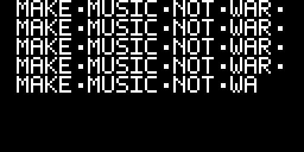<br><sub>MAKE MUSIC — progressive text stream</sub></td>
</tr>
<tr>
<td align="center">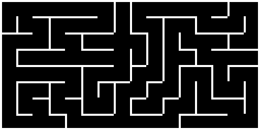<br><sub>LABYRINTH — generated maze</sub></td>
<td align="center"><br><sub>STARFIELD — three-depth parallax</sub></td>
</tr>
<tr>
<td align="center"><br><sub>FIREWORKS — pixel rocket and burst</sub></td>
<td align="center"><br><sub>OLED OFF — final display-protection stage</sub></td>
</tr>
</table>

## 21. Hidden boot Easter eggs

Hold the encoder push continuously from power-up until the boot screen finishes to enter the compile-time selected Easter egg. `CLOCK_EASTER_EGG` selects one of five implementations; the shipped/default build selects **BEATKNECHT**.

The four ranked games — **Pixel Raid, Formula 1, Breakout, and Egg Journey** — share the same presentation flow: game-specific intro, gameplay, optional three-letter initials entry for a qualifying score, and a scrollable Top 100. A long encoder hold exits back to the normal firmware lifecycle.

<table>
<tr>
<td align="center"><br><sub>Pixel Raid — ranked arcade shooter</sub></td>
<td align="center"><br><sub>Formula 1 — ranked driving game</sub></td>
</tr>
<tr>
<td align="center">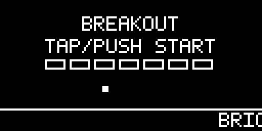<br><sub>Breakout — ranked brick game</sub></td>
<td align="center"><br><sub>Egg Journey — ranked lunar runner</sub></td>
</tr>
<tr>
<td align="center">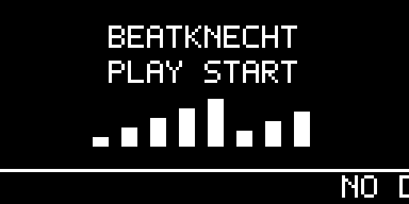<br><sub>BEATKNECHT — eight-channel rhythm utility</sub></td>
<td align="center">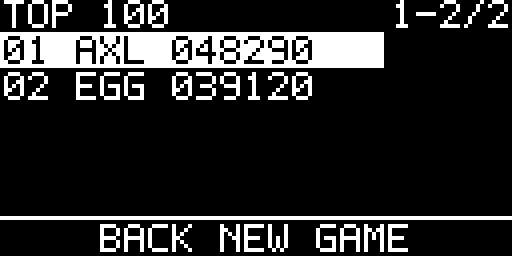<br><sub>Top 100 — shared ranked leaderboard</sub></td>
</tr>
</table>

- **Pixel Raid** — encoder moves the cannon; TAP fires.
- **Formula 1** — encoder steers through changing road geometry and traffic; three crashes end the run.
- **Breakout** — encoder moves the paddle; TAP launches the waiting ball; the run has three lives and scored bricks/board clears.
- **Egg Journey** — encoder shifts the egg within the scrolling lunar landscape; TAP jumps; craters and asteroids consume one of three lives.
- **BEATKNECHT** — not a ranked game. **PLAY/PAUSE** starts and pauses the rhythm, **STOP/BACK** stops it and resets the pattern to step 1, TAP cycles curated one-bar rhythm styles, and the encoder changes BPM. OUT 1–8 intentionally emit the displayed eight gate patterns. Pause forces every gate LOW while preserving the remaining step interval; PLAY resumes from that point. STOP additionally mutes all gate source GPIOs until PLAY is pressed again. A long encoder push opens an **EXIT GAME? / NO / YES** confirmation instead of leaving immediately. NO returns to the exact previous transport state; if the rhythm was playing it resumes from the preserved phase. YES stops the rhythm, forces all gates LOW, keeps gate output muted, and returns to the normal clock firmware.

After a ranked Easter egg has been launched at least once, the Settings root gains **HI-SCORES / CLEAR**. The entry is hidden beforehand and is not shown for BEATKNECHT. Clearing uses a guarded **NO / YES** confirmation, stops transport before Flash is written, clears the complete Top 100 for that selected ranked game, and keeps the menu entry available for later resets.

<table>
<tr>
<td align="center">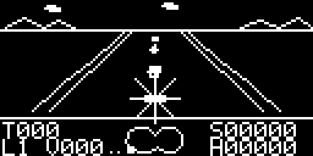<br><sub>Formula 1 crash recovery</sub></td>
<td align="center"><br><sub>Breakout modifier</sub></td>
</tr>
<tr>
<td align="center"><br><sub>Egg Journey gameplay</sub></td>
<td align="center"><sub><b>Leaderboard management</b><br>After a ranked Easter egg has been launched once, Settings exposes a guarded HI-SCORES / CLEAR action.</sub></td>
</tr>
</table>

Pixel Raid, Formula 1, Breakout, and Egg Journey keep all gate source GPIOs muted. BEATKNECHT is the deliberate exception: its intro is started with PLAY, it allows gate HIGH requests only while transport is PLAYING, drives the rhythm gates, forces all channels LOW on PAUSE, and returns all channels LOW plus mutes gate output on STOP or confirmed exit. Opening the exit confirmation also silences the gates; cancelling restores the prior PLAY/PAUSE/STOP state. Normal firmware resumes in STOP.

## 22. INFO, version, and updates

`SETTINGS → INFO` groups identity, maintenance information, and the deliberately buried factory-reset action:

- **NAME** — `CLOCK`
- **VERSION** — currently running firmware version
- **AUTHOR** — Axel Napolitano
- **LICENSES** — firmware and bundled third-party license identifiers/attributions
- **UPDATES** — full-screen QR code for the current project update URL (`https://github.com/napolitano`)


Long read-only information values use a separate overflow rule from editable Settings values. If a value does not fit its row, CLOCK shortens only that informational value with `...`; pressing the row opens a full-value popover. Editable values are never redirected through this mechanism because pressing them must retain its normal edit/confirm meaning. The AUTHOR row is the primary current example.

**FACTORY RESET** is the final INFO entry so it is not exposed as a routine performance control. Selecting it opens a separate confirmation screen with **NO** selected by default. Confirming **YES** stops transport, clears CURRENT, all eight named presets, legacy score data, and all Top-100 leaderboards, then restores the documented factory configuration.

<table>
<tr>
<td align="center">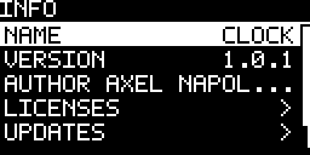<br><sub>Identity with bounded read-only values</sub></td>
<td align="center"><br><sub>Full value after pressing the truncated AUTHOR row</sub></td>
<td align="center">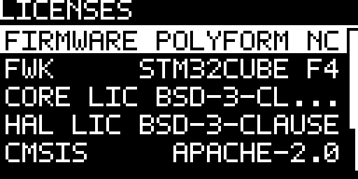<br><sub>Licenses</sub></td>
</tr>
<tr>
<td align="center"><br><sub>Updates</sub></td>
<td></td>
<td></td>
</tr>
</table>

## 23. Firmware installation and updates

CLOCK supports two firmware-programming paths: **ST-LINK / SWD** for first installation, recovery and debugging, and **USB DFU via PlatformIO** for routine updates.

> [!CAUTION]
> **Before connecting USB, switch the Eurorack system off and preferably unplug CLOCK's Eurorack ribbon cable. Do not power CLOCK from USB and the Eurorack bus at the same time.** After a USB update, the module can be booted and its display/controls tested directly from USB while the Eurorack cable remains disconnected.

For a routine update, enter the STM32 system-memory DFU bootloader with BOOT0/RESET and run the matching release environment, for example:

```bash
pio run -e release_default -t upload
```

The project upload helper writes the application and vector-table regions separately and preserves Flash sectors 1 and 2, which hold settings, presets and arcade high scores. Do not replace the supported update path with a flat contiguous `firmware.bin`.

The complete step-by-step procedure, including ST-LINK wiring, STM32CubeProgrammer, alternate Easter-egg variants, PlatformIO installation links, USB-only post-update testing and troubleshooting, is maintained in [`FIRMWARE_UPDATE.md`](FIRMWARE_UPDATE.md).

## 24. Current technical limits

The current firmware uses a deterministic **20 kHz scheduler**, giving a 50 µs service quantum. UI rendering and I/O transport do not decide musical gate timing. SPI remains the preferred/reference display path; I2C uses deferred, bounded foreground transactions so display work is deliberately subordinate to musical timing. The physical encoder uses PB6/PB7 in STM32 TIM4 encoder mode; SYNC/RST remain interrupt-captured inputs.

Persistence uses internal STM32 Flash A/B records. Large persistence staging buffers are static rather than runtime-stack allocations, embedded production code is guarded against dynamic heap allocation, and the build includes a production stack-frame gate.

These software safeguards do not replace physical validation. Representative hardware still needs oscilloscope/logic-analyzer proof for gate jitter and pulse widths, boot/reset behavior, SYNC/RST comparator behavior, EXTI capture timing, and SPI display stress. Until 1.5.0 this evidence is tracked but does not block the automated release build. See [`HIL_TEST_PLAN.md`](HIL_TEST_PLAN.md).

## 25. License

Firmware source is licensed under the **PolyForm Noncommercial License 1.0.0**. The Required Notice is `Required Notice: Copyright © 2026 Axel Napolitano.` See [`../LICENSE.md`](../LICENSE.md), [`../NOTICE.txt`](../NOTICE.txt), and [`LICENSING.md`](LICENSING.md). The publication manual and documentation artwork use the documentation license described in [`manual-source/LICENSE.md`](manual-source/LICENSE.md). Third-party components retain their upstream licenses and notices.

<h6 align="center">From Munich with &#9829;</h6>
