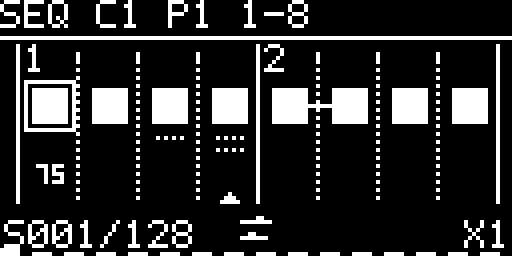

<!-- Author: Axel Napolitano | License: PolyForm-Noncommercial-1.0.0 -->

# 11 Sequencer mode

The current post-1.1 development Sequencer stores **eight patterns (P1–P8) per channel**, each with an active length of **1–128 steps**. The selected pattern slot is persistent.

`SEQUENCER` opens with **EDITOR** as the first item, followed by `PATTERN`, `LENGTH`, `ROTATE`, `MODE`, and `LOOP`.

The editor shows eight steps at a time. Turning the encoder moves the edit cursor through the complete pattern; crossing an eight-step boundary changes the viewport automatically. The page indicator at the bottom always describes the **editor viewport**, not the currently playing page.

The grid deliberately omits per-step numbers. Every four-step beat boundary uses a longer tick and solid vertical line and shows its beat number; intermediate step boundaries use shorter ticks and dotted lines. Gate cells are centered between those boundaries. This leaves the gate pattern and expression state readable on the 128×64 display.

Inside the editor:

- encoder turn moves the edit cursor and scrolls across viewport boundaries;
- encoder press toggles the selected gate;
- PLAY/PAUSE controls transport without moving the edit cursor;
- while PLAY is active, a small triangle at the bottom follows the real playback step when it is inside the visible viewport;
- TAP moves to the previous eight-step viewport; TAP + encoder press opens the selected step's expression editor;
- encoder long-press opens Pattern Operations;
- STOP/BACK returns to Sequencer parameters.

Per-step expression is sparse and optional:

- **Probability**: `%` marks a non-selected explicit override; on the selected step the compact numeric value replaces `%` in the same position instead of appearing in the header;
- **Gate / Duty**: short trigger, relative-duty and fixed gate-length overrides are available; DEFAULT inherits the channel gate setting;
- **Tie**: a continuous horizontal bridge joins the current gate cell directly to the next deterministic gate cell;
- **Ratchet**: 2–4 substeps are shown as one row of dots; 5–8 use two rows, with four dots on the first row and the remaining dots on the second. Ratchet sits above Probability so both attributes remain grouped with the same step. Probability and Ratchet may be combined.

Tie and Ratchet are mutually exclusive because one requests continuous HIGH while the other requests repeated bounded sub-events. Tie is unavailable in RANDOM direction because a random next step does not define deterministic adjacency.

The lower status area shows the selected step/length, channel rate and only the traversal-direction pictogram (`FORWARD`, `REVERSE`, `PINGPONG`, or `RANDOM`). `LOOP / ONCE` remains editable in Sequencer settings and is not duplicated in the live editor.

Pattern Operations provide pattern-wide transforms such as invert/clear/fill and copy/paste. Rate, Swing and Groove remain shared channel-timing controls. At `×1`, Sequencer steps use the established sixteenth-note grid, so 16 steps span one 4/4 bar. Per-step microtiming is deliberately not duplicated here: deterministic displacement belongs to Swing/Groove.

<h6 align="center">From Munich with &#9829;</h6>
