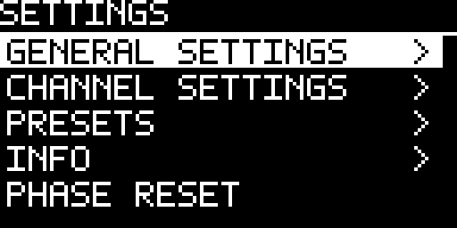
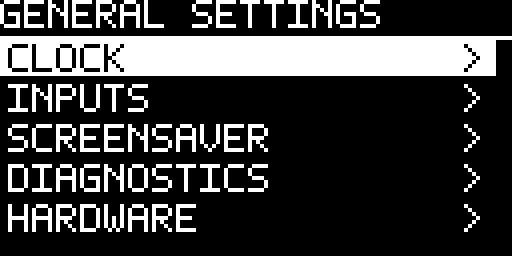
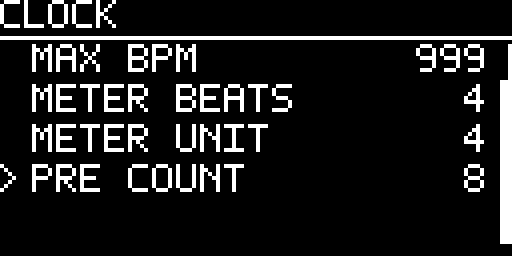

<!-- Author: Axel Napolitano | License: PolyForm-Noncommercial-1.0.0 -->

# 15 Settings map

Hold **TAP** and press the encoder from Performance to open the root Settings tree. The root is organized by scope rather than by implementation detail.

| Root item | Contains / does |
| --- | --- |
| **GENERAL SETTINGS** | Global CLOCK, INPUTS, SCREENSAVER, DIAGNOSTICS and HARDWARE pages. |
| **CHANNEL SETTINGS** | The currently selected Independent channel or the active One Clock / Divider Bank topology. |
| **PRESETS** | CURRENT recovery, Load/Save Preset, and factory Templates. |
| **INFO** | Product/version information, licenses, update QR and guarded Factory Reset. |
| **PHASE RESET** | Immediate non-destructive global musical phase reset. |

### GENERAL SETTINGS

GENERAL SETTINGS contains values shared by the whole device, not one output channel. `CLOCK` here means the **master clock configuration**, not the Independent channel mode named CLOCK.

| Page | Scope |
| --- | --- |
| **CLOCK** | Master BPM, user BPM limits, master meter, global Pre-Count. |
| **INPUTS** | INPUT 1/2 role assignment plus shared external clock/reset configuration. |
| **SCREENSAVER** | Screensaver and STOP-only display-protection timers. |
| **DIAGNOSTICS** | Live conditioned input states and eight gate-driver output states. |
| **HARDWARE** | Encoder direction and complete 0° / 180° framebuffer orientation. |

### CLOCK — tempo, meter and Pre-Count

| Setting | Meaning |
| --- | --- |
| **BPM** | Internal/fallback quarter-note tempo reference. |
| **MIN BPM / MAX BPM** | User/Tap-Tempo editing bounds: 1…999 with `MIN ≤ MAX`; factory range 20…999. These limits do not clamp a valid measured external clock. |
| **METER BEATS** | 1…16 beats per bar. Used by the bar/beat counter and Pre-Count beat cells. |
| **METER UNIT** | 2 / 4 / 8 / 16. Selects the note value represented by one master beat. |
| **PRE COUNT** | OFF or 1…64 silent beats before a fresh STOP→PLAY. All gates stay LOW and pattern phase remains zero until the count completes. |

The BPM number remains the quarter-note reference. At 120 BPM, `/4` produces 500 ms master beats, `/8` produces 250 ms master beats, and `/2` produces 1000 ms master beats. `METER BEATS` then determines the bar length from those beats.

### CHANNEL SETTINGS

Independent mode separates pattern generation from shared timing/output behavior. The most important controls are `RATE/NUM/DEN`, Swing, Groove, Probability, Gate length, Phase, Reset and Mute. Gate length is an absolute time value rather than a duty cycle; an otherwise-too-long pulse is shortened before the next rising event so it cannot consume the following onset.

One Clock exposes shared **TIMING** (rate, Swing, Groove, Humanize) and **OUTPUT** (Gate, Phase) pages. Divider Bank exposes divider family and one shared Gate length.

### INFO and read-only overflow

Long read-only information is shortened with `...` in the row and can be opened in full. The license page is the canonical example: `CORE LIC` may display a truncated `BSD-3-Cl...` row while preserving the complete identifier in the full-value view.

`PHASE RESET` is non-destructive. `FACTORY RESET`, by contrast, is the final guarded INFO action and clears CURRENT, named presets and score data before restoring factory configuration.

<h6 align="center">From Munich with &#9829;</h6>
